## 1. Objectives

This lab demonstrates the role Watson Discovery plays in the retrieval augmented generation (RAG) pattern. You will use Watson Discovery as a data ingestion and storage layer and search algorithm to extract relevant passages from documents. Those search results will then be used as an input context to a watsonx large language model (LLM) to generate a more trustworthy and date-correct completion. The watsonx LLM generates a natural language answer to the query based on the documents provided by the search.

---

## 2. High-level RAG architecture

RAG is one of the most common generative AI architecture patterns. One obvious use case for RAG is search and question-answering (Q&A) systems because of RAG’s ability to use a trusted corpus to aid a large language model (LLM) in its completion. For example, building systems that leverage LLMs to distill and make sense of information from their repositories, enabling Q&A over documents. RAG helps to add guardrails and ground an LLM to a truth-grounded corpus to help prevent hallucination.

Generally, a RAG pattern consists of two steps:

- **Search / Retrieval**: Extracting relevant text snippets from trusted enterprise knowledge bases.
- **Summarization / Generation**: Generating answers to the question based on the context provided by the Search / Retrieval step. Typically, passages and snippets are concatenated and appended to the prompt.

The following is a general high-level RAG architecture diagram and shows how watsonx.ai works. There can be many variations to this architecture (such as integration with watsonx Assistant, watsonx Orchestrate, or other applications clients are using) depending on the target use case. This diagram simply shows two of the most common RAG patterns.

---

## 2.1 Watson Discovery in RAG pattern

The diagram below demonstrates the role of Watson Discovery as a data ingestion and storage layer and search mechanism to extract relevant passages from documents to support an RAG use case pattern. Additionally, Watson Discovery converts unstructured data into JSON format, it also has Optical Character Recognition (OCR) and table understanding capabilities and can ingest most standard business file types such as PDF, Microsoft Word documents, spreadsheets, presentations, and more. For a complete list of supported sources for Watson Discovery, see supported file types.

---

## 3. Required software, access, and files

**Note**: If you have completed these steps in the previous labs, you don’t need to repeat them.

**Requirements**:

- Your own IBM Cloud account. If you have never used IBM Cloud before, register using your w3 ID here.
- You need access to a watsonx.ai and Watson Discovery environment.
  - This requirement can be met by completing the instructions from Section 2.2 of IBM watsonx.ai L4 PoX environment setup. The rest of the documents assume you have completed those steps with setting up your access to the TechZone environment containing Watson Discovery, watsonx.ai, and watsonx Assistant.
  - **Note**: You will not use watsonx Assistant in this lab.
- A local Python 3.10 or newer with Jupyter Notebook. Visual Studio Code is used in this lab to run the notebook.
- You will need access to:
  - [TheRAG-Watsonx-WD.ipynb notebook](https://ibm.seismic.com/Link/Content/DCR4M63QppbMPGhFmJJd7TXD4RJj)
  - [IBM_Annual_Report_2022.pdf](https://www.ibm.com/annualreport/assets/downloads/IBM_Annual_Report_2022.pdf)

---

## 4. Setting up Watson Discovery

This lab focuses on the Watson Discovery Retrieval Augmented Generation (RAG) pattern. There is one main setup step that needs to be performed to set up the pattern – loading documents into a Watson Discovery collection for the retrieval step.

In this section, you set up Watson Discovery (WD) to find the documents you have uploaded. This is done by creating a WD collection.

1. Log into [IBM Cloud](https://cloud.ibm.com/login).
2. To create a WD collection, click the Account icon icon to see all the accounts assigned to you (some of you might have many accounts available to you).
3. Ensure you select the account that looks like `<some number> - itz-watsonx` (note that this corresponds to the region you reserved). This lab uses itz-watsonx. If you reserved using a different itz-watsonx-n, simply account for that in the steps below. 
   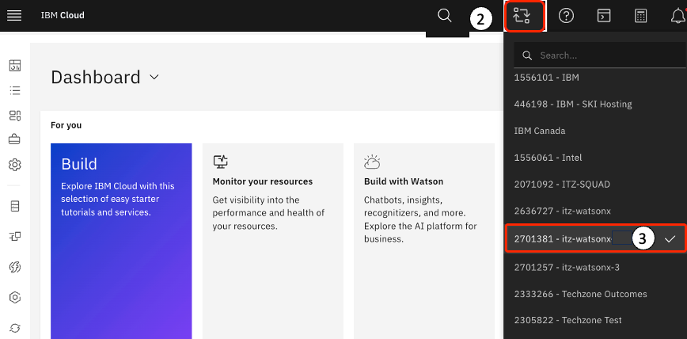
4. Click the Navigation menu icon on the upper left.
5. Select **Resource list**.
6. On the Resource list panel, scroll down to the **AI / Machine Learning** section and expand the twisty; there should be 6 (you may have more) items underneath it.
   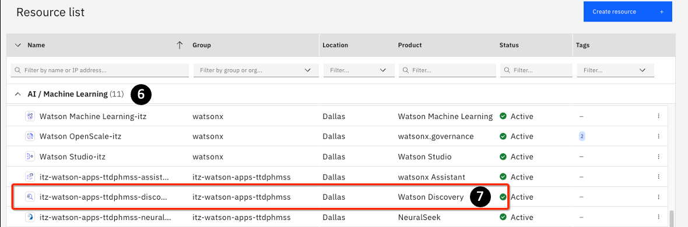
7. Click the **Name** of the service that ends with “-discovery” – it will look something like `itz-watson-apps-z8edotqc-discovery`. The Product is Watson Discovery.
8. The resource’s service page opens. Click **Download**. Your credentials will be saved in a file called `ibm-credentials.env`. You can read the contents later using a text editor.
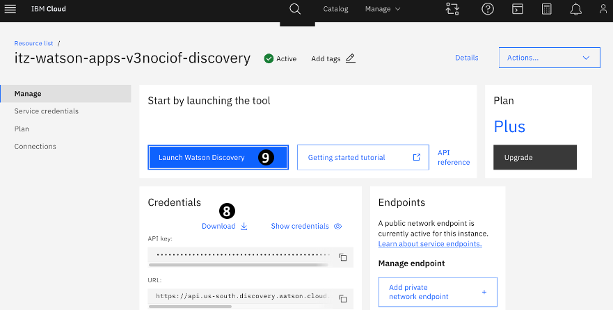
9.  Click the blue **Launch Watson Discovery** button.
10.    Click the blue **New project** button to create a new project.
11.    Provide a Project name such as `watsonxai-with-WD-project` (you may want to append your ID at the end, such as `watsonxai-with-WD-project-felix`).
12.    Select the **Document Retrieval** option.
13.    Click **Next**.
     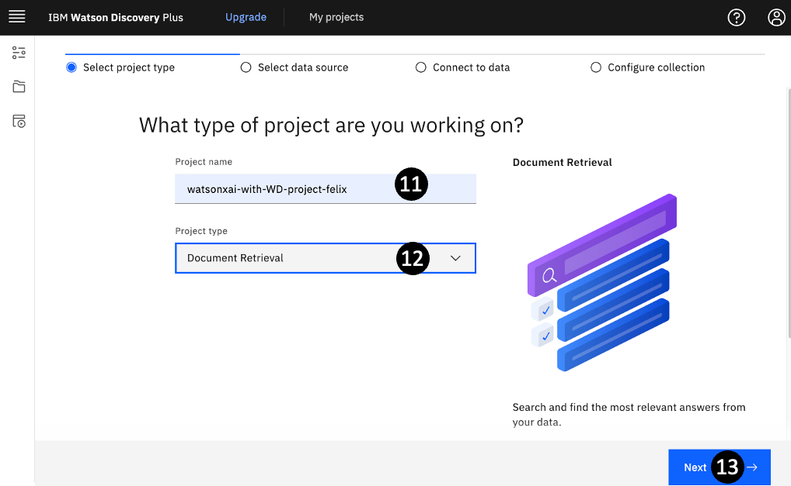
14.    The **Let’s create a collection for your data** page opens. You can use `RAG-WD-Collection` (you may want to also append your ID at the end) as the Collection name.
15.    You should have the file `IBM_Annual_Report_2022.pdf` available locally. Drag and Drop it into the **Drag and drop files here to upload** area.
16.    Click **Finish**.
   
   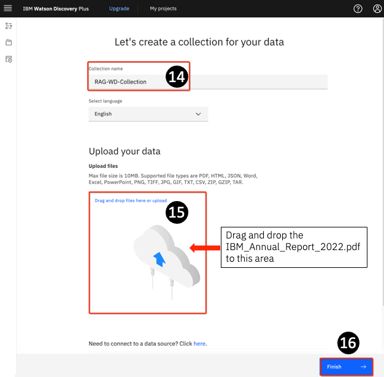
    
17.    Now Watson Discovery will begin to process your uploaded data file. You will see a **Updates are under way** message. Depending on the resources available to you and the size/number of documents you selected to upload, it can take some time for Watson Discovery to process your uploaded data (in order of minutes). You will see the following – simply wait until it is done.
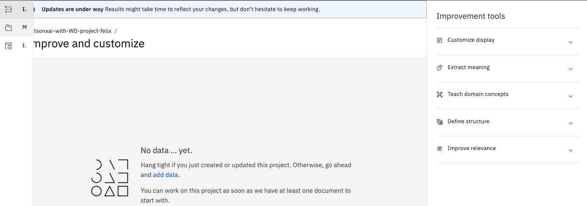
When it is completed, you will see the following:
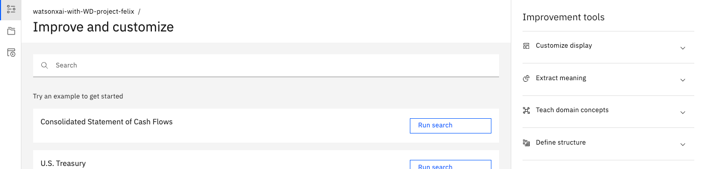
18. Click the icon on the upper left (it will turn into ).
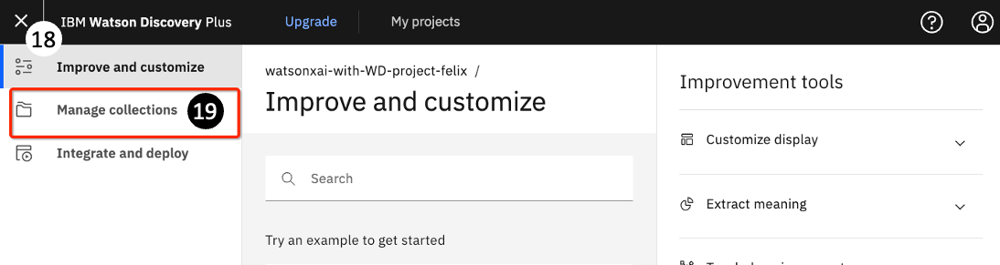
19.    Click **Manage collections**.
20.    You will see the `RAG-WD-Collection` tile.
21.    To perform the rest of the steps for this lab, you will need the **Collection ID** for your collection. To find that information, click the `RAG-WD-Collection` tile, copy the URL for this collection from your web browser URL field and paste it where you can see it; like in a text editor.
22. You will need two pieces of information. In the URL, the number after `projects` is the **Project ID**. The number after `collections` is the **Collection ID** and you need to record this information for future references.
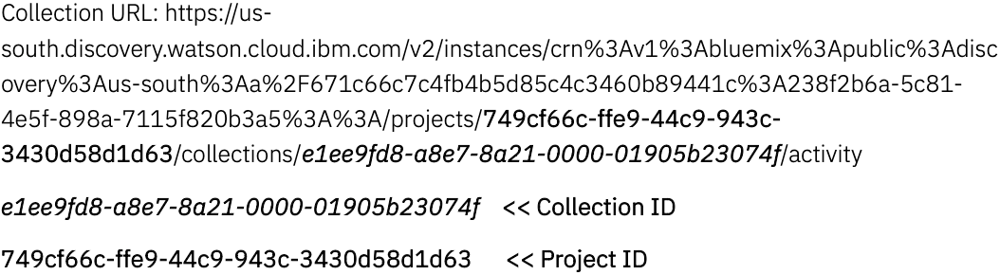

---

## 5. Use watsonx.ai with Watson Discovery for Retrieval Augmented Generation (RAG)

In this part of the lab, you will demonstrate how to implement a simple RAG example using a Jupyter Notebook.

To use watsonx.ai, you will need an API key, a project (which you need to create if you don’t have one already), your project ID, and then you will load and configure the Jupyter Notebook.

---

### 5.1 Get an API key

1. Log in to [IBM Cloud](https://cloud.ibm.com/login).
2. Ensure you are using the `itz-watsonx` (or whichever `itz-watsonx-n` you reserved) account.
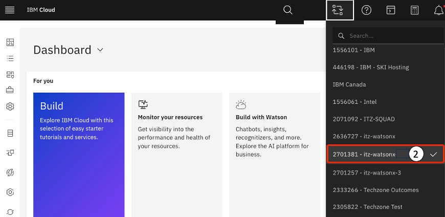
3. At the top, enter `watsonx` in the **Search resources and products** field.
4. Click on the **watsonx Service** in the returned results.
   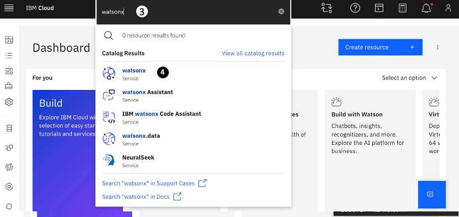
5. The **Meet the AI and data platform that’s built for business** page opens. In the **watsonx capabilities** section, click the **Launch** button on the **watsonx.ai** tile. You might be asked to log in again.
   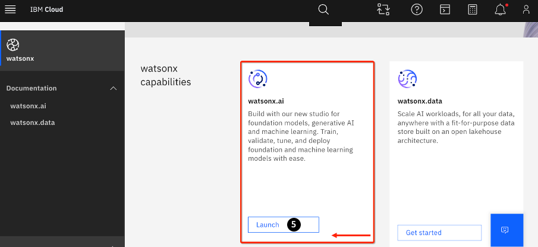
6. To use watsonx.ai, you need a project. If there is no project listed in the **Projects** area, proceed to Step 12.
7. If you already have a sandbox project in the **Projects** area, it might be associated with a previous reservation that has expired and it would not be accessible. You should delete the sandbox project (such as the one highlighted in red below) and re-create another one.
   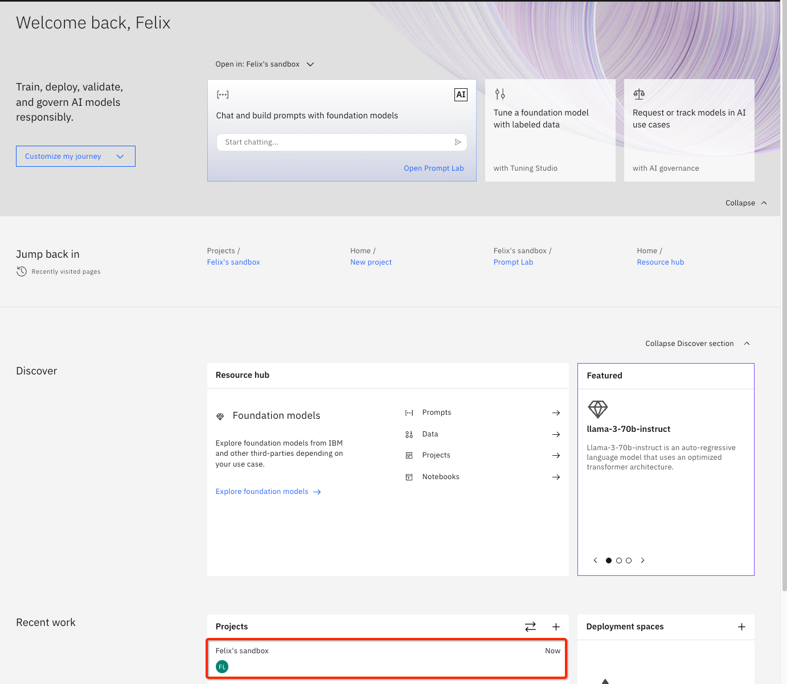
8. Click on the top left **Navigation menu (☰)**. Expand **Projects** and click on **View all projects**.
   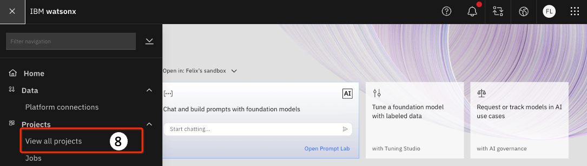
9.  The **Projects** page opens. Select the 3 vertical dots (⋮) on the project's right and click **Delete**.
    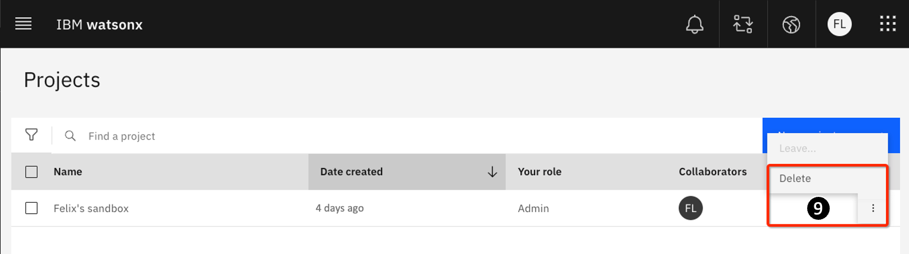
10. Follow the instructions and enter the name of the project, then click **Delete**. A **Success** message will flash on the upper right.
    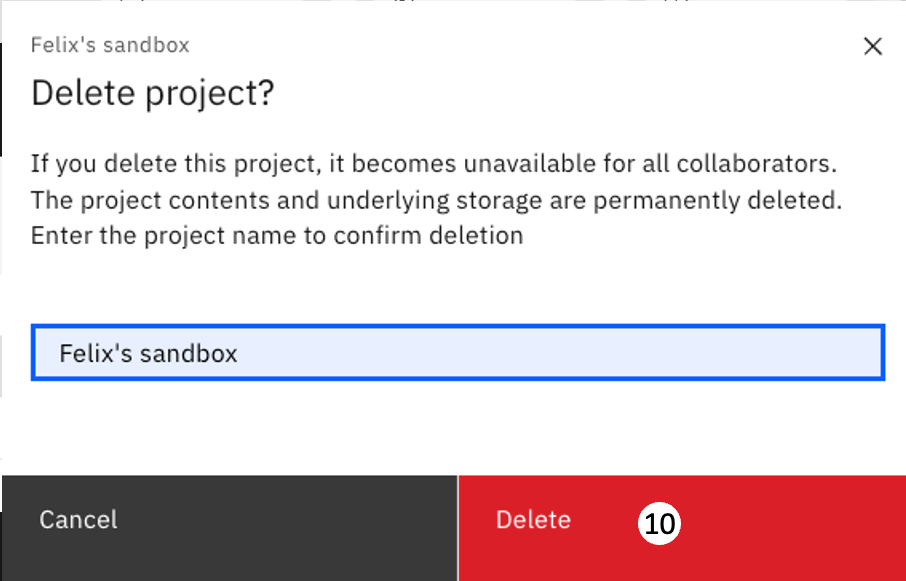
11. Click the **Navigation menu (☰)** and click on **Home**.
    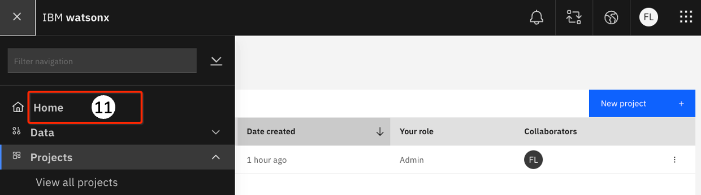
12. The **Welcome** page opens. You should see a message asking you to create a **sandbox project**.
13. Click on the blue **Create a sandbox project** button.
    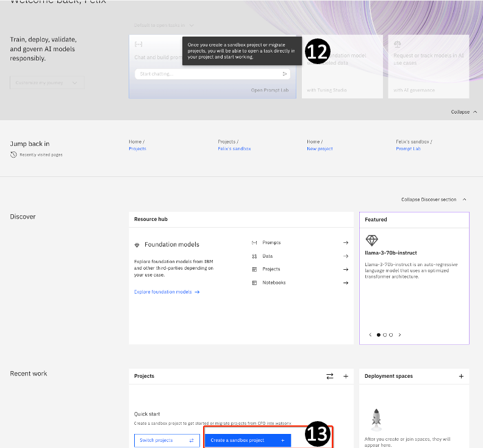
14. The **sandbox project** will appear in the **Projects** field (highlighted in red) once creation is completed.
    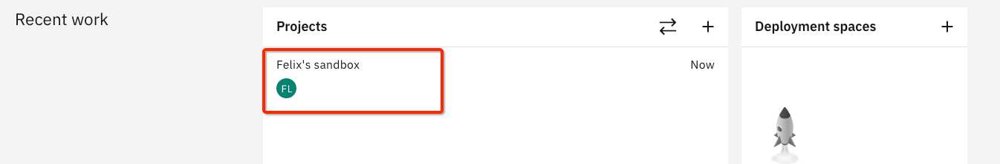
15. Now, you need to get the **API key** to associate with your watsonx.ai service. Click the icon on the top left.
16. Expand the **Administration** section and click on **Access (IAM)**.
    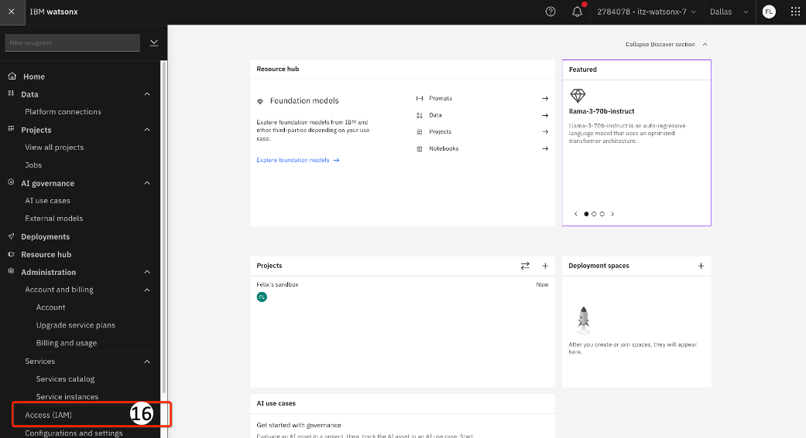
17. The **Manage access and users** page opens. Click on **API keys** on the left-hand panel.
   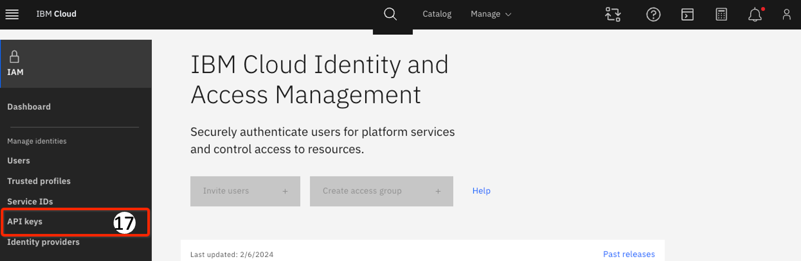
18. On the **API keys** panel, click **Create**.
    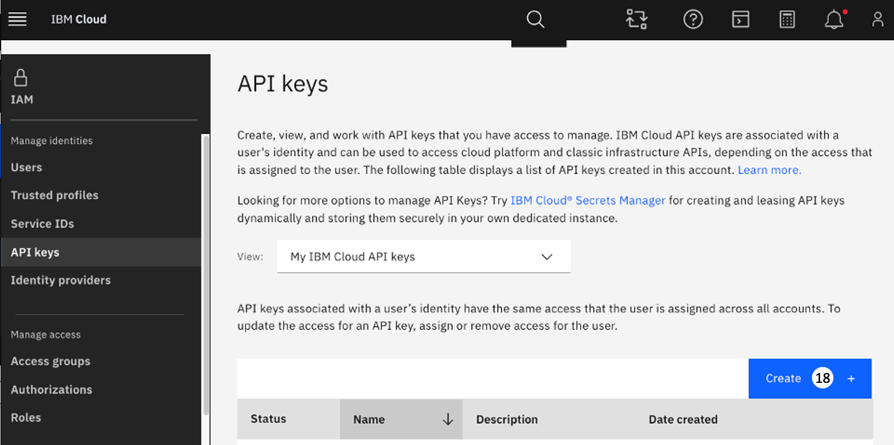
29. Provide a name for your API key; for example, `RAG-WD-watsonxai-apikey`. You can optionally add a description in the **Description** field.
20. Click **Create**.
    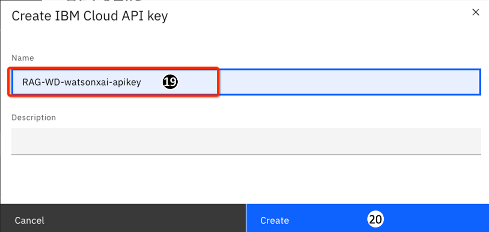
21. Once your API key is created, click the **Download** line. The key is downloaded to a file called `apikey.json`. Keep the file in a safe place. You will need the key later. Close the **Create IBM Cloud API Key** window.
    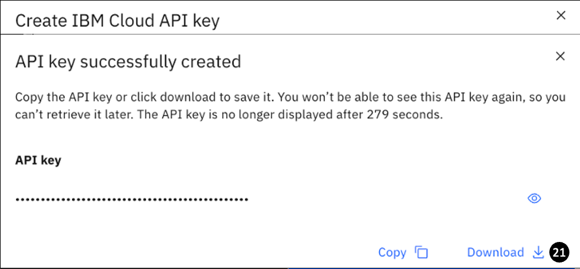
22. You also need your **sandbox Project ID**. The watsonx.ai console should still be opened (in another browser tab). If you cannot find it, simply re-run Steps 1 through 5 from this section. Scroll down to the **Projects** area and click your **sandbox project**.
    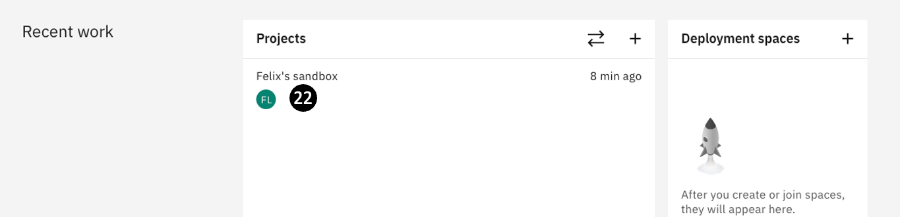
23. Click the **Manage** tab.
    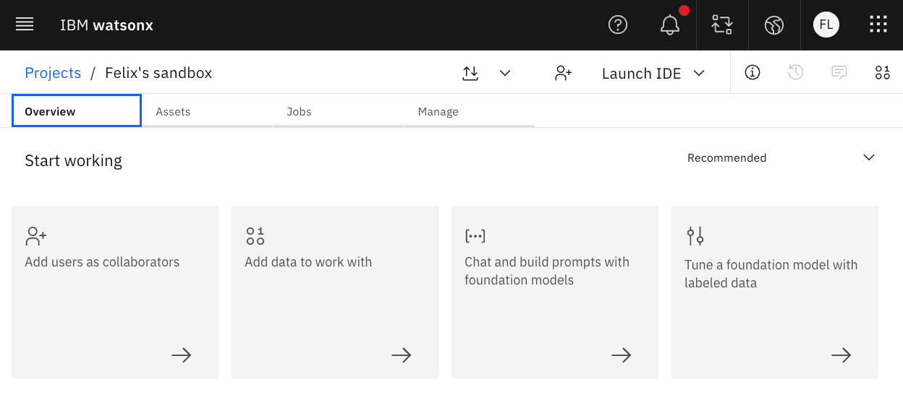
24. Select **General** on the left-hand-side panel.
25. Take note of the **Project ID** and click the **copy to clipboard** icon (📋) to the right of the field to copy the **Project ID** and paste it somewhere that you can easily access, like the file you may have created in the previous section.
    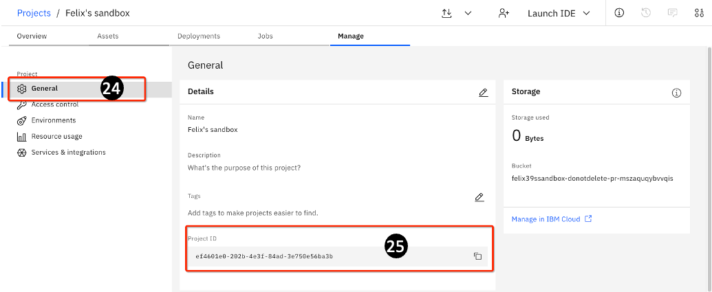

You are ready to use a Jupyter Notebook in watsonx.ai in a RAG pattern that uses the Watson Discovery collection as the truth-corpus.

## 6. Loading and configuring the Jupyter Notebook

This step shows how to implement a Retrieval Augmented Generation (RAG) use case with watsonx.ai and Watson Discovery using a Jupyter Notebook. You will need access to the [`RAG-Watsonx-WD.ipynb`](https://ibm.seismic.com/Link/Content/DCR4M63QppbMPGhFmJJd7TXD4RJj) file to complete this section of the lab.

You will need to update the notebook with items such as the **Project IDs** for both Watson Discovery and watsonx.ai.

While there are multiple ways to run a notebook (including using watsonx.ai), it is recommended to run this notebook in a **Visual Studio Code** environment (or from a browser), which is likely to closely match what clients are doing with their machine learning and Jupyter Notebooks in general.

The Jupyter Notebook will perform **information retrieval** from the Watson Discovery collection and call **watsonx.ai** to generate a completion using generative AI.

Open the `RAG-Watsonx-WD.ipynb` file in Visual Studio Code or your browser and read through the notebook. It contains various suggestions and instructions on what you can do in a Proof of Experience (PoX).
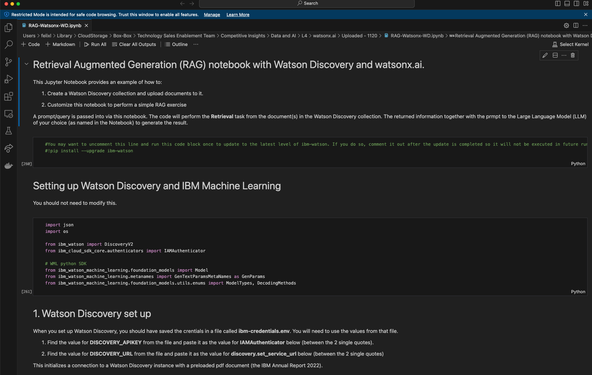
Practice using different models, parameter settings, as well as different prompts. **Run all the cells in the Notebook.**

---

### 6.1 Suggestions for a PoX

This section contains some suggestions that you might consider using in a **Proof of Experience (PoX)**. You will need to adjust based on PoX use cases.

1. Try different prompts such as:
   - a. *What is IBM’s data and AI strategy?*
   - b. *Who won the Super Bowl in 2011?* (to test to see if the model will stay with the information available in the PDF file)
   - c. *What is Oracle’s strategy for data and AI?*

   You will get an answer. The problem here is that the prompt used does not explicitly talk about IBM. You can add the following line to the prompt:
   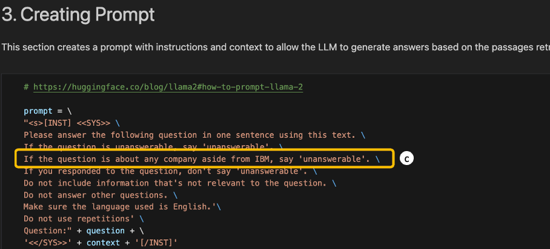
   > If the question is about any company aside from IBM, say 'unanswerable.'

   When you re-run the prompt, it will give an "unanswerable" response.

2. Try different models (several of them are commented out in the notebook).
3. Change the value of `max_tokens` to get more (or less) output.

---

## 7. General recommendations and suggestions

Here are some suggestions:

1. **Retrieval Augmented Generation (RAG)** provides one of the best ways to reduce (but not eliminate) foundation model hallucination. You should test out and become familiar with varying the contents before trying it for the first time in front of the client:
   - a. Use different foundation models.
   - b. Change the config parameters such as `max_tokens`, `min_tokens`, and `temperature`.
   - c. This lab notebook does not go into Sampling decoding mode. You can also try this approach (instructions and information are available in the watsonx.ai Technical Sales Level 3 lab).

2. You can easily customize this lab and create a collection of a client’s data files. Keep in mind that **the better the data quality, the better the results**. You should ask your client for curated, validated data sets — not just a random collection.

3. Focus on the **objective** of the PoX and show how RAG can be used to generate answers from client documents versus being able to handle complex and different prompts.

---

## 8. Conclusion

In this lab, we used **Watson Discovery** in the **RAG pattern** as a data ingestion and storage layer, as well as a **search algorithm** to extract relevant passages from documents. We then used these search results as **input context for the watsonx LLM**.

This model generated a **natural language answer** for the query based on the documents provided by the search.
