# watsonx.ai L3: Compare Foundational Models

1. Go to this page [here](https://compare-llms.1n73vwnirph6.ca-tor.codeengine.appdomain.cloud/static/#/home). Click **Login**.

   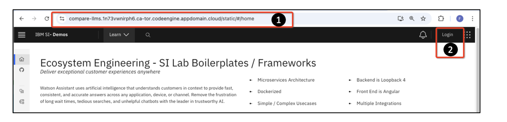

2. Click on **Login with IBMid** and login using the credentials.
   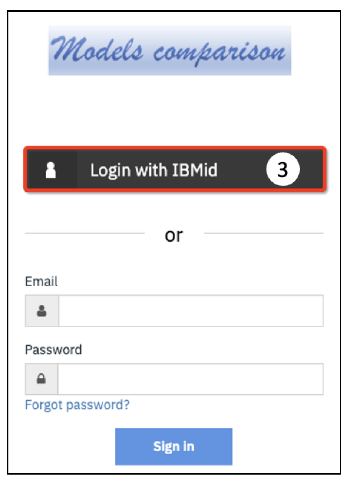

3. Verify sign in is done on the Compare Foundational Model page.

4. Once at the landing page explore different fields avaiable on the page as highlighted. There are five majore tasks available : Question Answering, Summarization, Extraction, Classification, and Generation and different models available for comparison.

   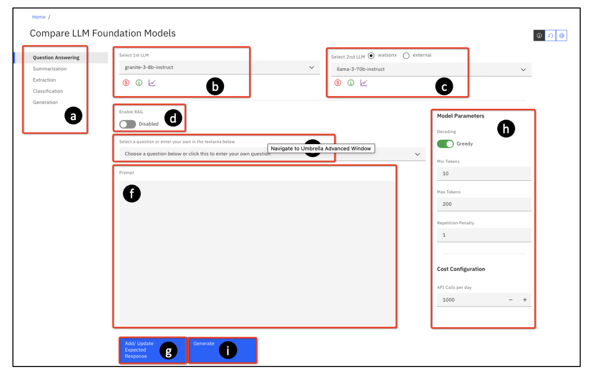

# Model Comparison
Now let us start comparing different models for different tasks, exploring different paramters and looking at a variety of metrics.

## 1. Simple Model Comparison

### Steps:

1. **Log into ComFM** – Follow the login steps from Section 4 of the ComFM documentation. If not logged out, click on the **refresh** button as shown.

   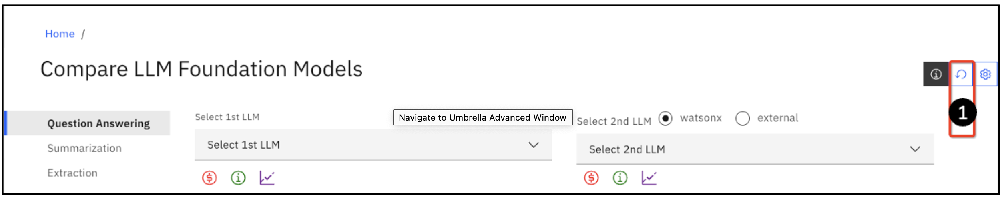

2. **Select Question Answering** – This is the default setting on the landing page. If not selected, choose it manually.  
3. **Choose Models for Comparison:**  
   - **1st LLM:** `granite-3-8b-instruct`  
   - **2nd LLM:** `llama-3-1-70b-instruct`  
4. **Enter the Question for Comparison:**  
   *What is operational risk in banks? Can you give 2/3 examples?*  
5. **Click Generate** – The tool will provide responses from both models.  

   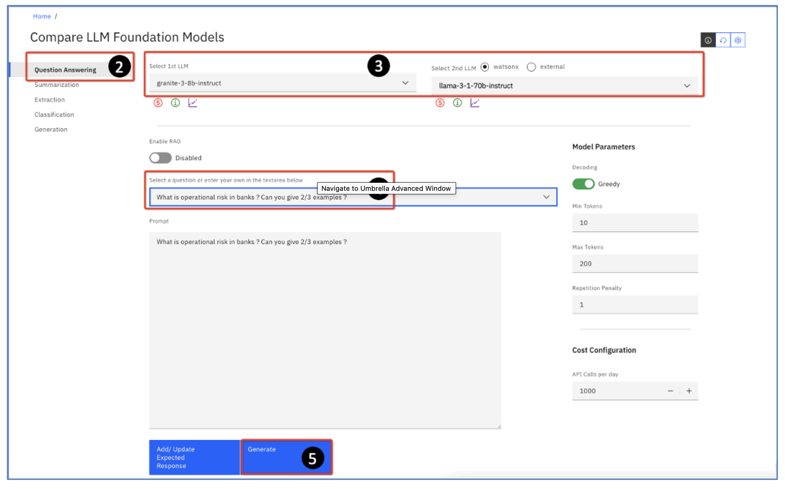

### Analyze the Output:

   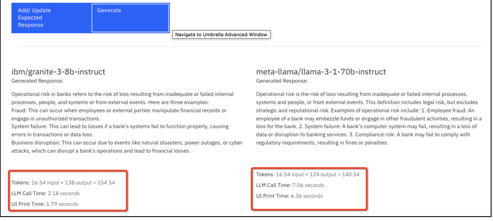

- **Token Usage** – Compare the number of tokens each model used.  
- **Response Time** – Observe the LLM Call Time for speed differences.  
- **Content Differences** – Identify variations in the examples provided by each model qualitatively.

### Scroll Down to View the Cost Graph:

   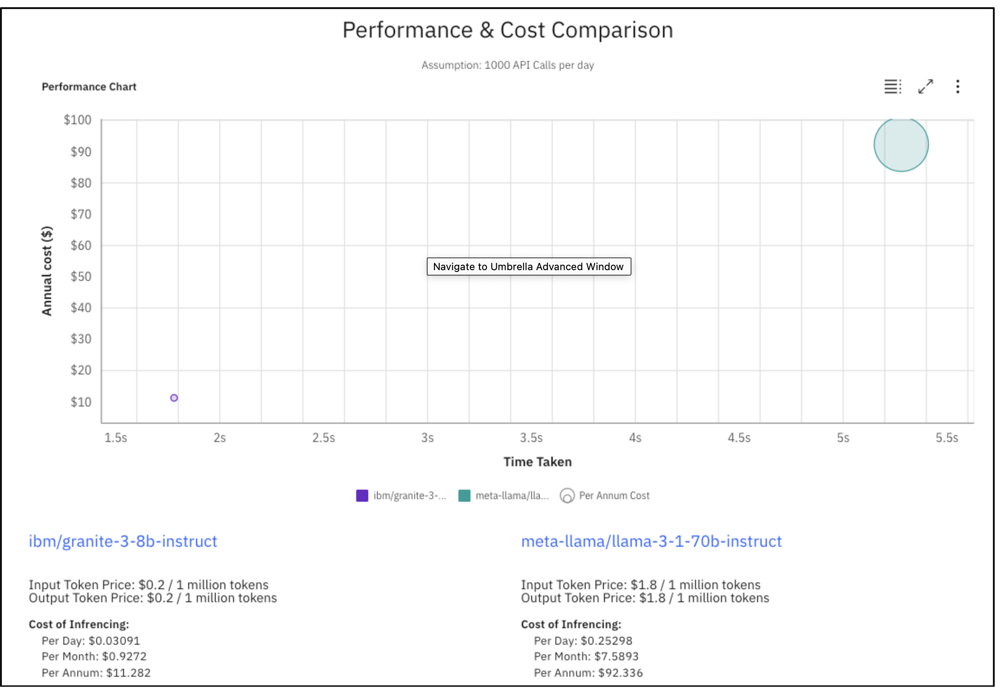

- The graph displays **Cost (Y-axis) vs. Time Taken (X-axis)**.  
- Cost is calculated based on API calls per day and published token rates.  

### Review the Evaluation Metrics:

   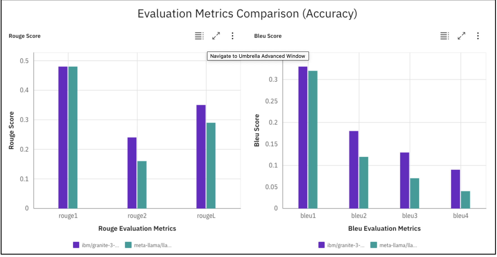

- **Rouge Score** – Measures how much of the reference text appears in the generated response (*recall-based metric*).  
- **Bleu Score** – Measures how many words in the generated text match the reference text (*precision-based metric*).  

## 3. Comparison in Sampling Mode

### Steps:

1. **Log back into ComFM** (or refresh the page if still logged in).  
2. **Ensure that you are using the correct models:**  
   - **1st LLM:** `granite-3-8b-instruct`  
   - **2nd LLM:** `llama-3-1-70b-instruct`  

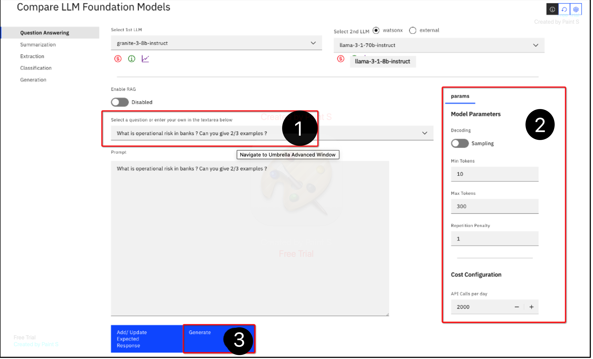

### Modify Model Parameters for Sampling Mode(2) :

- **Turn Off Greedy Decoding** – Allows the models to generate more creative responses. 
- **Set Max Tokens to 300** – Increases response length for more detailed answers.  
- **Increase API Calls per Day to 2000** – Simulates a high-volume usage scenario.  

### Enter the Same Question(1) :

*What is operational risk in banks? Can you give 2/3 examples?*  

**Click Generate.(3)**  

### Observe the Differences in Output:
- Because of the Sampling mode, different outputs will be recieved.
- **Both models produce longer responses** due to the increased max tokens setting.  
- **Granite Model Changes:**  
  - Fraud and System Failure remain.  
  - Business Disruption is replaced by Human Error.  
- **Llama Model Changes:**  
  - Lists Dumb and Deliberate (Human Error), Unfortunate Events, and Management Failure.  
  - Introduces hallucinations by discussing unrelated financial risks.  

### Compare Processing Time:
As shown above, each models will show completion time and in this case :
- **Granite Model:** Completes in **3.44 seconds**.  
- **Llama Model:** Takes **14.41 seconds**, significantly longer.  

### Review Cost Estimations:
As shown above, each models will show cost and in this case :
- The **Llama model is significantly more expensive**, especially at higher query volumes.  

### Analyze Accuracy Metrics:

You can also review the metrics as seen in the image earlier. In this case :

- **Granite Model Scores Higher on Rouge and Bleu**, showing better alignment with relevant information.  

# Model Comparison in a Text Generation Use Case

## Steps:

### 1. Log into ComFM and Select Text Generation Mode.
   - Open ComFM and navigate to the Text Generation mode.
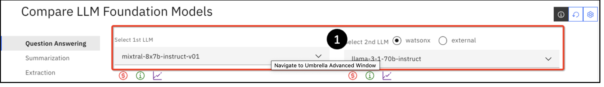
### 2. Choose Models for Comparison:
   - **1st LLM**: `mixtral-8x7b-instruct-v01`
   - **2nd LLM**: `llama-3-1-70b-instruct`

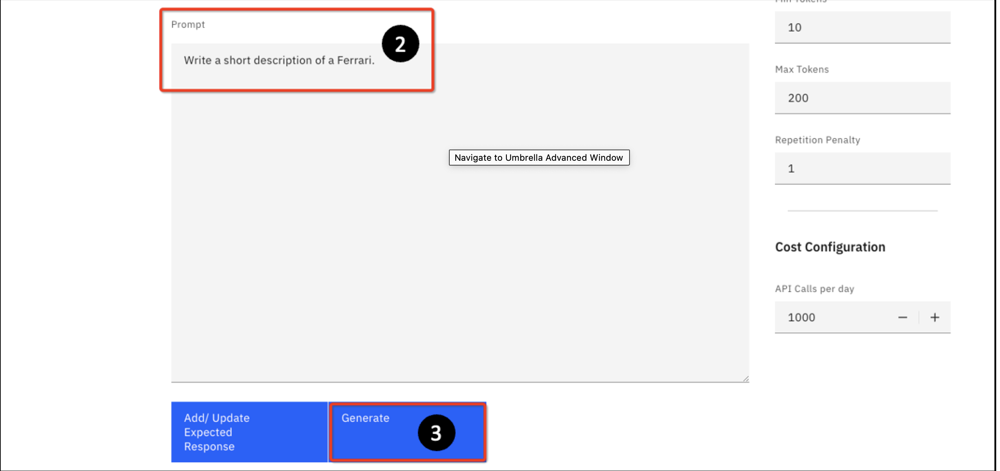
### 3. Enter a Prompt for Generation:
   - **Prompt**: "Write a short description of a Ferrari."

### 4. Click Generate:
   - Both models will provide different text completions based on the prompt.However, there are no evaluation metrics. The reason is that in a generation use case like this, to evaluate properly requires a “model answer” so the completions can be evaluated against that.

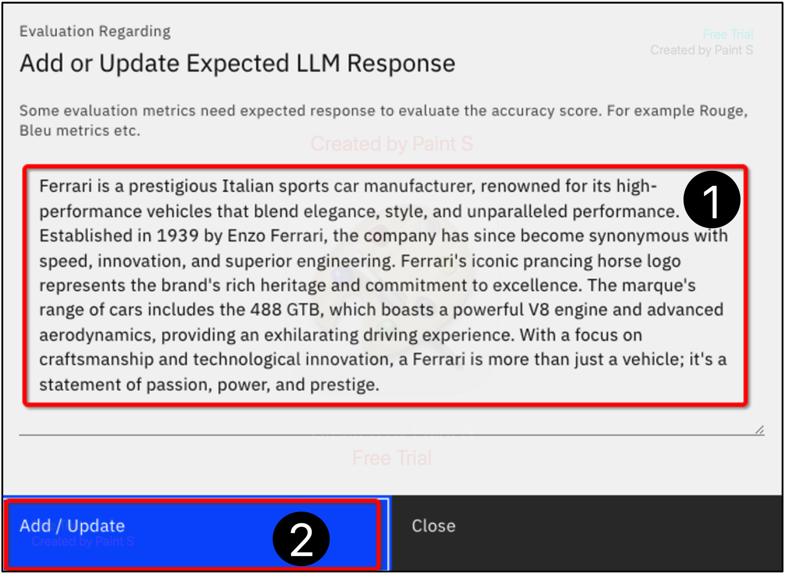
### 5. Add an Expected Answer for Evaluation(1):
   - Click **Add/Update Expected Response**.
   - Paste a high-quality reference response:
     ``` 
     Ferrari is a prestigious Italian sports car manufacturer, renowned for its high-performance vehicles that blend elegance, style, and unparalleled engineering...
     ```

### 6. Click Add/Update(2).

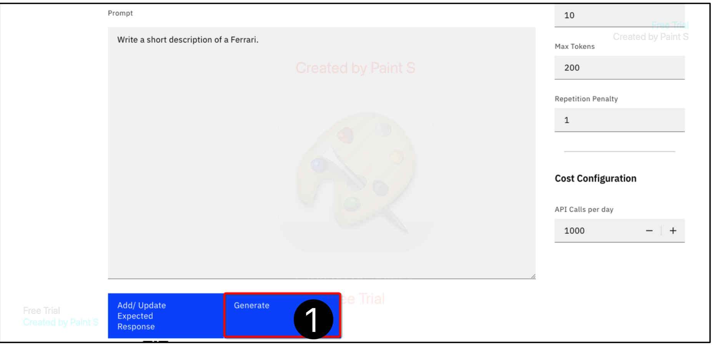
### 7. Click Generate Again:
   - ComFM will now evaluate the models against the reference answer.


### 8. Review the Evaluation Metrics:
   - Since a reference answer is provided, **Rouge** and **Bleu** scores will be calculated as shown in earlier images.
   - Higher scores indicate closer alignment with the reference.

# Model Comparison in RAG Use Cases with ComFM**

This guides you through comparing two generative AI models, **granite-3-8b-instruct** and **llama-3-70b-instruct**, using the ComFM tool for a Retrieval-Augmented Generation (RAG) use case.

## Steps:

### 1. **Log into ComFM**
   - Log into the **ComFM** tool.

### 2. **Select LLMs**
   - **1st LLM**: granite-3-8b-instruct
   - **2nd LLM**: llama-3-70b-instruct

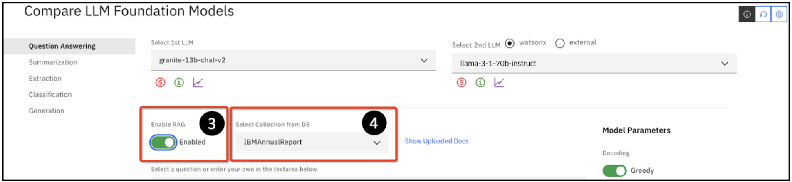

### 3. **Enable RAG**
   - Enable **RAG** to allow the tool to fetch context from a document.

### 4. **Choose Grounding Document**
   - Select the **IBM_Annual_Report_2022** PDF as the grounding document.

### 5. **Enter Prompt**
   - Prompt: `What is IBM’s strategy for sustainability?`

### 6. **Retrieve Context**
   - Click **Retrieve Context** to fetch relevant sections from the document.

### 7. **Review Instructions**
   - Check the **INSTRUCTIONS** section for system directives on formatting and accuracy.

### 8. **Generate Answer**
   - Click **Generate** to produce the output based on the retrieved context.

### 9. **Compare Outputs**
   - **granite**: Mentions net-zero goal by 2030, inclusion, and trust.
   - **llama**: Adds client sustainability initiatives, alongside ethical impacts.

### 10. **Cost Comparison**
   - **granite**: $0.2 per million tokens
   - **llama**: $1.8 per million tokens (9x more expensive)

### 11. **Adjust Token Limits**
   - Set **Min Tokens** to 200 and **Max Tokens** to 400, then click **Generate** again.
   - **granite** adds more detail, including client initiatives, while **llama** outputs a summary table.

### 12. **Evaluate Model Performance**
   - **Low Min Tokens (10)**: **llama** performs better.
   - **High Min Tokens (200)**: **granite** provides more detailed answers.

### 13. **Experiment**
   - Try different models, configurations, and prompts to compare results.

# **Tutorial: RAG Use Case with Expected Output**

This tutorial explains how to provide an **expected response** in a RAG use case to evaluate models more effectively.

## Steps:

### 1. **Clear Session**
   - If still logged in from Section 6.1, click the **Refresh icon** to clear the session.
   - If logged out, log back into the **ComFM** tool.

### 2. **Select Models**
   - **1st Model**: granite-3-8b-instruct
   - **2nd Model**: llama-3-1-70b-instruct

### 3. **Enable RAG**
   - Enable **RAG** and select the **IBM_Annual_Report_2022** as the grounding document.

### 4. **Enter Prompt**
   - Prompt: `What is IBM’s strategy for sustainability?`

### 5. **Add Expected Response**
   - Click **Add / Update Expected Response**.
   - In the dialog box, paste the following expected response:
     ```
     IBM's sustainability strategy:
     - Achieve net-zero operational greenhouse gas emissions by 2030
     - Reduced emissions by 61% since 2010
     - Uses sustainability solutions to simplify and automate reporting processes
     
     IBM's broader impact goals:
     - Protect the environment
     - Advocate for inclusion
     - Foster trust and transparency in technology and business
     ```

### 6. **Click Add / Update**
   - Click the **Add / Update** button to save the expected response.

### 7. **Generate Answer**
   - Click **Generate** to produce the output based on the prompt and the expected response.

### 8. **Evaluate Metrics**
   - Review the evaluation metrics to compare the model outputs.
   - In this case, **granite** will likely outperform **llama** in most cases (except RougeL), as expected responses are provided.

### 9. **Review Model Performance**
   - The **expected output** is a simplified point-form version of granite’s original output.
   - Granite’s output will be compared to this expected response, showing it evaluates better under these conditions.

# Comparing with Other Models Using the OpenAI API**

This tutorial demonstrates how to compare the **granite-13b-chat-v2** model with OpenAI's **gpt-4** using the ComFM tool. For this, you would need to generate Open AI API secret key. Instructions can be found here.

## Steps:

### 1. **Go to ComFM Tool**
   - Return to the **ComFM** tool.

### 2. **Select LLMs**
   - **1st LLM**: granite-13b-chat-v2
   - **2nd LLM**: Select **external**.

### 3. **Enter OpenAI API Key**
   - Enter your **OpenAI API key** (from Step 12 in Section 5.4.2).

### 4. **Add API Key**
   - Click **Add/Update** after entering your API key.

### 5. **Expand 2nd LLM List**
   - On the landing page, expand the **Select 2nd LLM** list.

### 6. **Select GPT-4**
   - From the list, select **gpt-4** (or another available model).

### 7. **Enable RAG**
   - Enable **RAG** and use the **IBM_Annual_Report_2022** as the grounding document.

### 8. **Select a Query**
   - Choose a query, e.g., `Can you provide details on the $2 billion spent on acquisitions in 2022? What strategic objectives do these acquisitions serve?`

### 9. **Generate Answer**
   - Click **Generate** to compare the models' outputs.

### 10. **Compare Outputs**
   - The generated content from both models will be displayed.
   - **granite-13b-chat-v2** (13B parameters) is faster, completing the generation in ~4.7 seconds.
   - **gpt-4** (1.7 trillion parameters) takes ~12.5 seconds (almost 3x longer).

### 11. **Cost of Inference Comparison**
   - **gpt-4**: Estimated to cost $35,000/year for 1000 APIs per month.
   - **granite-13b-chat-v2**: Estimated to cost under $1,000/year for the same usage.
