<QuizAlert text='Heads Up! Quiz material will be flagged like this!' />

# watsonx.ai L3 Part 1: Basic navigation and zero shot prompting

Watsonx.ai is a core component of watsonx, IBM's enterprise-ready AI and data platform designed to multiply the impact of AI across a business. The watsonx.ai component makes it possible for enterprises to train, validate, tune, and deploy traditional AI and generative AI models.

> NOTE: If you are completing this lab in an IBM workshop/classroom setting, the watsonx.ai instance will be shared among all students. You should have been invited to an IBM cloud account and added to a watsonx.ai project with name format: `VEST-Labs-{Location}-{MMDD}` where _Location_ is the location and _MMDD_ indicates the month and day of your workshop.

## Watsonx.ai console

We'll start with a quick explainer of the watsonx.ai console. First, [follow these instructions](/watsonx/watsonxai/100#accessing-watsonxai-from-ibm-cloud) to access the watsonx.ai homepage.

The homepage will look similar to the following:

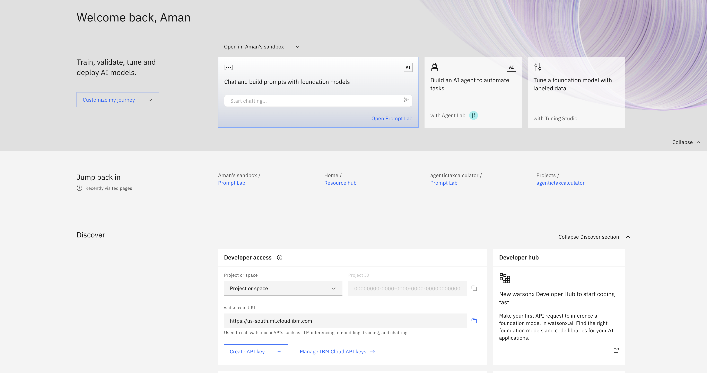

There are various sections that can be explored.

## Prompt Lab - Basic Navigation

<QuizAlert text='Quiz question on Prompt Lab capabilities!' />

1. Now, let us start by exploring prompt lab. For prompt lab, first a sand box will need to be created as shown here :

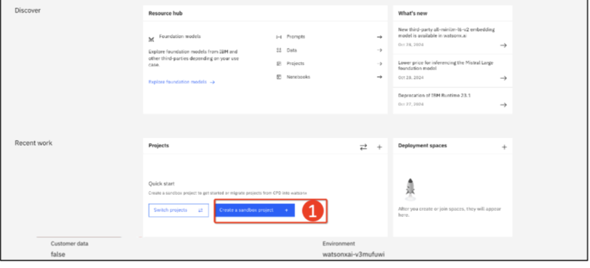

2. Sandbox created and appears above.

3. Enter the prompt lab as shown.

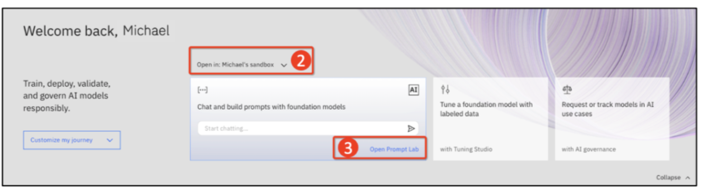

If this is your first time accessing the prompt lab in this account, you'll be prompted to acknowledge a few points related to generative AI models and optionally take a tour.

Whether you decide to take the tour or not, you should end up on the prompt lab UI, which is where we will begin!

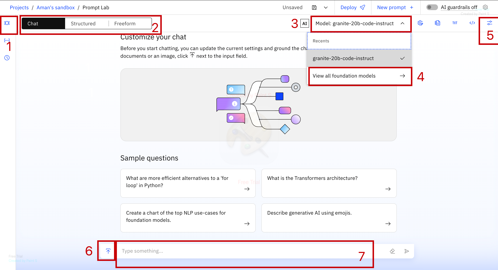

This lab will cover a core subset of the Prompt Lab capabilities. For an initial explanation of the UI, lets walk through the numbered sections:

1. **Sample Prompts**: Sample templated will be found here.

2. The ability to toggle between **Chat**, **Structured** prompt or **Freeform** prompt editors.

   a. **Structured** prompt is the default and provides guidelines for prompt creation.

   b. **Freeform** prompting shows one text area to interact with the foundation model. Likely preferred by more experienced users.

   c. **Chat** is the normal chat interface.

3. Use the dropdown to choose between different foundation models.

4. Different foundation models available on the platform can be found under **View all foundation models**. Different models and filters are provided here :

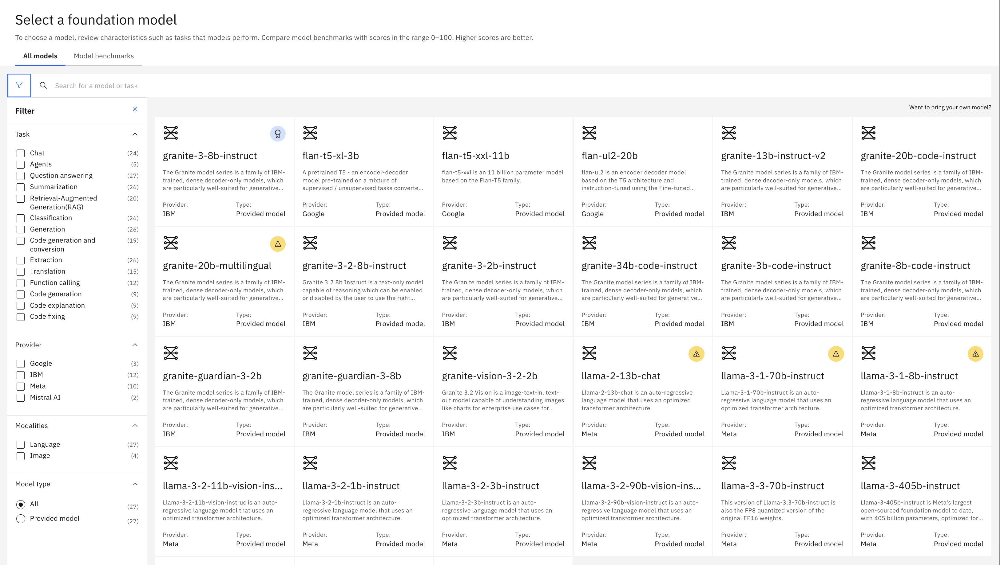

5. Models parameters can be explored and configured here.

6. A file can be uploaded here.

7. Prompt can be entered here and output recieved.

More information will be discussed as we progress through the labs.

## Exploring foundation models with a zero-shot prompt

These are the available foundation models in watsonx.ai as of March 2024.

| Model                       | Architecture    | Parameters | Trained by               | Usage                                                                                                            |
| --------------------------- | --------------- | ---------- | ------------------------ | ---------------------------------------------------------------------------------------------------------------- |
| Starcoder-15-5b \*          | Decoder only    | 15.5b      | BigCode                  | Code generation, Code conversion                                                                                 |
| mt0-xxl-13b                 | Encoder-decoder | 13b        | BigScience               | Generation, Summarization, Classification, Question Answering                                                    |
| codellama-34b-instruct-hf   | Encoder-decoder | 34b        | Code Llama               | Code generation and conversion                                                                                   |
| flan-t5-xl-3b               | Encoder-decoder | 3b         | Google                   | Generation, Extraction, Summarization, Classification, Question Answering, RAG                                   |
| flan-t5-xxl-11b             | Encoder-decoder | 11b        | Google                   | Generation, Extraction, Summarization, Classifciation, Question Answering, RAG                                   |
| flan-ul2-20b                | Encoder-decoder | 20b        | Google                   | Generation, Extraction, Summarization, Classification, Question Answering, RAG                                   |
| mixtral-8x7b-instruct-v01-q | Decoder only    | 46.7b      | Mistral AI, tuned by IBM | Summarization, RAG, Classification, Generation, Code generation and conversion, Extraction                       |
| llama-2-13b-chat            | Decoder only    | 13b        | Meta                     | Generation, Extraction, Summarization, Classification, Question Answering, RAG, Code generation, Code conversion |
| llama-2-70b-chat            | Decoder only    | 70b        | Meta                     | Generation, Extraction, Summarization, Classification, Question Answering, RAG, Code generation, Code conversion |

\* Deprecated

More will be added as other foundation models are vetted and deemed appropriate for watsonx.ai.

### Model details
You can click on the model from the list of foundational models, to see the details and scroll down to see various details regrding the model. Here is an example : 

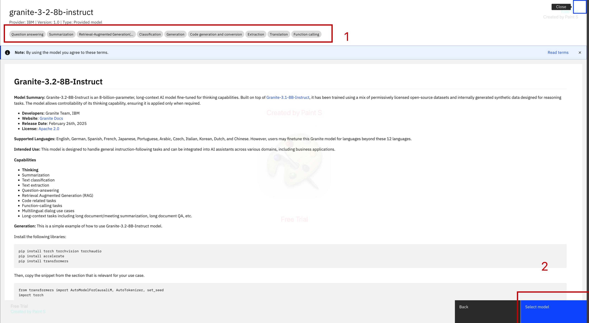
various use cases of the model can be seen here(1) and the model can be selected to further use(2).

Scroll further below, you can see different information for different models as below :
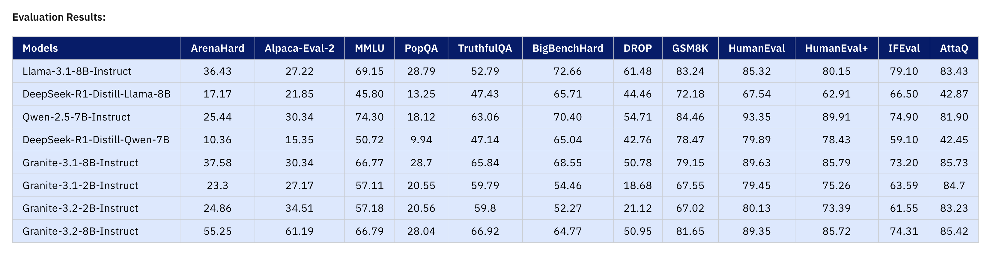

Some models might also have **Training Taxonomy** option, to see a detailed tree of the taxonomy of training data used to train the model.

# Comparing Instruct Models (Llama-3 vs. Granite 3.0)

now, we'll compare two instruct models: **Llama-3-1-8b-instruct** and **Granite-3-8b-instruct**, focusing on summarization tasks. You'll follow steps to evaluate both models and understand their differences in output format and behavior.

---

## Step 1: Select the Freeform Tab in Prompt Lab

1. Open the **Prompt Lab** interface.
2. Select the **Freeform** tab to begin working with your prompt.

---

## Step 2: Prepare the Input Prompt

1. Click on the **freeform** tab.

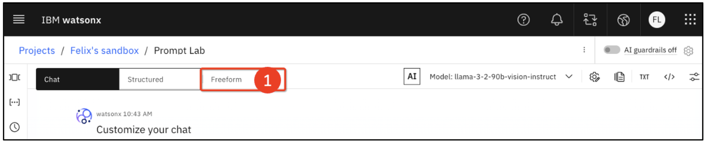

**The following document is a transcript from a financial earnings call. Read the document and then write a summary in point form.

Document: Financial Highlights

I’ll start with the financial highlights of the fourth quarter. We delivered $8 billion in revenue, $1.5 billion of operating pre-tax income, and operating earnings per share of $1.5. In our seasonally strongest quarter, we generated $2.5 billion of free cash flow. Our revenue for the quarter was up over three percent at constant currency. While the dollar weakened a bit from 90 days ago, it still impacted our reported revenue by over $500 million – and 3 points of growth. Revenue growth this quarter was again broad-based. Product Sales revenue was up eight percent and Services up nine percent. These are our growth vectors and represent over 35 percent of our revenue. Within each of these segments, our growth was pervasive. We also had good growth across our geographies, with mid-single-digit growth or better in the Americas, EMEA, and Asia Pacific. And for the year, we gained shares overall. We had strong transactional growth in Product Sales to close the year. At the same time, our recurring revenue, which provides a solid base of revenue and profit, also grew. Earnings Prepared Remarks Earnings were up 8.5 percent from last year. Looking at our profit metrics for the quarter, we expanded the operating pretax margin by 85 basis points. This reflects a strong portfolio mix and improving Product and Consulting margins. These same dynamics drove a 30-basis point increase in operating gross margin. Our expense was down year to year, driven by currency dynamics. Within our base expense, the work we’re doing to digitally transform our operations provides flexibility to continue to invest in innovation and in talent. Our operating tax rate was 7 percent, which is flat versus last year. And our operating earnings per share of $1.5 was up over seven percent. Turning to free cash flow, we generated $2.5 billion in the quarter and $4.5 billion for the year. Our full-year free cash flow is up $1 billion from last year.

Summary:

**

---

## Step 3: Run the Llama-3-1-8b-Instruct Model
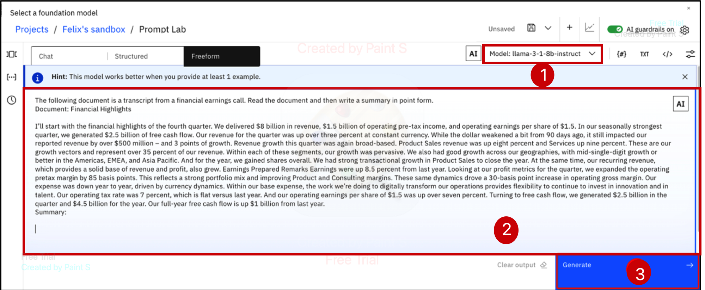

1. Click on the model name (for example, **flan-ul2-20b**) to open the model drop-down menu. If **Llama-3-1-8b-instruct** does not appear in the list, click **View all foundation models** to display the full model list. Select **Llama-3-1-8b-instruct**
from the list as shown.
2. Enter the prompt in the text field as shown.
3. Click **Generate** to run the model.

### Output from Llama-3-1-8b-Instruct:

- The model generates a **bullet-point summary**. Here's an example output:

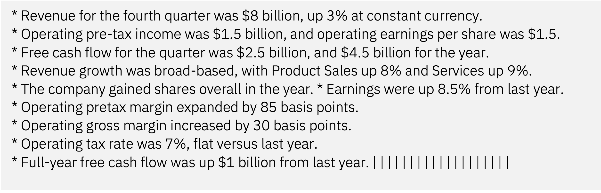
- **Note**: The output might contain extra characters such as vertical bars (**||||||||**), which can be removed if necessary.

## Step 4: Run the Granite-3-8b-Instruct Model

1. **Clear the output** from the previous model by clicking the **Clear output** icon.
2. Re-run the process by following above steps and select the **Granite-3-8b-instruct** model (this model became available on October 21, 2024).
3. Click **Generate** to run the Granite model.

### Output from Granite-3-8b-Instruct:

- The model generates a **numbered list** with a more verbose summary. Example output:

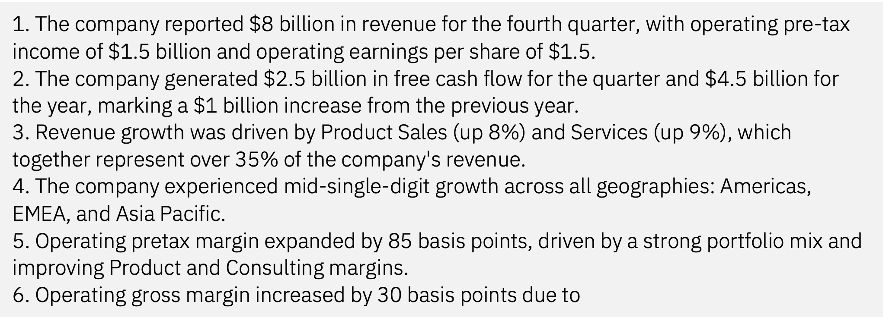

---

## Step 5: Adjust Max Tokens (if the output is cut off)
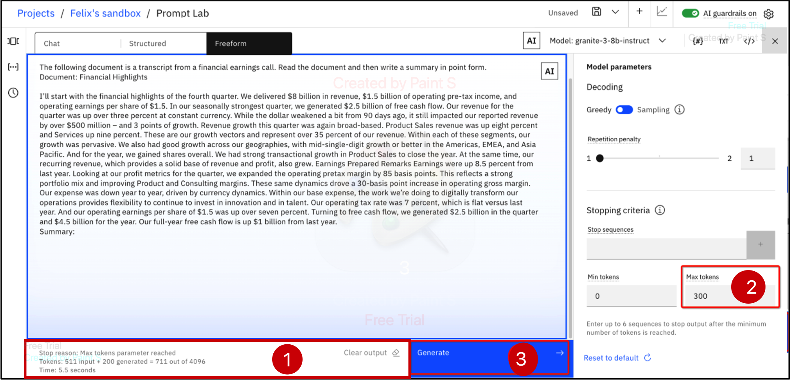
1. As can be seen, since the model is wordy, it runs out of token.
2. Click the **Model parameters icon** to adjust the settings and increase **Max tokens** to **300** to allow the model to complete the summary.
3. **Clear the output** and click **Generate** again to get the full result. You will be able to see that the model completed the entire generation.

---

## Step 6: Key Differences Between Models

- **Llama-3-1-8b-Instruct Model**:
- Output format: **Bullet points** (concise).
- Use case: Ideal for **presentations** or **quick summaries**.
- Requires minimal tokens, and output is short and to the point.

- **Granite-3-8b-Instruct Model**:
- Output format: **Numbered list** with more **detailed** text.
- Use case: Better for **detailed reports** or **emails**.
- Requires more tokens for detailed output. The output is more verbose and complete.

---

## Step 7: Explore More Granite 3.0 Models

You can explore other Granite 3.0 models available on **watsonx.ai**.

## Comparing Multimodal vs Text-Only Models (Llama-3-2-11b-Vision-Instruct)

We'll explore the differences between **multimodal** models and **text-only** models using the **llama-3-2-11b-vision-instruct** model on **watsonx.ai**. This model is capable of processing both text and images, enabling it to generate outputs based on visual input, which is a key distinction from previous text-only models.

---

## Step 1: Download the Table Image

1. Download the image file used for the lab by visiting the following link:
   - [Download Table Image (PNG)](https://ibm.seismic.com/Link/Content/DC26X6HpcJjb88qP4q847CVFGPWG)
2. Click the **download button** (located at the top right of the page).
3. Save the image file on your computer.

---

## Step 2: Open Prompt Lab

1. Open the **Prompt Lab** interface, or click on the **Prompt Lab window** if it is still open.
2. In Prompt Lab, click on the **Chat** tab and open the **model selection dropdown menu** to begin the process of selecting a model as discussed above.

---

## Step 3: Select the Model

1. Click **View all foundation models** in the model selection dropdown menu.
2. Either **scroll** through the list or use the **filter** option to find the **llama-3-2-11b-vision-instruct** model under multimodal models.
3. Click on the **llama-3-2-11b-vision-instruct** model tile to select it.
4. Inspect the model card to understand the tasks model is designed to perform. You will see that this model is designed to handle both text and image inputs, providing text-based outputs.

---

## Step 4: Upload the Image

1. Click the **upload button** (a small icon on the left side of the **Type something...** field).
3. In the popup menu, click **Add image**.
4. Click the **Browse** button, navigate to where you saved the image downloaded in Step 1, select the image file, and click **Open** (for MacOS, you may need to select **Upload** instead).
5. Once the image is added, it will appear above the **chat bar**.
   - **Note**: Don't worry about the image’s sizing; it may appear stretched, but this will not affect your results.

---

## Step 5: Input the Prompt

1. Copy and paste the following prompt into the **Type something...** field:

**Extract the data from this table and turn it into a markdown table.**

2. Press the **Enter key** or click the **Send** icon on the right side of the text input field.

---

## Step 6: Review the Model’s Output

- The **llama-3-2-11b-vision-instruct** model will process the image and generate a **markdown table** based on the data in the uploaded table image.

The above **Steps** can be seen below in the image.

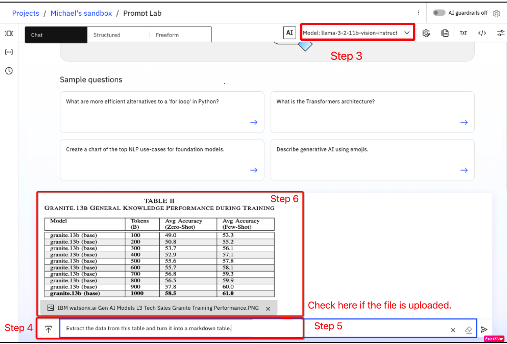

---

## Step 7: Ask the Model a Question

1. Now, enter the following prompt into the **Type something...** field:

**Which single step represents the largest increase in accuracy for Zero-Shot?**

2. Press **Enter** to submit the question.

### Expected Output:

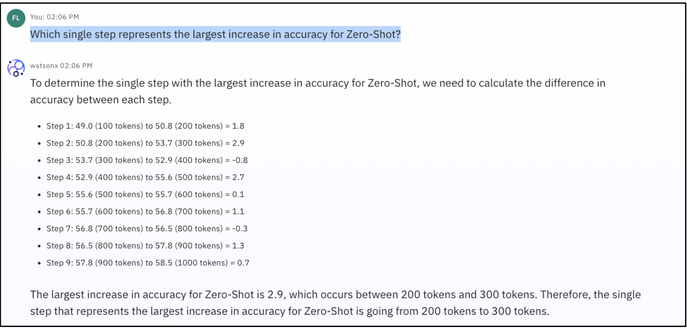

- The **llama-3-2-11b-vision-instruct** model will analyze the data in the table and deduce that the largest increase in accuracy occurs when moving from **100 tokens to 200 tokens**.

---

## Section Summary

- **Multimodal models** allow you to input both text and image data to perform various tasks, such as:
- **Classification** (e.g., identifying objects like fruit, car brands, tools, etc.).
- **Summarization** (e.g., describing what is shown in an image or the level of damage to an object).
- **Text generation** (e.g., producing markdown tables or textual summaries from images).

- These models offer exciting possibilities for **client use cases** by enabling a wider range of applications that involve both visual and textual data.

**Considerations**:
- Multimodal models are generally **larger** and **costlier** to use, especially when processing images.
- Clients should be mindful of these models’ **availability** and carefully select them based on their specific **needs**.

# Custom Foundational Models

In addition to the models provided by watsonx.ai, clients can deploy their own **Custom Foundation Models (CFM)**, often referred to as **Bring Your Own Model (BYOM)**. This feature allows you to leverage models that you have already tuned or used, while also utilizing various features of watsonx.ai. 

> **Note:** Custom Foundation Models (CFMs) can also be deployed to **watsonx.ai** for clients who have specific, pre-trained models they wish to use for supported model architecutres.
