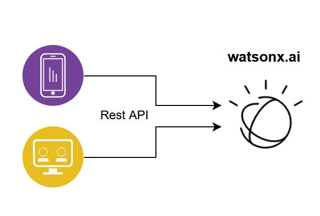
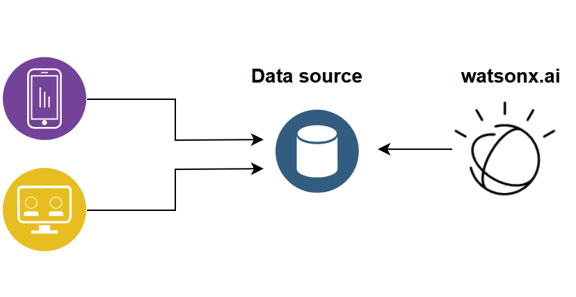
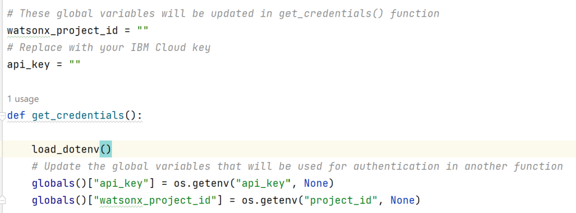
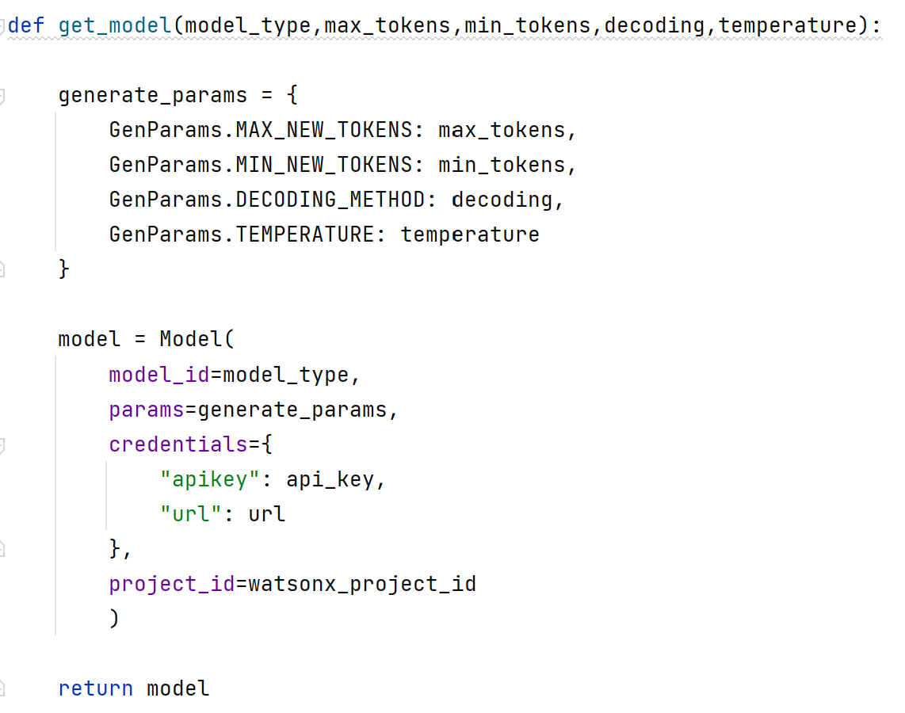
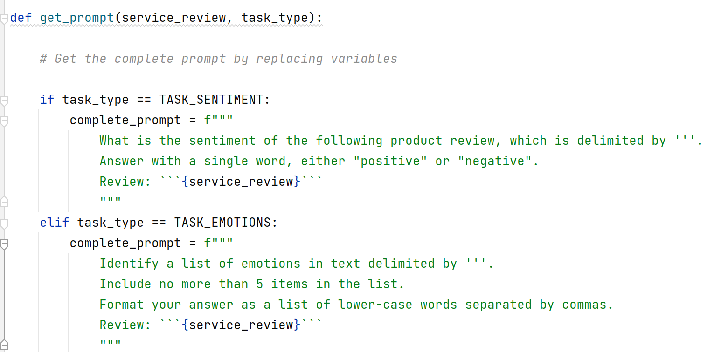
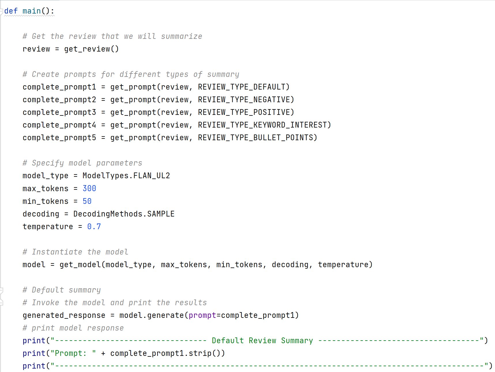
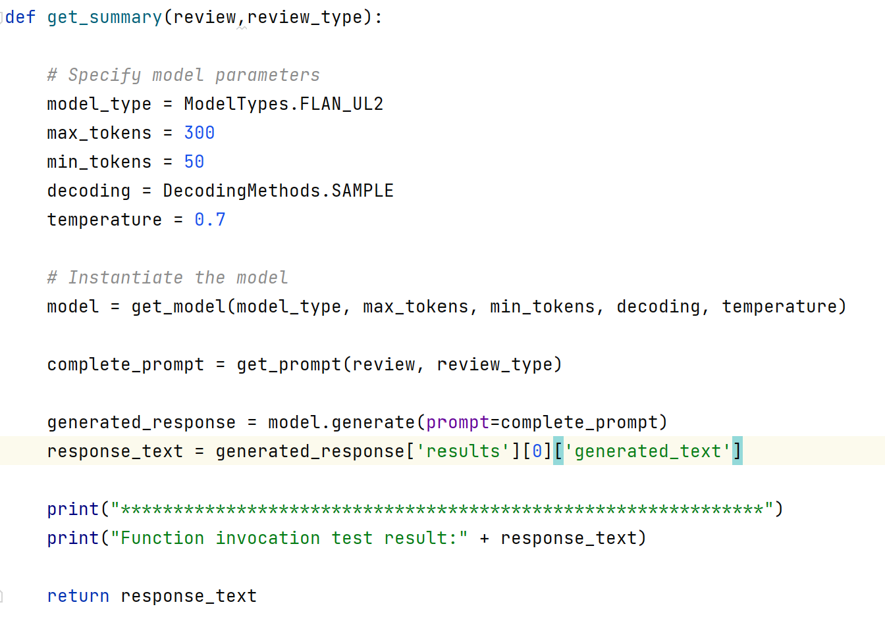
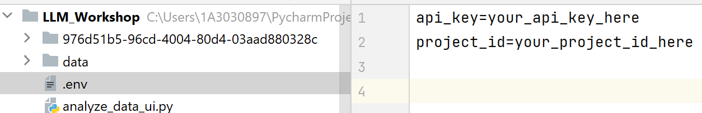

# Large language model application building blocks

In this lab you will review and run examples of LLM application building blocks. We will expand on the concepts that you learned in the Introduction to Generative AI lab.

As we discussed in the Introduction to Generative AI lab, LLMs are building blocks for applications that are used by business users. Examples of business applications are CRM systems, Insurance Claim processing systems, and Marketing Campaign management software. These applications can be developed in-house or by 3rd party vendors. Usually, applications that are developed by vendors are extendable and customizable. For example, a CRM application can make a REST call to a traditional ML model or LLM.

Another integration approach between business applications and models is data-level integration. In this scenario ML or LLM inference (scoring) is deployed as a batch job. Scoring results are stored in a data source, and data from this data source is used in end-user applications. Examples of this type of integration are:

- Output of customer segmentation is displayed in a graph (a traditional ML model)
- Prediction of customer churn (a traditional ML model)
- Customer intent from emails/calls (an LLM or a traditional NLP model)
- Customer sentiment (an LLM or a traditional NLP model)
- Key topics from customer complaints (an LLM or a traditional NLP model).

In this lab we will review several Python code samples which can be used as “building blocks” for an LLM application.

## Prerequisites

- Completed the **Getting Started with Generative AI in watsonx.ai Lab**.
- Access to watsonx.ai.
- Python IDE with Python 3.10 or 3.12 environment, such as VS Code.
- You will also need to download the lab files from [watsonx.ai-Assets.zip](https://github.com/CloudPak-Outcomes/Outcomes-Projects/raw/main/L4assets/watsonx.ai-Assets.zip)
  - We will refer to this folder as the _repo_ folder.

## Review scripts for various LLM tasks

In this section we will review 4 Python scripts and 2 notebooks that can be used as building blocks for LLM applications.

> Note: Prompts and model configuration in the scripts may not always return perfect results. If you wish, you can modify prompts and model parameters.

**LLM task scripts**
1. Load the following scripts from the repo/scripts folder into your Python IDE:

    - use_case_infererence.py
    - use_case_summary.py
    - use_case_generate.py
    - use_case_transform.py

2. Let’s review code in the scripts. 

   Similar to the example in the Introduction to Generative AI lab we use the ibm-watson-machine-learning library to invoke LLMs deployed in watsonx.ai. 
    
   As you can tell from the script names, the scripts contain prompts for most common LLM use cases. 
   
   Each script follows a similar code structure:

     - API key and project id are retrieved from the .env file (the environmental file) which will be created in Step 3.
       

     - The get_model() function creates a model object that will be used to invoke the LLM. Since the get_model() function is parameterized, it’s the same in all examples.

       

     - All scripts have a get_review() or get_sample_text() function which contains a hardcoded string that will be analyzed by the LLM. This text is used by the get_prompt() function to create the final prompt that will be passed to the model.
  
       

     - The main() function specifies the model parameters and invokes all other function. Since these are test scripts, this function prints LLM output to terminal. 
       

     - Finally, each script contains at least one function that can be called by an external Python module. For example, in use_case_summary.py, the function name is get_summary(review,review_type). 
     
     - Notice that in each function that can be used by external applications we pass in the text that will be used as a part of the prompt. We use string concatenation to combine the hardcoded prompt instructions (such as “summarize or generate”) with the string that we want it to use for the task.
     - It is possible to organize the code without hardcoding the instruction part of the prompt, but we will not cover it in this lab.

       

3. Run each script.
   
   - If you have not created the .env file in the previous lab, create it in the root folder of your project and update it with the cloud API key and project id.  

     

   - In the provided examples model output is not perfect. Experiment with modifying model settings and prompts to improve it. 

   - As you review and run the code, consider the following questions:
      - Why did we implement this code as scripts, and not notebooks?

      - When does it make sense to implement this code as notebooks?
 
      - How can this code be improved?

      - Why results could be different in each execution? 
         
      - What parameters we can adjust to minimize variability of the model output to make it more deterministic?

   > **Note:** for the inference use case, implemented in use_case_inference.py, you may need to add the repetition_penalty parameter to get better results. See [documentation](https://pages.github.ibm.com/WML/python-client/model.html#metanames.GenTextParamsMetaNames) for more information. 

## Conclusion

You have finished the LLM Application Building Blocks lab. In this lab you learned:

- How to write work with the watson-machine-learning library to invoke LLMs that perform various tasks.
- How to write modular code that can be used from client applications.

If you have questions about these topics, please review the documentation
