# Introduction to LangChain Tutorial

This tutorial provides a hands-on lab to explore the [LangChain](https://python.langchain.com/docs/get_started/introduction) framework, using it to build Large Language Model (LLM) applications with [IBM watsonx.ai](https://www.ibm.com/products/watsonx-ai). You'll run Python examples to learn key *LangChain* features, building on prior generative AI knowledge.


## Prerequisites

> **Note**: If you've completed the *Getting Started with Generative AI in watsonx.ai* lab, skip repeating these steps. Review them for debugging tips if issues arise.

- Completed the *Getting Started with Generative AI in watsonx.ai* lab
- Access to [watsonx.ai](https://www.ibm.com/products/watsonx-ai)
- A Python IDE with Python 3.10 or 3.12 (e.g., [Visual Studio Code](https://code.visualstudio.com/))
- Python packages for the RAG exercise (installation may take up to 15 minutes):
  - Monitor errors for missing packages and install them
  - Multiple attempts may be needed to resolve dependencies
- Download lab files: [watsonx.ai-Assets.zip](https://github.com/CloudPak-Outcomes/Outcomes-Projects/raw/main/L4assets/watsonx.ai-Assets.zip)
  - Referred to as the *repo folder* in this tutorial

## What is LangChain?

LLMs are embedded in applications, not used standalone. *LangChain* is an open-source framework that simplifies LLM application development by handling tasks like:

- Creating prompt templates
- Parsing LLM outputs
- Sequencing LLM calls
- Managing session state (memory)
- Supporting Retrieval-Augmented Generation (RAG) use cases

**LangChain** does not add new capabilities to LLMs, it’s a complimentary framework that’s used to build well-structured LLM application in Python and JavaScript. 

Its vendor- and LLM-neutral APIs work across providers. For example:

```python
chain = prompt | model | output_parser
```

This creates a chain (model, prompt, parser) for various LLMs. Here are some learning resources:

- [DeepLearning.AI LangChain Course](https://learn.deeplearning.ai/courses/langchain/lesson/u9olq/introduction)
- [LangChain Documentation](https://docs.langchain.com/)
- [LangChain Community](https://www.langchain.com/community)

**LangChain in watsonx.ai**

Watsonx.ai supports LangChain via the `langchain_ibm` library, connecting to the `ibm-watsonx-ai` SDK. The Watson Machine Learning (WML) API handles LLM calls.

👉 Check the [langchain-ibm documentation](https://ibm.github.io/langchain-ibm) for updates.

---

## Tutorial Tasks

---

### Task 1: Run a Sample Notebook

**Steps:**

1. Log into **watsonx.ai** and open your project.
2. Create a notebook:
   - Select `New Task -> Work with data and models in Python and R notebooks`
   - Keep the default runtime (**Python 3.10 XS**)
   - Choose `Local file` and select `LangChain_Integration.ipynb` from `repo/Notebooks`
    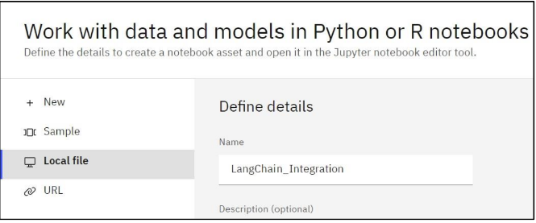
---

   #### Understand the Code
Let’s review code in the notebook. 

Scroll down to the Foundation Models on watsonx.ai section of the notebook. 
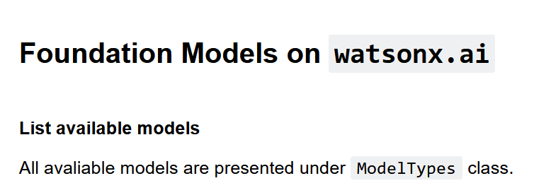
The first few cells instantiate the LLM model object and provide parameters. This code is 
like the WML code we used in other labs (at this time we’re not using the LangChain API 
yet). 

Scroll down to the WatsonxLLM interface section. Here we instantiate the WatsonxLLM object, which is the object that we will use to invoke other LangChain APIs. As you can see 
in the code, we create a wrapper around the watsonx.ai LLM model with the required parameters to call the LLM in the IBM Cloud

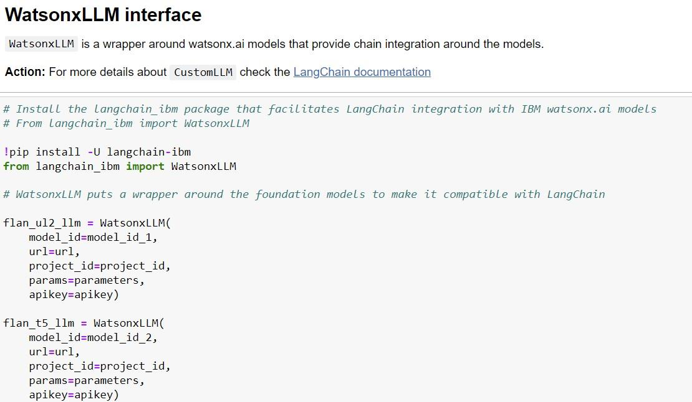
Now that we have the model object that we can use with LangChain, we can test the supported features.

The capability demonstrated in the notebook is **simple sequential chain**. A simple sequential chain allows us to create “steps” in the LLM execution process. While it may seem like a trivial task, the simple sequential chain has 2 important features:

- The steps can use different models
- Output of the previous step is automatically passed to the next step.

These features make simple sequential chain a versatile API that can be used in many types of tasks of LLM applications. For example, we can use it to implement the following sequence of tasks: Translate -> Summarize/Classify -> Generate -> Format. These tasks are common for use cases such as automating response to customer emails. 

The sample notebook implements a much simpler scenario. We will review more complex implementations later in the lab. 

In the notebook, scroll down to the section that instantiates the **PromptTemplate**. The PromptTemplate object does not add any new capabilities to prompts, but it helps us write better-structured code. Notice that when we create the PromptTemplate object, we explicitly specify parameters (input variable) that will be used in the prompt. 

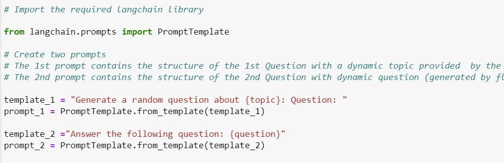

Next, we create two runnable sequences (or chains) which contain the models and the prompts.

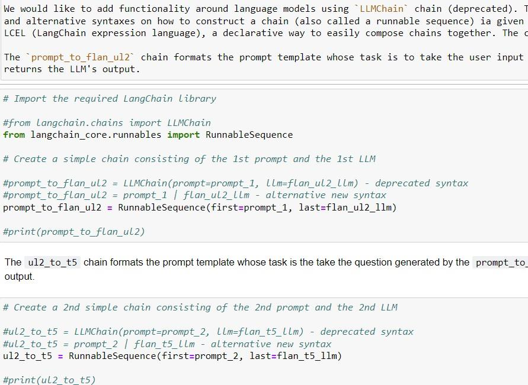

Lastly, we create another runnable sequence that chains the previous runnable sequences together. The qa.invoke() function call in the last cell invokes the LLMs sequentially.


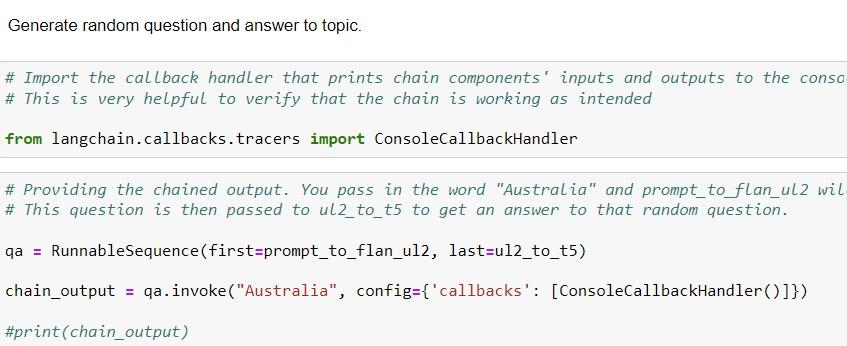

Note that we also invoke the Console Callback Handler to print chain components’ input and output to the console. This is very helpful to verify that the chain is working as intended.

3. Run the notebook and scroll down to the output of Cell 13. If you wish, change the parameter that’s passed to the LLM to see different results. Scroll down in the generated output until you find the generated question: **“What does Australia call its indigenous people?”** (note that you question might be different, but it will still be about Australia).

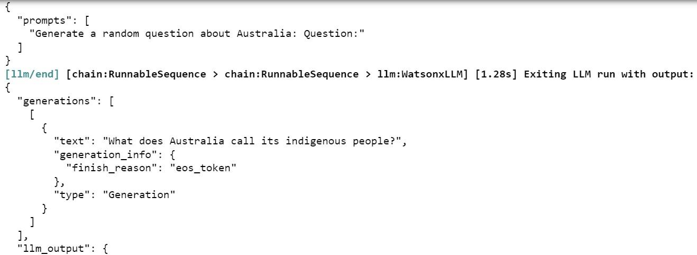

Scroll to the bottom of the generated response to find the answer to the question: **“aborigines”**.

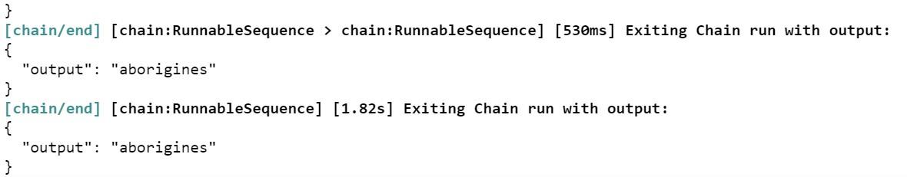

To build an AI application, you would need to extract the question and answer and present it in a more accessible format.

This is accomplished in the rest of the notebook with a summarization and a classification of a customer complaints example and chain. Scroll to the end of the notebook and inspect the output.

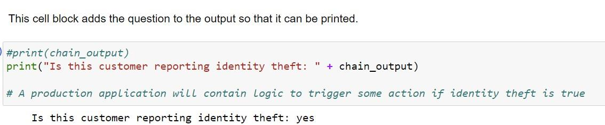

Next, we will look at another feature of the LangChain API, memory. 


---

### Task 2: Implement memory with LangChain

As you have likely noticed in your experience with LLMs, they are stateless. Each request to an LLM is independent of the previous or the next one. In architecture this is called a _stateless_ implementation. For some use cases, specifically for the ones that involve multiple
interactions with an LLM (for example, a chat) we may need to maintain a “history” of the conversation, which in programming terms is described as _memory_.


In _LangChain_ memory is implemented by appending to the prompt. Both input and output are appended. 

The benefit of this approach is that it’s easy to understand and implement. However, there are two important considerations:

- The token limit of LLMs still applies. If you keep adding prompts and responses to memory, you can quickly run out of tokens.

- Cost of tokens if you’re using a hosted instance of LLMs.

LangChain provides several types of memory to help mitigate these issues, such as:

- **ConversationBufferWindowMemory**: keeps a list of the interactions in the conversation over time. It only uses the last K interactions.
- **ConversationSummaryBufferMemory** keeps a summary of interactions, using token length rather than number of interactions to determine when to flush interactions.
- **ConversationTokenBufferMemory** keeps a buffer of recent interactions in memory, and uses token length rather than number of interactions to determine when to flush interactions.

This task uses `ConversationBufferMemory`, which holds all data until cleared or memory is filled. According to LangChain documentation, it uses the “first in, first out” approach to removing information from the buffer.

**Steps:**

1. Log into **watsonx.ai** and open your project
2. Create a notebook:
   - Select `New Task -> Work with data and models in Python and R notebooks`
   - Keep the default runtime (**Python 3.10 XS**)
   - Choose `Local file` and select `LangChain_Memory.ipynb` from `repo/Notebooks`


Let’s review code in the notebook. 

After installing the required libraries, we create a model object like the way we created it in a previous example.

We recommend that you try both flan and llama models in this notebook (uncomment the model that you would like to run and re-run the cell).

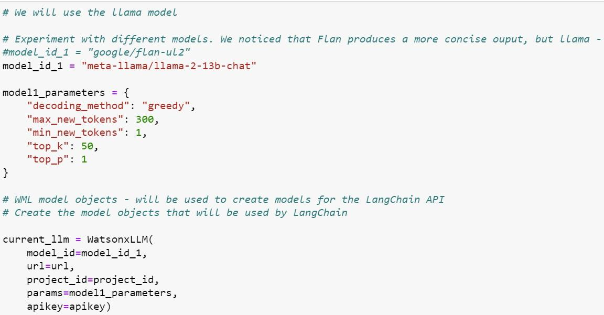

We use the standard LangChain API to create a memory buffer object.

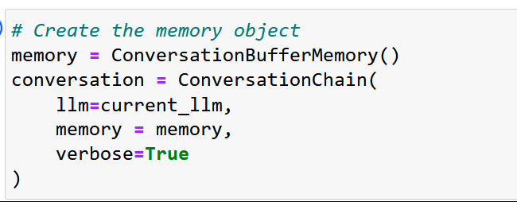

After that, we construct our prompts, and in our code we expect the 2nd call to the LLM to analyze the output from the 1st prompt.

Notice that we provide 2 examples of user_input for the first prompt. If you would like to try the 2nd example, make sure to clear the buffer memory in the cell above (commented out by default).

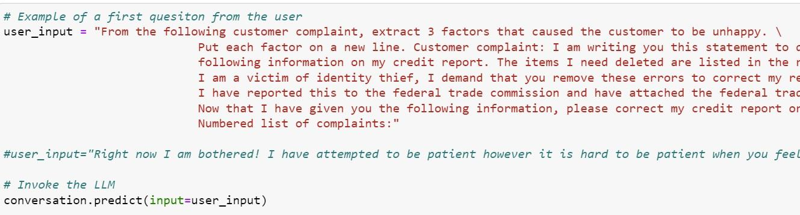

When you invoke the LLM, the output generated by the LLM starts with AI:

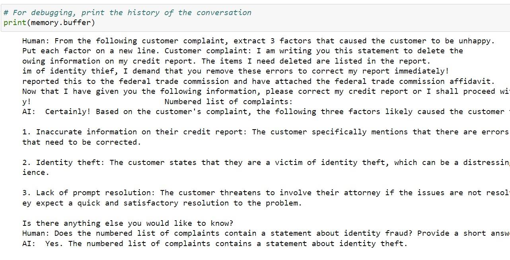
---

### Task 3: Implement a simple RAG use case with LangChain

**RAG (Retrieval Augmented Generation)** allows us to use LLMs to interact with “external data”, i.e. data that was not used for model training. Many use cases require working with proprietary company data, and it’s one of the reasons why RAG is frequently used in generative AI applications. 

There is more than one way to implement the RAG pattern, which we will cover in a separate lab. In this lab we will use LangChain’s RetrievalQA API to demonstrate one implementation of a RAG pattern. In general, RAG can be used for more than just question and answer use cases, but as you can tell from the name of the API, RetrievalQA was implemented specifically for question and answer. 

According to LangChain documentation, RetrievalQA uses an in-memory vector database, which may not be suitable for all RAG use cases. When we use an in-memory vector database, data will be loaded each time. This approach may also not work for large documents that will consume a large amount of memory.

RetrievalQA is generally a good choice for small documents and prototyping the RAG pattern. 

**Steps:**

1. Open `use_case_RAG_LangChain.py` from `repo/Scripts` in your IDE
2. Update the watson project id and WML API key as you’ve done in other examples. If you created a .env file, the id and key will be updated when you run the program.
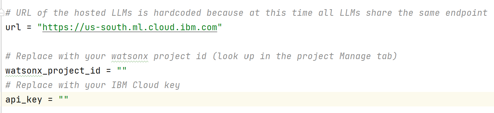

3. Copy `Generative_AI_Overview.pdf` from `repo/Documents` to the script’s folder
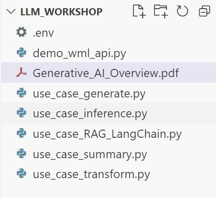
> **Note:** We chose this approach because relative path is formatted differently on Windows and macOS. If you know how to specify absolute or relative path, you can put these files into a different directory and modify the script code accordingly.

Let’s review the code. 

- The **get_model()** function creates a model object that will be used to invoke the LLM. Since the get_model() function is parameterized, it’s the same in all examples.

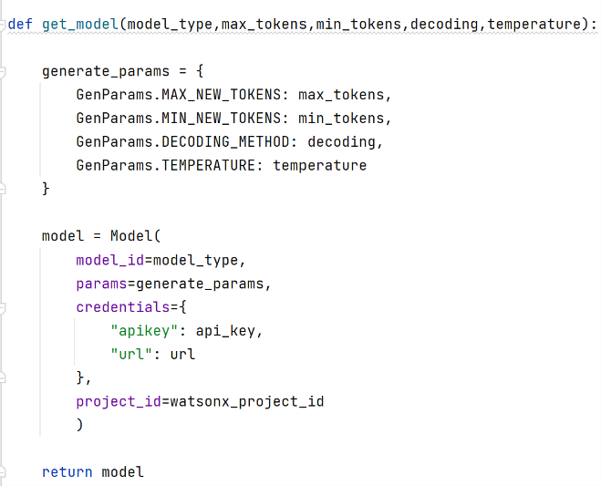

- The **get_lang_chain_model()** function creates a model wrapper that will be used with the LangChain API.

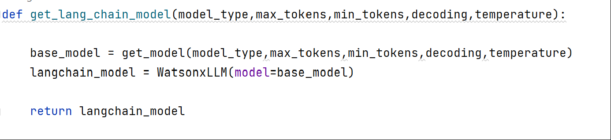

- The **answer_question_from_doc()** function specifies model parameters, loads the PDF file, creates an index from the loaded document, then instantiates and invokes the chain.

Notice that unlike other examples, we don’t have to create a prompt. The question and file path are specified in the main() function that invokes answer_quesitons_from_doc(). 

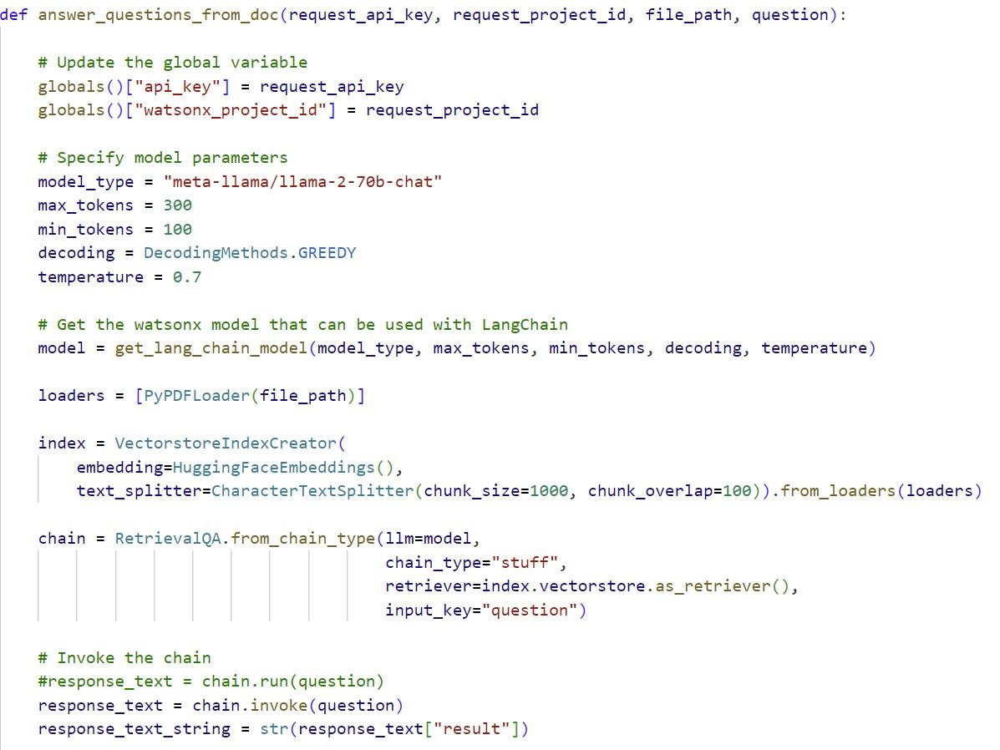

4. Run the script and review output, then test it with different questions (provided in the script)

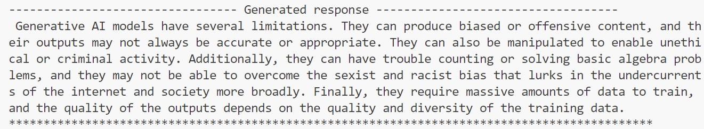

If you wish, try uploading small PDF files (for example, your resume) and come up with your own questions. We recommend using files that have mostly text (not images or tables, which are more difficult to process for PDF loaders). 

You can also test with different model types or different model parameters. 

## ✅ Conclusion

You’ve completed the LangChain tutorial, learning to:

- Sequence LLM calls
- Manage conversation memory
- Build a RAG application with `RetrievalQA`

👉 Explore more [LangChain APIs](https://docs.langchain.com/docs/).
