# 204: Implement RAG Use Cases

In this lab, you will review and run examples of LLM applications that implement the _Retrieval Augmented Generation (RAG)_ pattern of working with LLMs. We will expand on the concepts that you learned in the previous labs.

## Required software, access, and files

- Completed the **Getting Started with Generative AI in watsonx.ai Lab**
- Access to **watsonx.ai**
- A Python IDE with a **Python 3.10** environment (e.g., Visual Studio Code)
- Download and extract the required files from the GitHub repository:  
  [**watsonx.ai-Assets.zip**](https://github.com/CloudPak-Outcomes/Outcomes-Projects/raw/main/L4assets/watsonx.ai-Assets.zip)
- The extracted folder will be referred to as the **repo folder** throughout the lab
- Some knowledge of **Python**


## RAG Overview

_RAG (Retrieval-Augmented Generation)_ is one of the most common use cases in generative AI because it allows us to work with data "external to the model", for example, data that was not used for model training. Many use cases require working with proprietary company data, and it's one of the reasons why RAG is frequently used in generative AI applications. RAG also allows us to add some guardrails to the generated output and reduce hallucination.

RAG can be implemented for various AI use cases, including:

- Question and answer
- Summarization
- Content generation

> **Note:** A "human interaction" analogy of RAG is providing a document to a person and asking them to answer a question based on the information contained within.

RAG is "an application pattern" that can be implemented with multiple technologies. However, there are two key steps:

- During the **retrieval** step, we searched through a knowledge base (documents, websites, databases, etc.) to find information relevant to the instructions sent to the model. Retrieval can be based on keyword search or more advanced algorithms, like semantic similarity.
- The **generation** step is similar to the generation in non-RAG use cases. The main difference is that information retrieved in the first step is provided as "context" (included in the prompt). Prompting the model to rely on "retrieved context" only, in contrast to the general knowledge which was used to train the LLM, is the key step for preventing hallucinations.


### Vector databases

The "knowledge base" for the retrieval step is typically implemented as a **vector database**. Vector databases are not new, they have been used for several years for semantic search.

Semantic search is a search technique that aims to understand the intent and context of a user's query. It's more advanced than traditional keyword-based search, which relies on matching specific keywords.

Some popular vector databases are:

- Chroma (open-source)
- Milvus
- Elasticsearch
- SingleStore
- Pinecone
- Redis
- Postgres

Some vector databases, like _Chroma_, are in-memory databases, which makes it a good choice for experimenting and prototyping RAG use cases. In-memory databases do not need to be installed or configured. This is because all of their data is stored in volatile memory for the duration of the program's runtime. The downside of this though is that we will need to load the data each time we run the application.

Vector databases store unstructured data in a numeric format. For AI use cases, we use a specific term to describe the converted unstructured data - **_embeddings_**. Embeddings are created by using an embedding model, for example, a popular open-source model _word2vec_.

One of the key features of embeddings is the ability to preserve relationships. With embeddings, words can be "added and subtracted" like vectors in math. One of the most famous examples that demonstrate this is the following:

```txt
king - man + woman = queen
```

In other words, adding the vectors associated with the words _king_ and _woman_ while subtracting _man_ is equal to the vector associated with the word _queen_. This example describes a gender relationship.

Another example might be:

```txt
Paris - France + Poland = Warsaw
```

The vector difference between _Paris_ and _France_ here captures the concept of a capital city.

Here's an example of a semantic search for the word "education". Notice the "nearest point" words in the table. The measurement is in numbers because the search was performed using vector (numeric) data.

You can experiment further with this [here](https://projector.tensorflow.org/).


Based on what we have discussed so far, we can make the following conclusions:

- We have a choice of _vector databases_ for implementations of RAG use cases
- We have a choice of several _embedding models_ for converting unstructured data to vectors
- Retrieval of relevant information is the first step in the RAG pattern, and the quality may be affected by the choice of a vector database and an embedding model.

In addition to the mentioned factors, loading data into the vector database requires **_"chunking_"**, which is the process of dividing text into sections that are loaded into the database. There is no single guideline for defining chunks because the best size depends on the content we're working with.

For generative AI use cases, we typically start with _fixed-size_ chunks, which should be "semantically meaninguful". For example, if in your document each paragraph has approximately 200 words, convert the number of words to several tokens (may vary per LLM), and use this number as the starting chunk size. In addition to the size of the chunk, we also need to specify overlapping (the same information in more than one chunk).

Model providers should publish information on recommended chunk size and overlap percentage for specific use cases. However, even if this information is published, developers will still need to experiment to find the optimal chunk size. If you can't find information on the recommended overlap, you can start with 10 percent (specified in the format of "number of tokens", for example, _100_ if your chunk size _1000_).

To summarize, we should follow these steps when implementing the RAG use case:

1. Select a vector database. When working with watsonx.ai, we should confirm that the selected vector database is supported. [Check IBM documentation for the latest updates](https://dataplatform.cloud.ibm.com/docs/content/wsj/analyze-data/fm-rag.html?context=wx&audience=wdp).
2. Select the embedding model. Confirm that the embedding model works with the selected vector database.
3. Experiment with chunk size.

As we discussed earlier, the second part of the RAG use case, sending instructions to LLM, is similar to non-RAG patterns. Developers should pay special attention to token limits because retrieved content will be added to the prompt. If the token limit is exceeded on input, then the model will not be able to generate output. This check will need to be implemented as "custom code" in your LLM applications.

WML API does return errors if token size is exceeded.


## RAG on documents with LangChain and ChromaDB

> **Note:** Depending on the work you have been doing in your Python environment and labs that you have previously completed, you may or may not need to install the following packages:

- chromadb
- sentence-transformers 
- langchain
- pypdf
- spacy (python -m spacy download en_core_web_md for Anaconda Python)

You may also see an error related to cryptography, which may be different on different operating systems. 
1. In your Python IDE open the use_case_RAG script located in the repo/Scripts folder. 
2. If you have not created the .env file in the previous lab, create it in the root folder of your project and update it with the cloud API key and project id. 

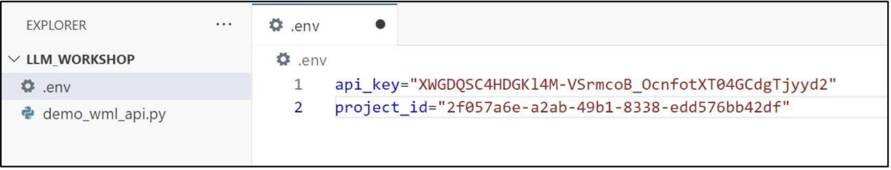

3. Copy two files from the repo/Documents folder into the same directory as your Python script:
    - state_of_the_union.txt
    - Generative_AI_Overview.pdf
    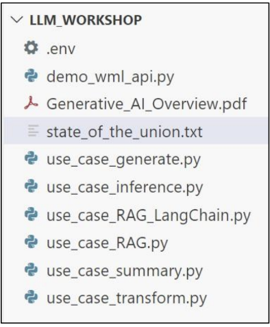


    >**Note:** we chose this approach because relative path is formatted differently on Windows and macOS. If you know how to specify absolute or relative path, you can put these files into a different directory and modify the script code accordingly.

    Let’s review the code. 

    - The get_model() function creates a model object that will be used to invoke the LLM. Since the get_model() function is parameterized, it’s the same in all examples.
    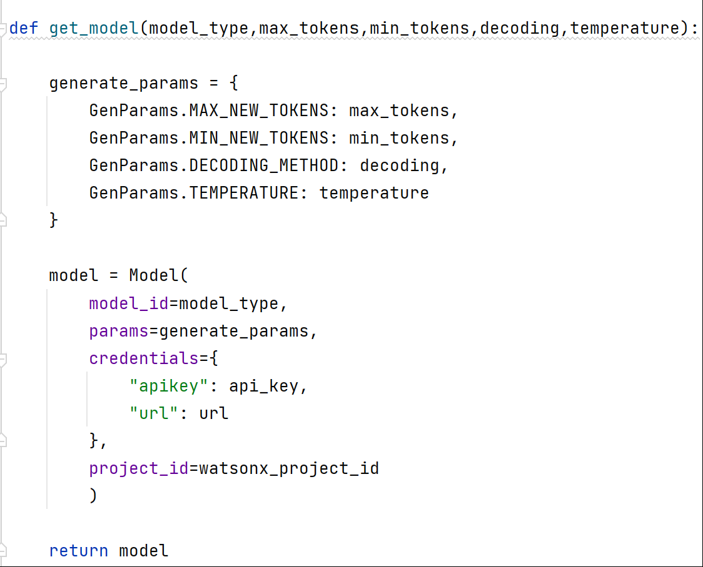
    
    - The create_embeddings() function loads text data into the in-memory chromadb. In this sample script we test asking questions against a text file and a PDF file. We use different APIs from LangChain to load text and PDF data. 

      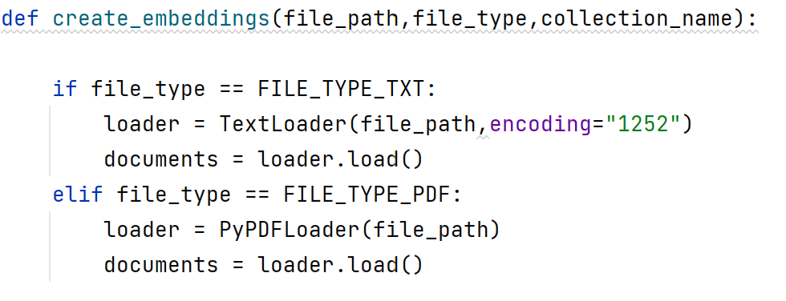

      Another LangChain API, CharacterTextSplitter, simplifies the process of chunking data.

      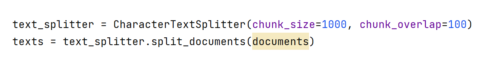

      Finally, we load data into the in-memory chromadb. Since this is an in-memory database, data will be loaded each time. If we want to avoid loading data each time, we will need to configure a static vector database.

      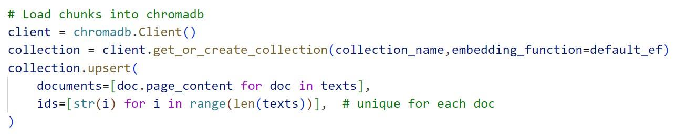

    - Similar to other sample scripts, the prompt is constructed in the create_prompt() function. 
    
      Notice that in the beginning of the function we query the vector database to retrieve information that’s related to our question (semantic search). Search results are appended to the prompt, and the prompt instruction is “to give an answer using the provided text”

      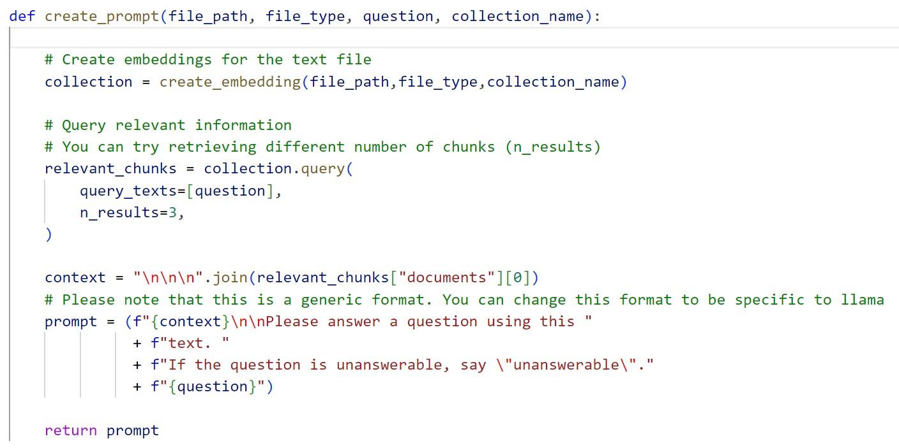
    

    - Sample questions and paths to documents are specified in the main() function. 
      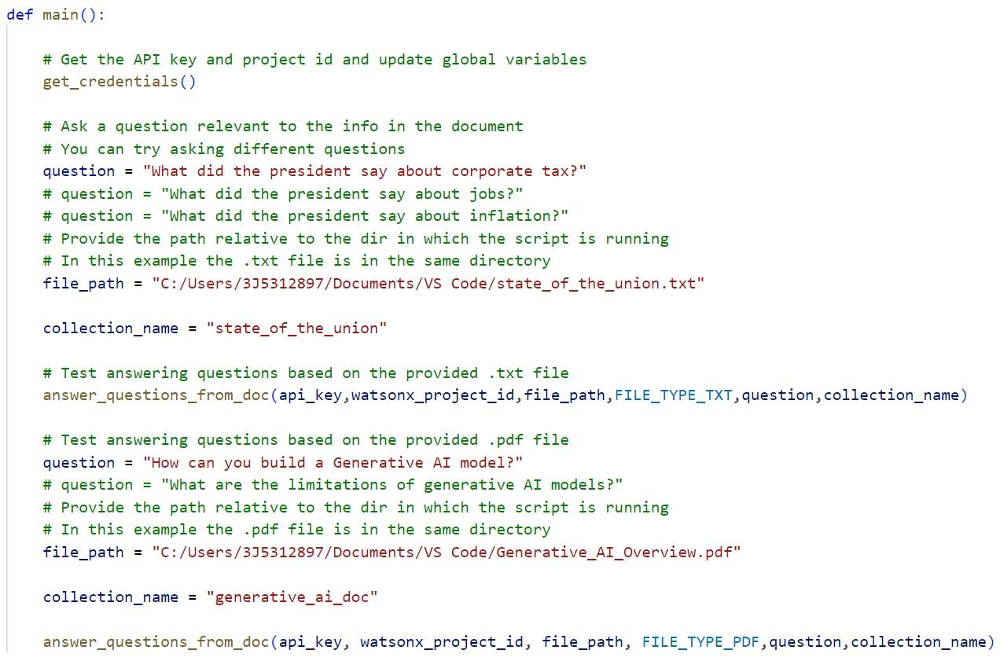

   
4. Run the script and review output, then test it with different questions (provided in the script).

   When you run the script, examine the output in the Python terminal, specifically the passages that are attached to the prompt. If the correct passages are not retrieved, then the LLM won’t be able to generate the right answer. 

   In our example, we get the passages that contain the right information. For example, for the tax question:

   **Retrieved passage:**
   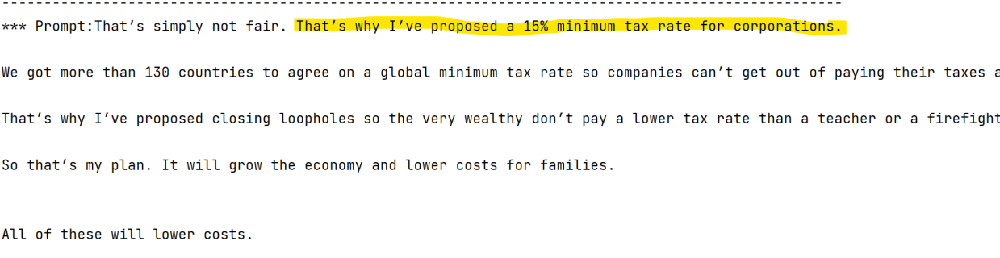

   **LLM answer:**
   


   If you wish, review the provided .txt and .pdf files and come up with your own questions. 

   You can also test with different model types or different model parameters. 

   If you try different documents, and you don’t get the expected results, you can try changing the chunk size (in the create_embeddings() function) and the number of retrieved passages setting (in the create_prompt() function).

   The chunk size corresponds to a “logical unit” in text, and the number is the token count. 

   Overlap is repeating tokens in chunks (used to preserve context). 

   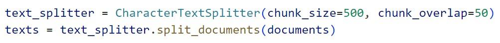

   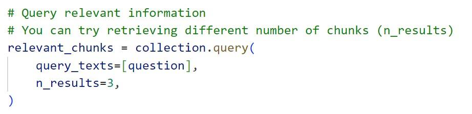


## Conclusion

You have completed the **Introduction to RAG** lab.  
In this lab, you learned how to implement RAG use cases using an **in-memory Chroma DB**.


Check the [IBM documentation](https://dataplatform.cloud.ibm.com/docs/content/wsj/analyze-data/fm-rag.html?context=wx&audience=wdp) for the latest code samples, tutorials, and other information related to **RAG**.
