# Working with crewAI

# CrewAI Framework Overview

**CrewAI** is a Python framework designed for building multi-agent systems, aimed at automating research, managing complex tasks, and creating data analysis pipelines. It emphasizes collaboration among agents and supports various use cases such as research automation, process automation, and task management.

## Key Features
- **Agent Creation**: Leverage IBM WatsonX.ai and Crew.ai to build autonomous agents.
- **Multi-Agent Orchestration**: Coordinate multiple agents to work together efficiently.
- **Process Management**: Define and manage workflows for seamless task execution.
- **Flexible Tool Integration**: Integrate a wide range of tools that agents can use.

## Core Concepts

1. **Agent**: 
   - An autonomous unit that can perform tasks, make decisions, and utilize tools.
   
2. **Crew**: 
   - A collaborative group of agents that work together to achieve a set of tasks.

3. **Process**: 
   - A workflow management system that defines how agents collaborate on tasks.

4. **Task**: 
   - A unit of work that includes a description, the responsible agent, and any tools required for execution.

5. **Tool**: 
   - Specific skills or functions that agents can utilize to carry out various actions.

## Workflow
- The **Crew** organizes and oversees the overall operation.
- **AI Agents** focus on their specialized tasks, leveraging the necessary tools.
- **The Process** ensures smooth collaboration between agents.
- **Tasks** are completed with the help of required tools to achieve the desired outcome.


# Lab Preparation

Follow the steps involved in Agentic Setup guide(210) for lab setup instructions.

# Implementation

## Setup
Lets us dive into implementation. make sure **Python** and **code editor** of your choice has been installed.
- Create Folder and check for the python version
    ```bash
    mkdir lab1-crew-ai
    python --version
    ```

## Exercise 1
Let us start with the first exercise of the lab.

- Move to the lab folder and initialize/activate a virtual environment

    ```bash
    cd lab1-crew-ai
    python -m venv .venv
    bash
    source .venv/bin/activate
    ```

- Install Crew AI tools required and see the installation.
    ```bash
    pip install 'crewai[tools]==0.95'
    crewai version
    ```
- The crew.ai framework includes a tool to bootstrap new projects. By default, this tool creates agents that generate research reports about AI. Our lab will begin with that.

    Create a new agent called "airesearch" using the crew.ai CLI tool.
    ```bash
    crewai create crew airesearch
    ```

- Perform the following selection to connect with watsonx.
  - Provider : Watson(6)
  - Model : watsonx/ibm/granite-3-8b-instruct(8)

    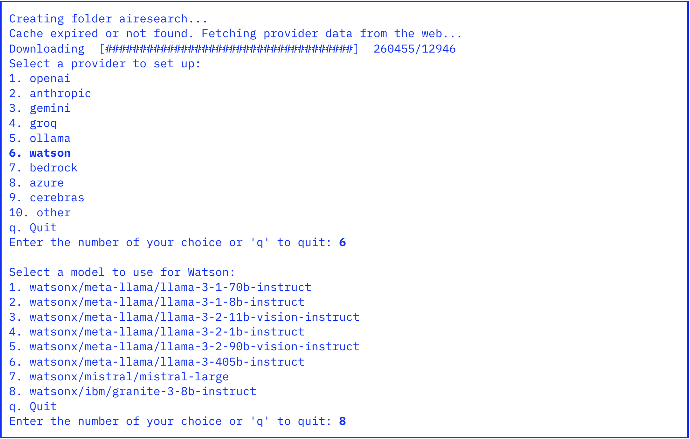

- Populate **WATSONX URI**, **WATSONX API** and **WATSON PROJECT ID** with  your values.
    
    This completes the process and a .env file has been created with the credentials you entered.

- Move to the directory the crew.ai cli created with the agent.
    ```bash
    cd airesearch
    ```

- One more step is needed to communicate with watsonx.ai API. Open .env in your preferred editor, duplicate the line with the variable **WATSONX_APIKEY** and rename the new variable **WATSONX_API_KEY**.

    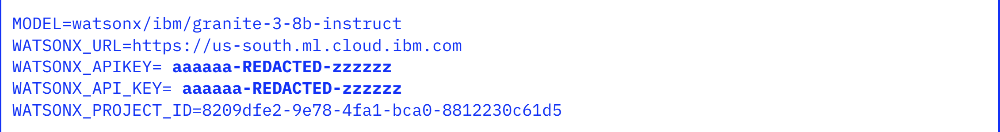

- Install packages
    ```bash
    crewai install
    ```

- **Run**
    ```bash
    crewai run
    ```

- A **report.md** would have been created, once the run has been completed. View it in your editor and inspect the results.

    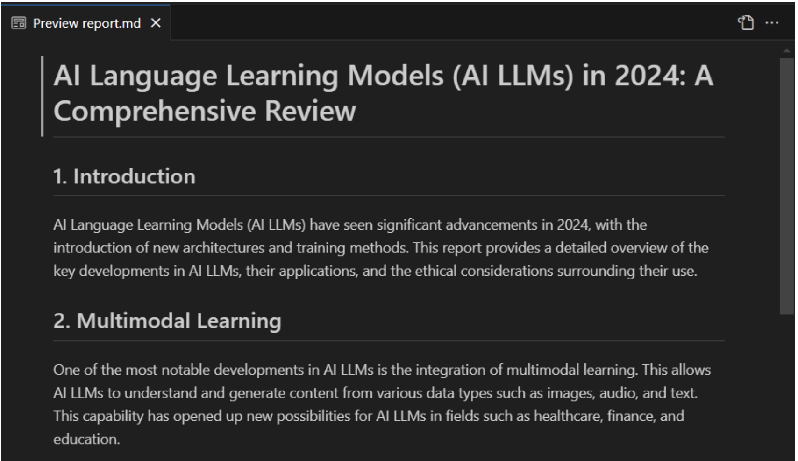


## Exercise 2 : Passing values to agents as variables.

- Move to the folder airesearch/src/airesearch
- Open the following files and take a look. These files have the agents and tasks description.
  - config/agents.yaml
  - config/tasks.yaml 
- Review the files and note that the instructions use 'topic' instead of specifying the subject to research.
- Similar to the varaible **'topic'**, create 2 more variables.
  - **'count'** : Replacing the hardcoded value of 12 in tasks.yaml.
  - **'deliverablles'**: Replacing "reports/a report" in both agents.uaml and tasks.yaml.

  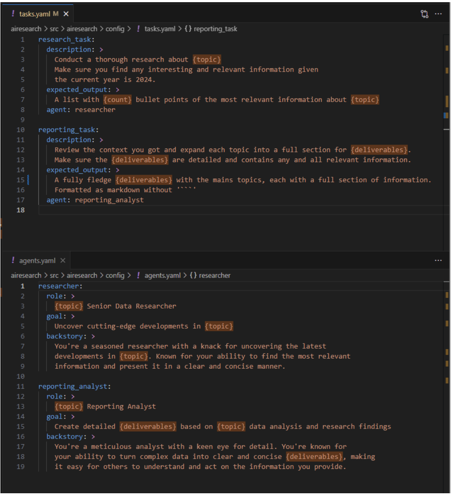

- In **main.py**, locate the **run()** method. Expand the inputs.   The inputs would now look like : 
  ```code
  inputs = {
    'topic':'AI LLMs',
    'count':'12',
    'deliverables':'blog post'
  }
  ```

- **Run**
  ```bash
  crewai run
  ```

- Once again, observe the logs in your terminal and inspect the **report.md** file created in your preferred editor. Clearly, the formatting and the look of the report file changes based on the custom **deliverable**, we inputed. This gives us improved flexibility.

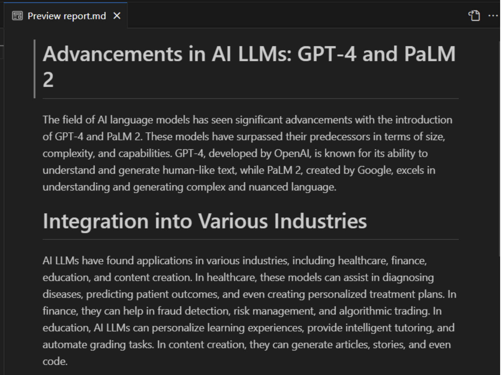


## Exercise 3: Tool Calling

It is clear that the knowledge of the above agent comes from the training data used for the LLMs. But what if, we can give our own context to the agent. Lets say we can give a web link to the agent, to give it more context. How would this change the output !! let's explore this **tool calling**.

### Lab
- Lets start by changing the topic and reducing the count.(1)
  Topic : “AI Agents and Assistants”
  Count : 10

- Move the inputs from the run() method to a global variable.       Update the run, train, and test methods (2) as well.(2)

  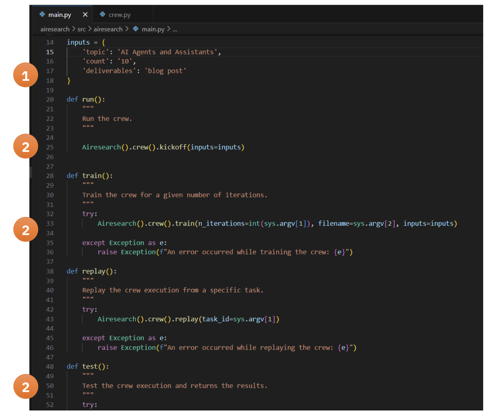

- Now, let us add and configure the **ScrapeWebsiteTool**.Make the following changes to **crew.py**.
  - Import **LLM** and **ScrapeWebsiteTool**.(**1**)
    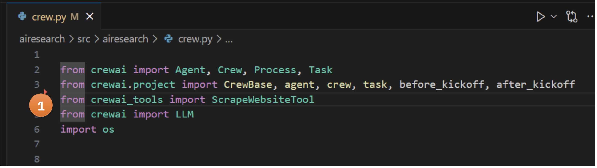
  - In researcher agent method, instantiate ScrapeWebsiteTool with this URL : [context](https://www.ibm.com/think/topics/ai-agents-vs-ai-assistants)(**1**) and pass the new tool to agent.(**2**)
    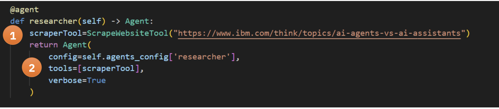

- Now, to determine, when to call tools, the Crew needs to perform planning first. Modify the crew method to enabling planning (**1**) and specifying that planning should be performed with the same model used for inferencing (**2**), as specified by MODEL environment variable.

    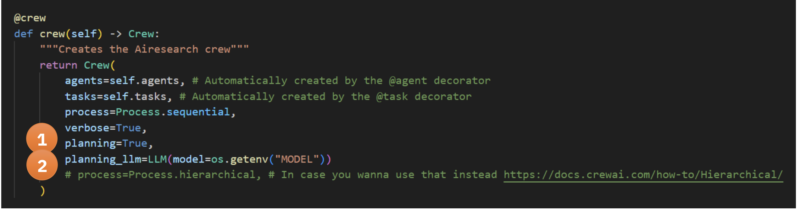

- **Run**
  ```bash
  crewai run
  ```

- Again, observe the logs and inspect the **report.md** file in the editor of your choice. You should see how the context, influences the change in the output.

    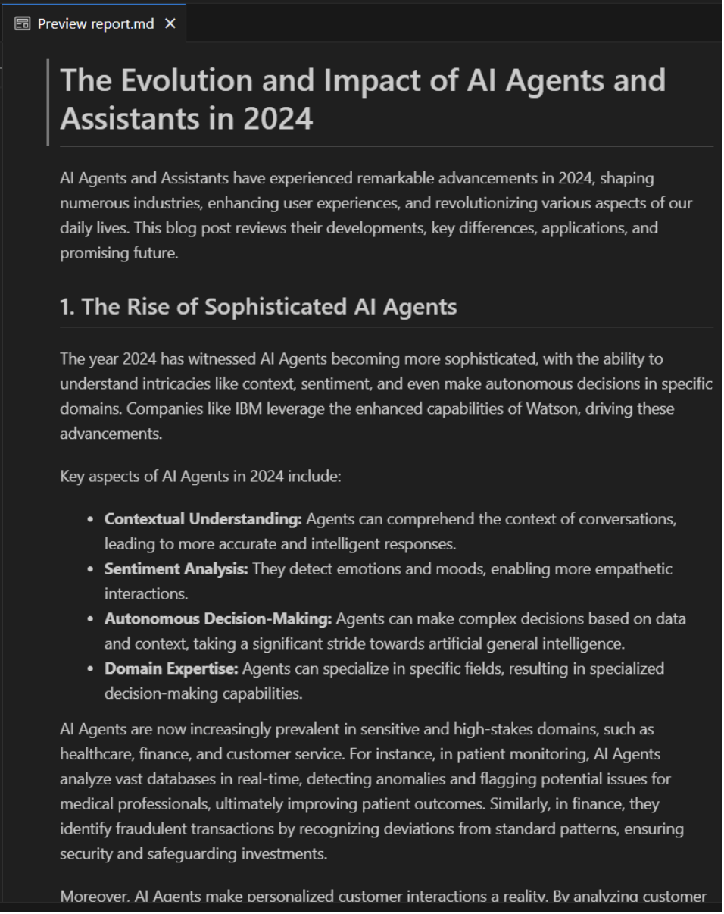

## Exercise 4: Tracing Agent Operation
Crew.ai uses **LITELLM** to communicate with language model engines like **watsonx.ai** and provides an abstraction for logging behavior. This exercise involves implementing a custom logger that records a subset of the communication to a debug log file for easier debugging.

### Key Points:
- **LITELLM**: SDK for logging communication between Crew.ai and language models.
- **Custom Logger**: Logs specific communication details to a debug file.
- **Purpose**: Helps developers trace and debug model behavior effectively.

### Lab
- To obtain the logger code, go [here](https://github.ibm.com/technology-expert-labs-ww/watsonxai-agents-labs/tree/main/crewai-lab). Download **litellm_pythonlogger.py** and move it to **./airesearch/src/airesearch**.

- Modify **main.py** file, to incorporate logging as follows: 
    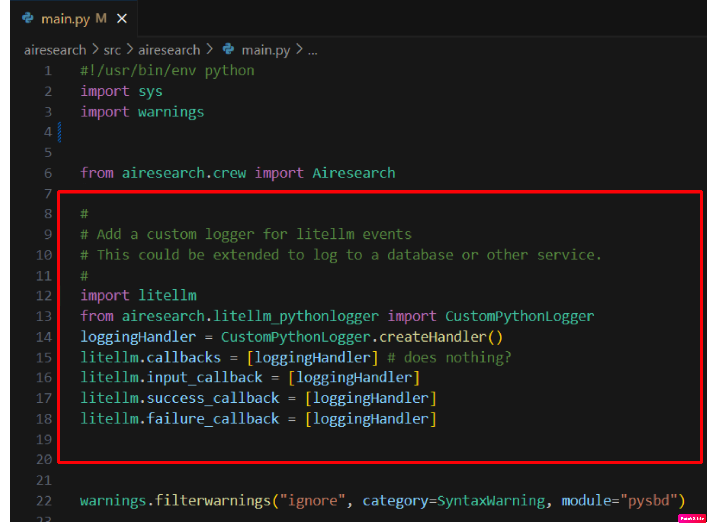

- **Run**
  ```bash
  crewai run
  ```
- Open and review **litellm.debug.log**, to see how agentic communication works. it is partially shown below :
    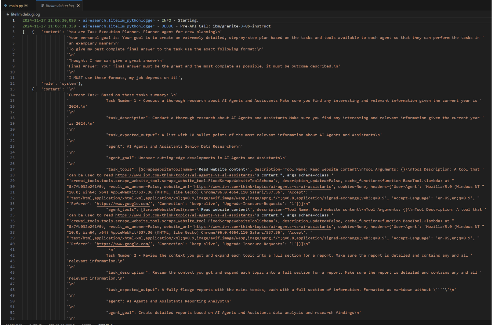


## Key Reflections

### Lab 1

#### Default Research Crew Components
- **AI LLMs Senior Data Researcher**: Conducts initial research.
- **Topic Reporting Analyst**: Processes and creates the final report.
- **Collaboration**: Sequential processing, with the researcher's output feeding into the analyst’s work.

#### Sequential Processing and Alternatives
- **Sequential**: Ensures each agent has a defined role and order.
- **Alternatives**:
  - Parallel processing
  - Hierarchical processing
  - Iterative processing

#### Report Content Breakdown
- **Researcher Agent**: Generates raw research findings.
- **Analyst Agent**: Structures findings into a report.

#### Limitations
- **Knowledge**: Limited to LLM’s training data.
- **Lack of External Sources**: No access to real-time information or fact-checking.

### Lab 2
#### Variable-Passing Benefits
- **Flexibility**: Allows dynamic changes without altering code.
- **Customizability**: Adjusts research topics, output formats, and agent behavior.

#### Variable Changes Impact
- **Scope and Depth**: Affects research focus and content structure.
- **Output Customization**: Changes in format, specificity, and length.

#### Advantages & Risks of Variables
- **Advantages**:
  - Increased flexibility and reusability
  - Customization for varied use cases
- **Risks**:
  - Prompt injection
  - Inconsistent output from unexpected variable values
  - Performance degradation with extreme values

#### Modifying Configuration Files
- Adjust agent roles, task goals, and variables in **agents.yaml** and **tasks.yaml**.
- Add new analysis parameters or modify task sequences.

### Lab 3
#### Impact of Web Scraping Tool
- **Improves Output**: Access to current information, fact-checking, and citations.
- **Accuracy**: Provides grounded, real data.

#### Agent Decision-Making
- **Tool Usage**: Decides when to use tools vs. relying on base knowledge for facts or verification.

#### Useful Tools to Add
- **Database Querying**: For structured data.
- **API Integration**: For real-time data.
- **File System & Calculation Tools**: For local document analysis and numerical tasks.
- **Visualization Tools**: For data presentation.

#### Local Tools vs External API
- **Advantages of Local Tools**:
  - Better privacy, faster response times, no rate limiting or costs
  - More reliable and customizable

### Lab 4
#### Debug Logs Insights
- **Communication**: Logs show prompts, API call structures, response formats, error handling, and token usage.

#### Prompt Structure with Tools
- **Tool Integration**: Prompts include tool descriptions, syntax, and context about available tools.

#### Insights from Tracing
- **Visible Aspects**: Conversation flow, decision-making, error handling, token usage, intermediate processing steps.

#### Debugging with Tracing
- **Improvements**: Optimize prompt patterns, tool usage, token management, error handling, and performance tracking.


    


 


