# Introduction

An **LLM agent** is controlled by a large language model (LLM) and uses tools to navigate its action space. Common paradigms include **ReAct** (Reasoning and Action) and **ReWOO** (Reasoning without Observation).

This lab focuses on using **watsonx.ai** and **LangChain** to build and optimize AI agents for enterprise use-cases.

## 1.1 Lab Overview
- Hands-on experience with **watsonx.ai** for AI agents.
- Implement tools using **LangChain**.
- Exercises must be completed in order.

## 1.2 Product Disclaimers
- **LangGraph** core is MIT-licensed; additional features require a commercial license.
- This lab uses **LangGraph** but not the **langgraph-sdk**.

## 1.3 Prerequisites
- Python
- Code editor
- IBM cloud and github access
- **jq** tool to process JSON.

## Lab Preparation

Follow the steps involved in Agentic Setup guide(210) for lab setup instructions.

## Labs

## Setup 

- Create a project folder
  ```bash
  mkdir lab-watsonxai-api
  ```

- Visit [here](https://github.ibm.com/technology-expert-labs-ww/watsonxai-agents-labs) and download the repo as zip file.

- Move this zip file to the above project folder and unzip.
  ```bash
  unzip watsonxai-agents-labs-main.zip
  cd watsonxai-agents-labs-main/api-langgraph-lab
  ```

## Lab 1: Tool calling with watsonx.ai API and Mistral

- ```bash
  cd exercise1
  ```

- Gather the **watsonx.ai project id**, **API URL**, and **API KEY**. Using your preferred text editor, save these in a file named .env. Make sure to replace the placeholders(example values) with your actual values.
  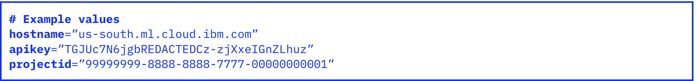

- Using your preferred editor, open the file **chat.json**, which contains the payload of the call to the watsonx.ai API.
    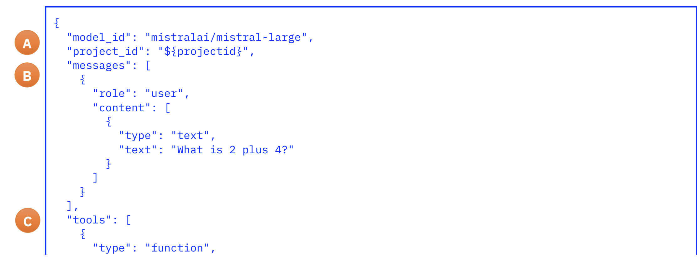
    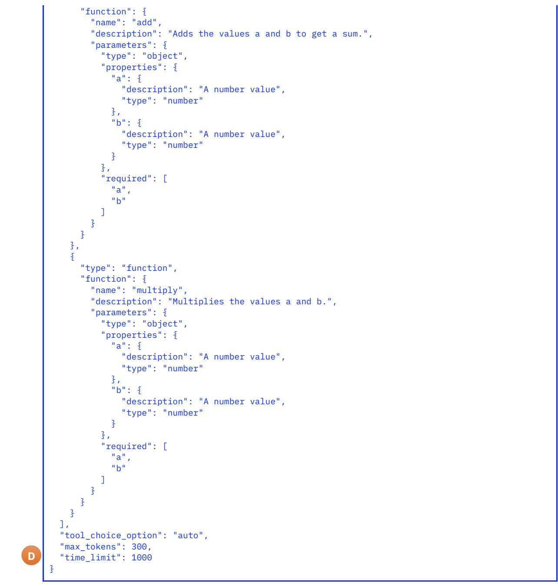
    - (A) The header section, defining the target watsonx.ai model and project. 
    - (B) The messages section, which contains the user role’s input text, which is a math problem.
    - (C) The tools section, which defines two functions by name and description, namely "add" and "multiply".
    - (D) A closing section defining the maximum number of tokens to generate (max_tokens), and 
    maximum time to run (time_limit) in milliseconds.
    > **Note:** Review the **chat.json** file carefully. if the type of variables "a" and "b" are **float**, change them to **number** for both "add" and "multiply" functions to avoid any errors.

- Open the **exercise.sh** file and review it carefully.This file:
  - Processes the .env file to obtain the settings as variables 
  - Replaces the projectid variable present in chat.json with their values.
  - Sends the processed chat.json output to the watsonx.ai API Chat method, using curl.
  
- Run the Script
  ```bash
  ./exercise.sh
  ```

- Review the response and notice the following:

  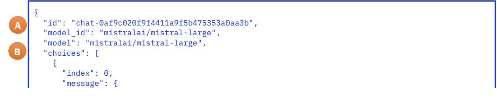
  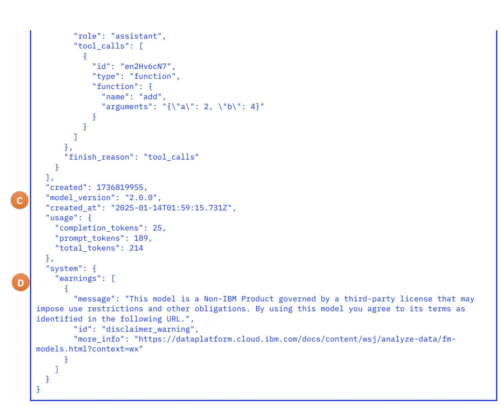

  - **(A)** Header section: Defines chat ID and model.
  - **(B)** Choices section: Includes:
    - Author role of the response.
    - Message contents.
    - Tool calls generated by the model.
    - Reason for finishing (e.g., "tool_calls" indicates model stopped due to tool input needed).
  - **(C)** Chat metadata: Includes creation timestamp (Julian and ISO-8601), model version, and resource usage.
  - **(D)** System information: Includes any service warnings.
  


## Lab 2:  Tool Calling with watsonx.ai API and Granite

- Enter the **exercise2** folder and copy the **.env** file there.
  ```bash
  cd ../exercise2
  cp -v ../exercise1/.env .env
  ```

- As done, previosuly, review the input by opening the **chat.json** file.
   
  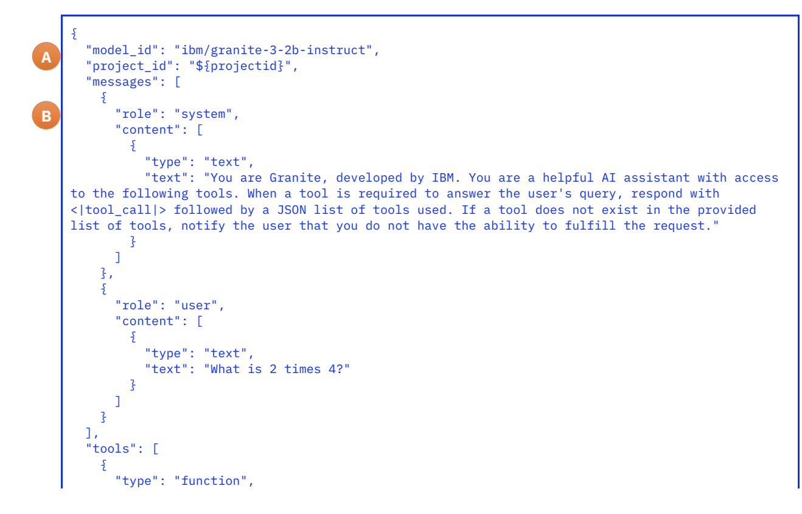
  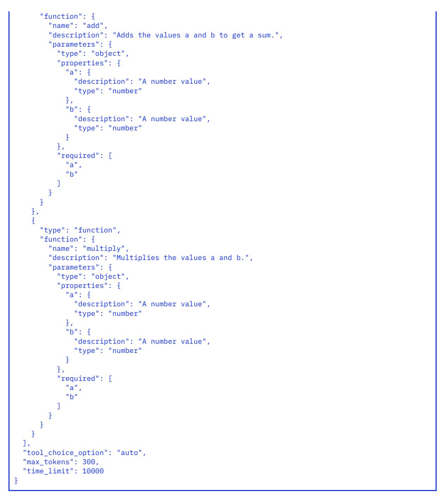

  - (A) The updated header section, defining a different target watsonx.ai model. 
  - (B) The messages section, which adds the system role and prompt.

- Run the Script
  ```bash
  ./exercise.sh
  ```

- Observe the response and see what are diferences compared to that in Lab 1.
  
  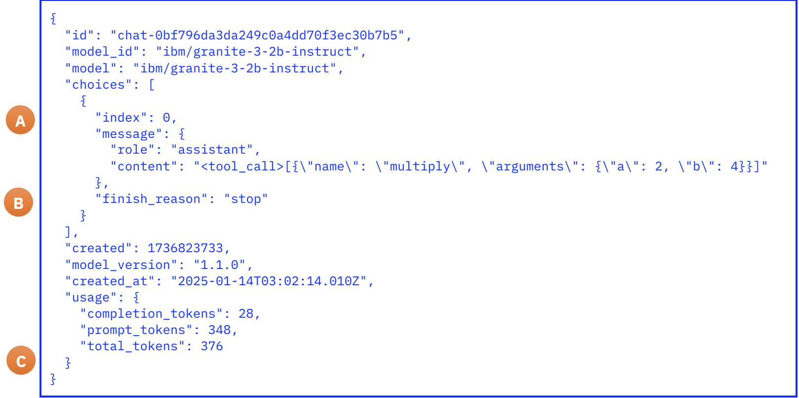

  - (A) The response message from the model message embeds the JSON tool call.
  - (B) The completion reason is “stop” instead of “tool_call”.
  - (C) There is no system message containing a warning message.
  

## Lab 3: Tool Calling using LangChain and LangGraph.

### Introduction

This exercise demonstrates how **LangChain** and **LangGraph** simplify agent creation by integrating tool calls and offering features missing in previous exercises.

### About the Frameworks
- **LangChain**: Provides a standard interface for LLMs, embedding models, and vector stores, integrating with multiple providers.
- **LangGraph**: Used for building stateful, multi-actor LLM applications with key benefits like cycles, controllability, and persistence. It allows fine-grained control over application flow and state, essential for reliable agents.

### The ReAct Agent Architecture
- **ReAct Architecture**: Involves iterative model calls, where each response helps decide the next action, such as calling a tool or providing output to the user.

### Lab

- Gather the notebook and API key. The source notebook is available in **exercise3** folder. This would be required in the subsequent steps.

- Return to watsonx.ai Studio and open the Sandbox Project. Open the **Assets** tab (A) and click **“New Asset”** (N).
  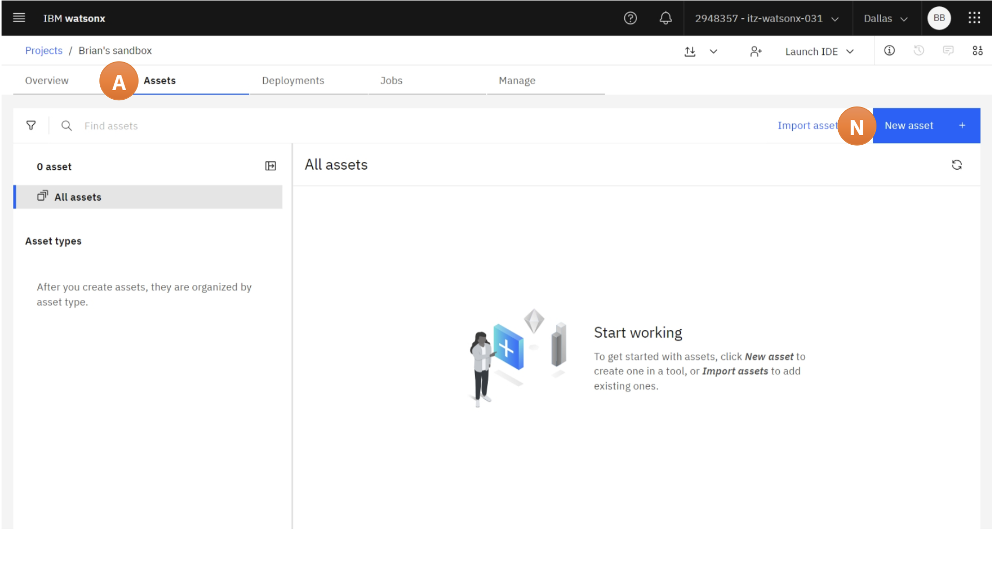

- Select **“Work with data and models in Python or R notebooks”** (W).
  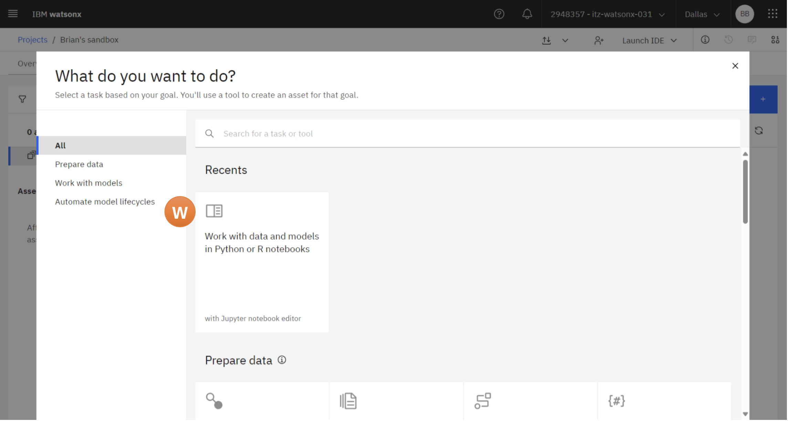

- From the left menu, select “Local file” (L) and upload the source notebook.
  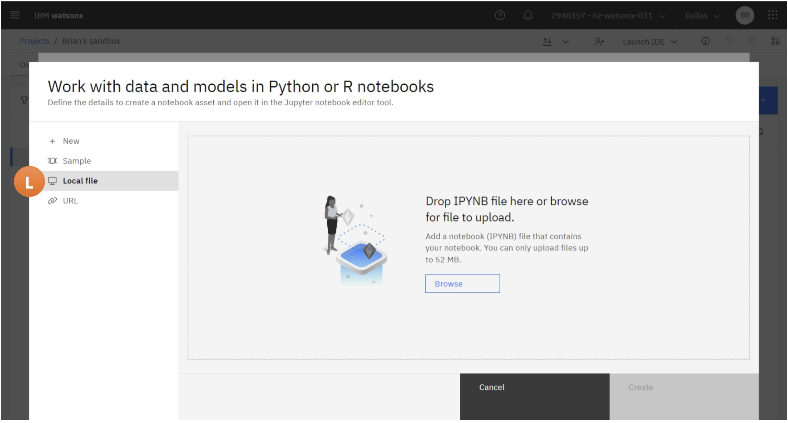

- Since this lab requires very few resources, change the runtime to **“Runtime 24.1 on Python 3.11 XXS”** (R). then click **“Create”** (C).

  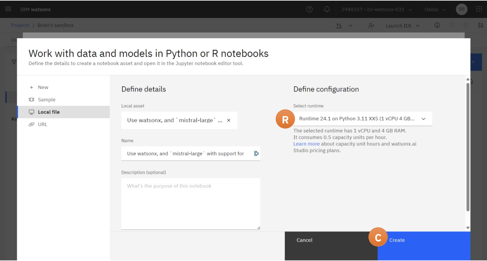

    > **Note:**  
    > Wait for the instance to load. It may take a minute or two to complete, depending on system demand. If loading freezes at 99%, return to the project view and open the asset directly.  
    > If the notebook is not already open, navigate to the project’s **Assets** tab (A), and click the **Notebook** (N) to open it.

- Click the **Pencil** (E) icon to edit and run the notebook.
  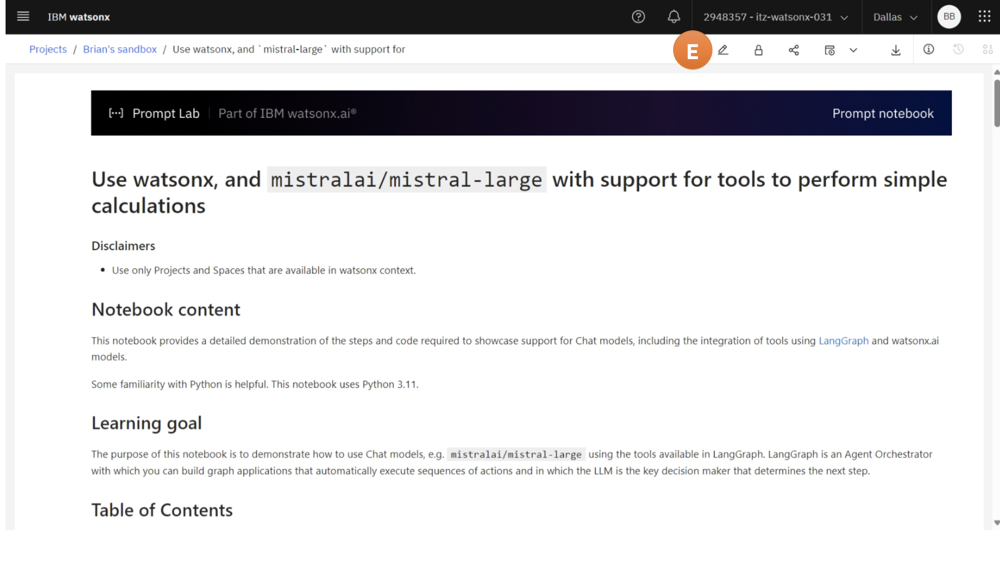

- Run all cells by opening the **Run** menu and selecting **Run All Cells**.

- Execution will pause waiting for the user to enter the API key. At the prompt, type the API-key previously captured in the .env file.
  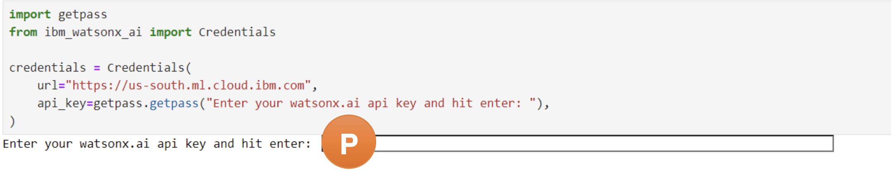

- Review the notebook. The following points can be noted

  - **LangGraph create_react_agent**: Connects tools and chat, defining a processing graph for evaluating prompts.
  - **Runtime Processing**: The framework iteratively traverses the graph, invoking the model or tools until the result is obtained.
  Note: The specific **processing graph** created by `create_react_agent` is the one that connects the tools and chat flow as part of the agent architecture. Here is the graph:
    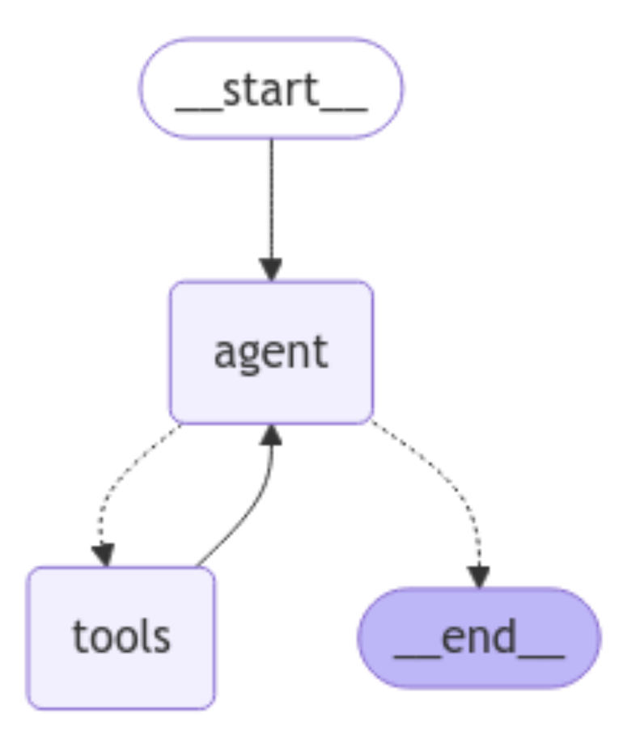
  - **Example**: The model sums values step by step, first adding two numbers(1), then invoking the tool again to add the third value(2).
    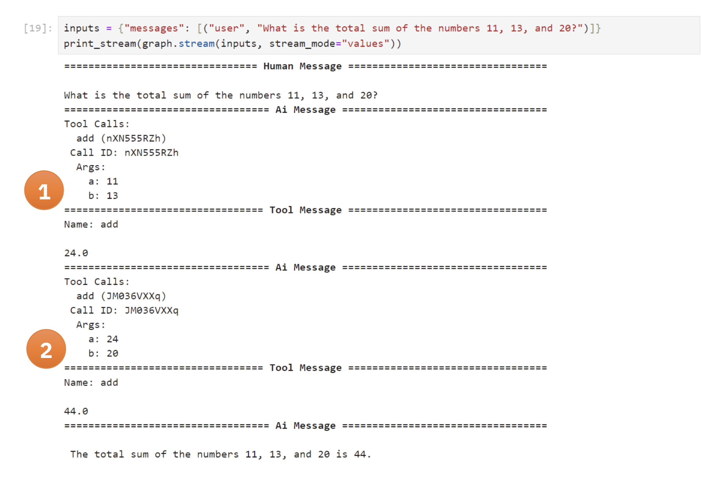


## Key Reflections

### Lab 1

- **What system prompt is used in the request?**
  - There is **no specific system prompt** instructing Mistral to use tools.

- **What are some missing items in the tool definitions?**
  - The tool definitions are missing:
    - **Response message type**.
    - **Error conditions** or **exceptions thrown**.

- **Where is the code for the tool functions defined?**
  - The tool functions are **not defined yet**. A framework is needed to provide these functions.

- **Where is the code for the tool functions executed?**
  - The code for the tool functions is **not executed** yet.

---

### Lab 2

- **What system prompt is used in this exercise?**
  - A **detailed system prompt** is used that explains the model’s role and includes a template for the response if a tool is needed.

- **How does the response from Granite model differ from Mistral’s?**
  - Granite calls **different tools** depending on the arithmetic operation needed.
  - The **response format** is slightly different, and the **stop reason** is also different.
  - There is **no warning about the model origin** in the response.

- **Did the response message include template text for a tool call?**
  - Yes, the raw response template `<|tool_call|>` was likely detected by the **watsonx.ai API**, which reprocessed it to produce the response.

- **How are responses that need further processing handled?**
  - Only the **raw response message** is provided.
  - The developer is responsible for:
    - Parsing the response.
    - Detecting tool calls and invoking the appropriate tools.
    - Returning tool responses and handling further calls.
  
- **How might these differences affect development?**
  - The code cannot be model-agnostic; **specific processing** is required for each model as they are added to the product.

---

### Lab 3

- **Which foundation model is used in this exercise?**
  - The foundation model used is **Mistral-large**.

- **What capabilities do LangChain and LangGraph add compared to previous exercises?**
  - **Tool definitions** are now coded in Python.
  - The need for detailed prompt/API development is reduced, as **tools are automatically handled through Python annotations**.
  - **Orchestration**: The framework manages interaction between the model and tools, automatically passing parameters and handling responses.
  - Interfaces for monitoring **processing plans** and intermediate results (e.g., using `print_stream`).

- **How can we modify the notebook to perform trigonometric operations?**
  - Define new functions for **sin**, **cos**, and **tan** using Python’s **math module**.
  - Annotate these functions with `@tool` and include a description indicating they work in **radians**.
  - Add these functions to the tool array passed to the model and test by asking the model to compute an angle.


  
  


  
