# AutoAI RAG in watsonx.ai Tutorial: Part One

## Introducing AutoAI RAG
Retrieval Augmented Generation (RAG) has been the most popular and powerful use case for generative AI for enterprise businesses. Once a client has found the right model and setup, RAG can be a powerful tool for many client business use cases. It can provide answers and accurate responses based on validated enterprise knowledge and data.

However, getting to that point can be time-consuming and difficult. It is difficult to compare the outputs of different models in response to different embedding methods and configurations. The client may need to re-run multiple tests to find the best combinations, which is very time-
consuming. When the grounding documents are changed or updated the clients may must pay the same price again. 

IBM watsonx.ai AutoAI RAG provides an easy-to-use and efficient way for clients to test out different combinations to find the best RAG pattern to use for their use case. 

Using AutoAI RAG, clients can try different patterns using different combinations of 
- Models
- Embedding methods
- Chunking size and Chunking overlap
- Metrics
- More …

## Prerequisites & Getting Started

For the setup, refer to the setup guide of this section.

## Download the LAB Report and Sample Q&A

### 1. **Download LAB Report**  
   - Go to [LAB: Large-Scale Alignment for ChatBots PDF](https://arxiv.org/pdf/2403.01081).
   - Save the file as `LAB 2024 paper.pdf` instead of the default `2402.01081v3.pdf`.

### 2. **Import to watsonx.ai**  
   - Log in to [watsonx.ai](https://watsonx.ai) and open your sandbox project.(**A**)
     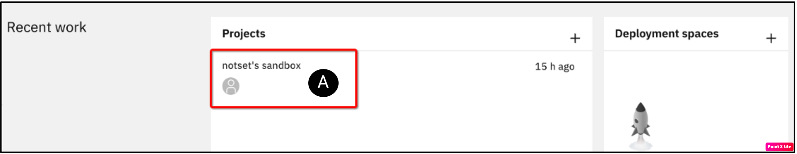
   - Click the **Assets** tab(**B**) and then **Import assets**(**c**).
     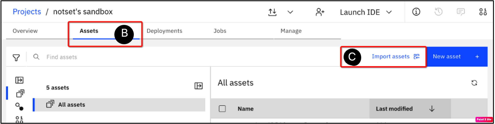
   - Select **Local file**(**D**), click **Data asset**(**E**).
     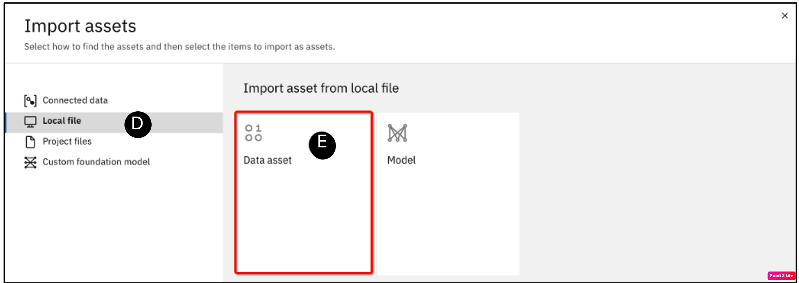
   - Drag & drop `LAB 2024 paper.pdf`.Click **Done** once uploaded.
   - Confirm if it shows up in the asset section.

### 3. **Download LAB Q&A JSON**  
   - Download `LABpaper.json` from [this link](https://ibm.seismic.com/Link/Content/DCGdqb6JdQp868CBPWgpTQQd9jgV).
   - Import `LABpaper.json` into your project by following the same steps as above and confirm.

## Milvus Data Store Setup
In an RAG use case, you will typically chunk your input data source and use an embedding scheme to embed the data in a vector data store. In this lab, you are using a Milvus data store available from a TechZone image.

You need to set up a connection from your project to the Milvus data store. To do so, you need information from the IBM watsonx.data Development Lab -2.1.1 GA reservation

### 1. **Retrieve Milvus Connection Info**  
   - Go to [IBM TechZone](https://techzone.ibm.com) > **My TechZone**(**A**) > **My reservations**(**B**).
     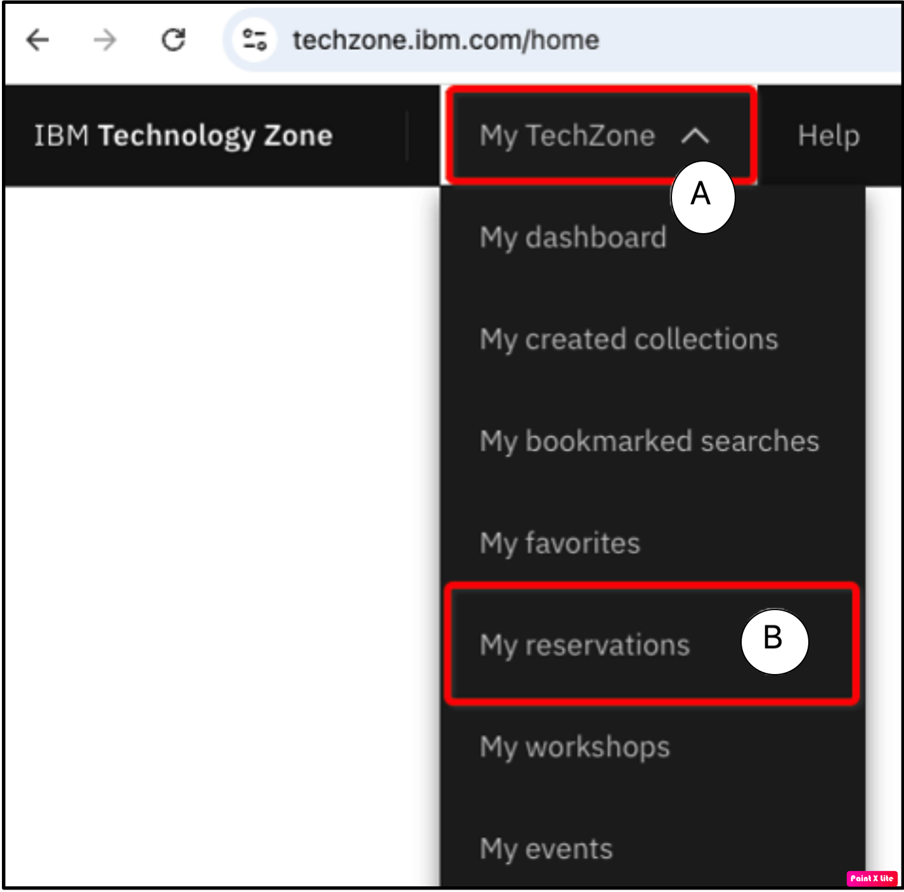
   - Open the **IBM watsonx.data Development Lab – 2.1.1 GA** environment.
   - Note down the **Server** and **Port** values(**A**). Example:
     - Server: `useast.services.cloud.techzone.ibm.com`
     - Port: `24640`
     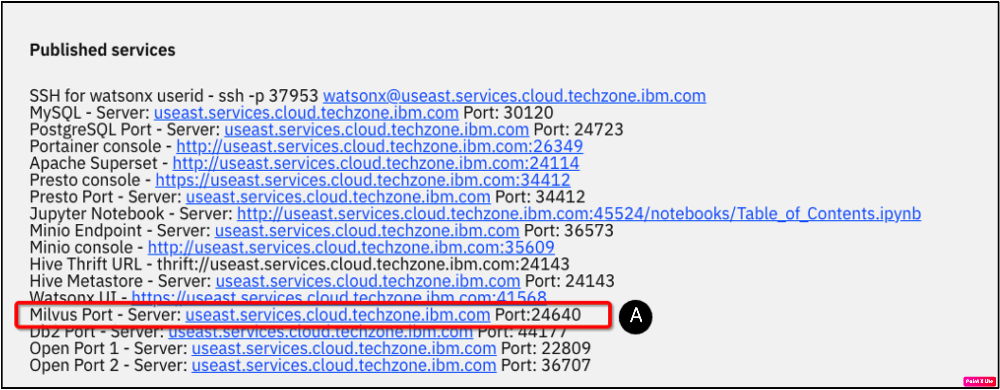

### 2. **Download SSL Certificate**  
   - Click the link next to **Jupyter Notebook – Server**(**A**).
     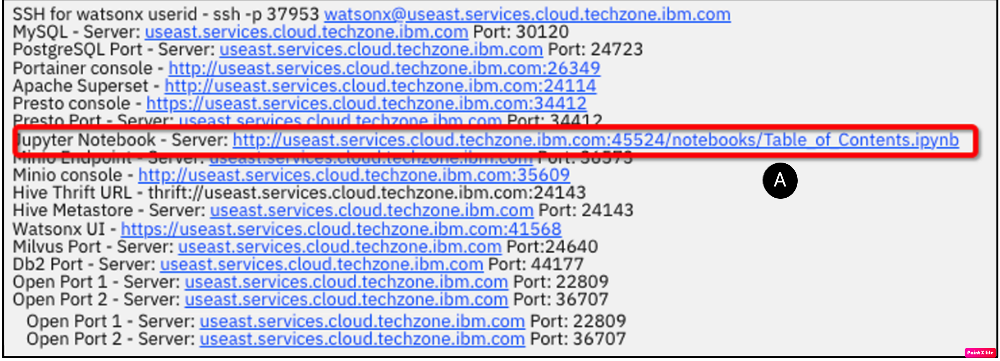
   - The Jupyter sign in page appears. Enter `watsonx.data` to the **Password or token** field and click **Log In**.
   - The **watsonx.data** page opens. Click the arrow on the lower right corner of the **Watsonx.data Credentials** tile(**B**).
    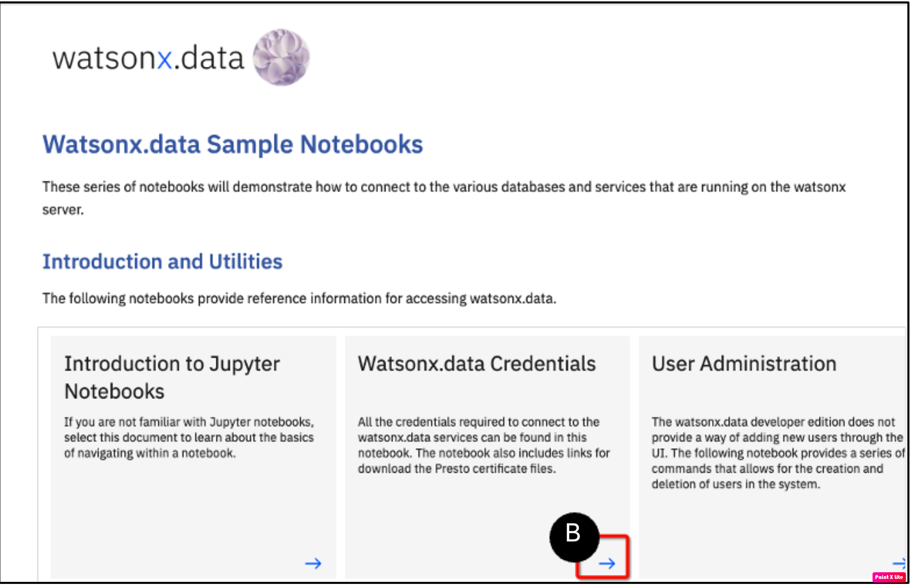
   - The **Watsonx.data Credentials** Jupyter Notebook opens. Scroll to the **Presto Certificate File** section at the bottom and click **presto.crt**(**C**) to download the certificate file, which would be reqired for connection.
    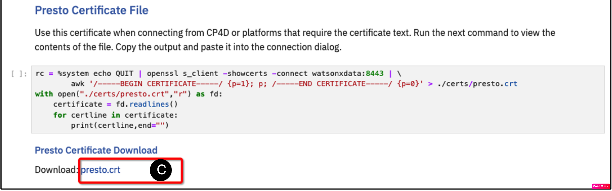
   > **Note:** You might see a warning on **Insecure download** that is blocked like the following. Click **Keep**.

## Setting up AutoAI RAG

### 1. **Create New Asset**  
   - In your sandbox, click **New asset**(**A**) and search for `autoai`(**B**).
     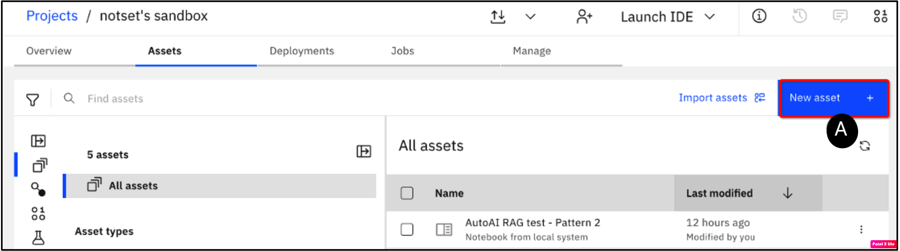
     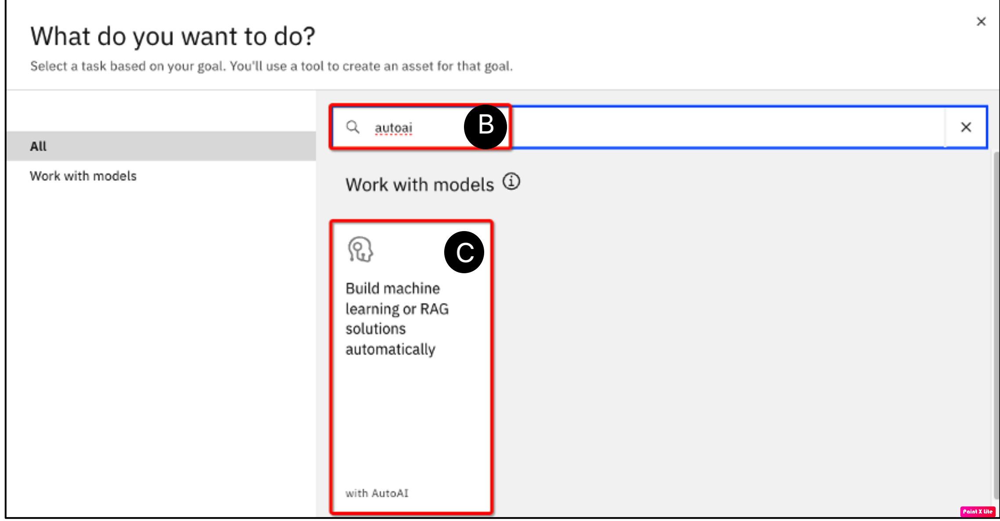
   - Select **Build machine learning or RAG solutions automatically**(**C**), then **Build a RAG solution**(**D**).
     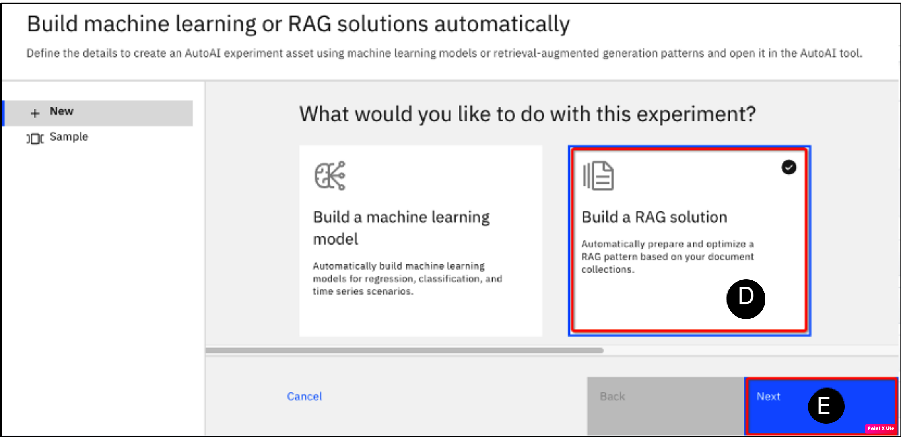
   - Enter `AutoAI RAG test` for the name and click **Create**.

### 2. **Select Grounding Document**  
   - After creation, click **Select from project**(**A**).
     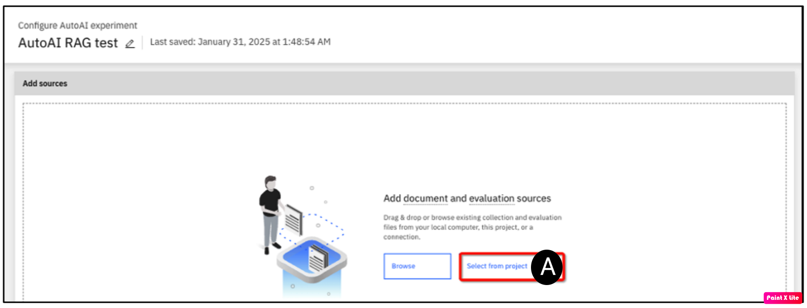
   - Click **Data asset**(**B**), select `LAB 2024 paper.pdf`(**C**) and **Select asset**(**D**).
     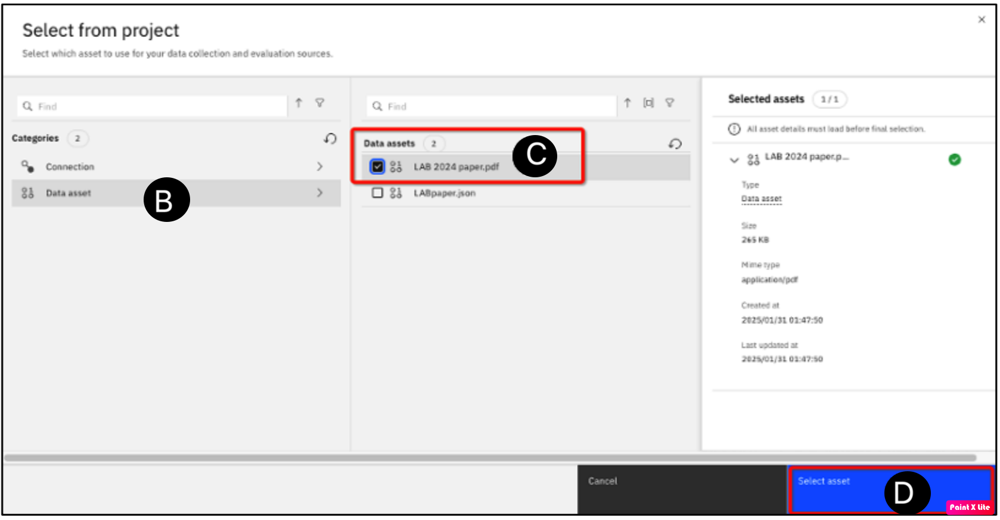

### 3. **Add Crdentials**
   - You see the following warning if you do not have the required **Task credentials** (a User API key). Click **Create**(**A**).
     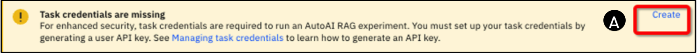
   - The **User API key** page opens to a new window. Click **Create a key**(**B**).
     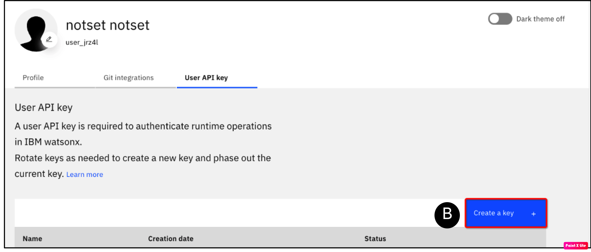
   - Click back to the AUTOAI RAG test window (should be opened on another tab). The **Create** button in A should now have been changed to **Reload**.

### 4. **Create Milvus Connection** :
   - Here is an overview of the page:
   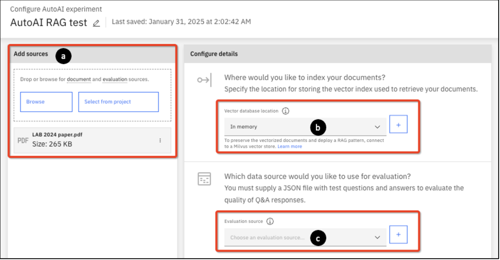
      - a. You can add more documents.
      - b. You can designate a vector data store. The default is In memory (Chroma), but is customizable(which will be done in this step).
      - c. To evaluate various RAG patterns, you need to provide a set of model questions/answers so the output of each pattern can be matched against the model answer.
   - As can be seen, `LAB 2024 paper.pdf` is already added.
   - Click the **Vector database location**(**b**) field, and choose **Connect to a data source: Milvus**.
   - Enter the **Server**(**E**) and **Port**(**F**) as discussed previously. Enter **AutoAI RAG Connect** for **Name**(**D**).
     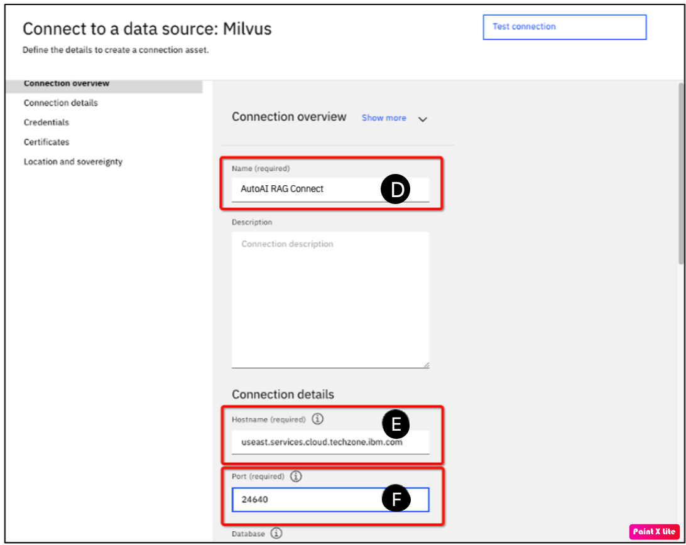
   - For **Credentials** setting(**G**), keep the default value of **Shared**.  
   - **Username** : **ibmlhadmin**(**H**)
   - **Password** : **password**(**I**)
   - Scroll down and paste the entire content of the **presto.crt** file into the **SSL certificate** field(**J**)(including the -----BEGIN CERTIFICATE----- and the -----END CERTIFICATE----- part).
     
   - Click **Test connection**(**K**) 
     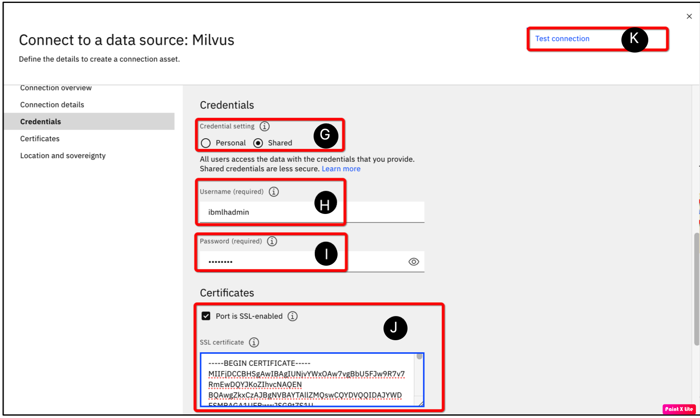
   - You should see a test connection successful message, if all steps are done correctly as shown below.
     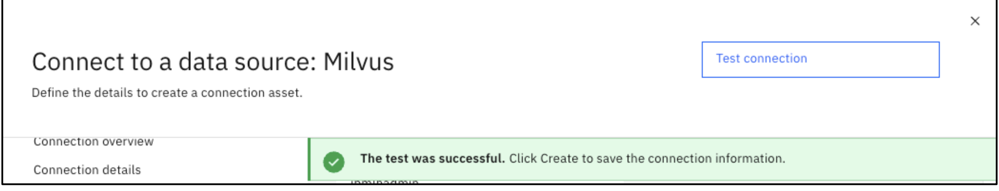
   - Click **Create**.

### 5. **Set Evaluation Source**
   - Check **A**, to see if **AutoAI RAG Connect** is added to the **Vector database location**.
     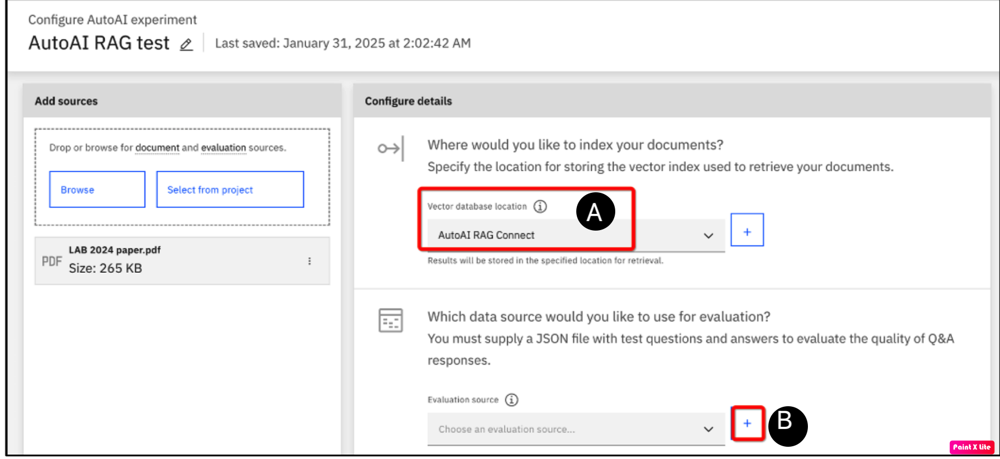
   - Click the **'+'**(**B**) button and click **Select from project**(**C**) in the **Evaluation source** field.
    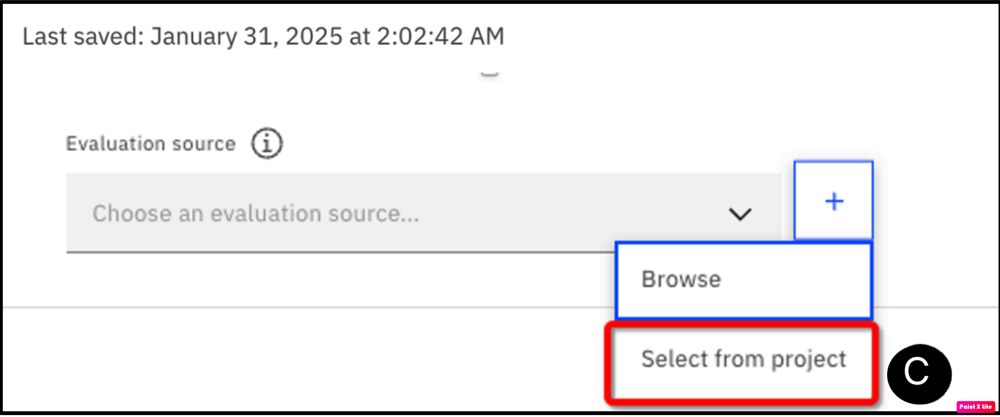
   - Now upload the file `LABpaper.json` as a **data asset**, similar to how the grounding document was uploded.
   - We are now ready to run AutoAI RAG experiment

### 6. **Configure Experiment Settings**  
   - The current setting is provided (**A**), where you will run a test using the **Answer faithfulness** metric, 3 foundation models, and 2 embeddings (subject to changes).  
   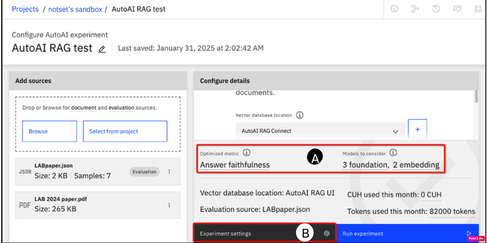

   - Click **Experiment settings** (**B**) to review the following:

     #### 1. **Retrieval & Generation Settings**(Contains the following)
     ##### a. **Optimized Metric**: 
     Choose the evaluation metric:
       - **Answer Faithfulness**: Measures token precision—how much of the generated answer matches the retrieved context.
       - **Answer Correctness**: Compares the output against the model answer for token inclusion.
       - **Context Correctness**: Considers the ranking of answers returned by the LLM. 
     - **Selection for Experiment**: Use **Answer Correctness** for the current test.
     
     ##### b. **Retrieval Methods**: 
     Choose between:
       - **Window**: Retrieves relevant information with surrounding context (better for smaller collections).
       - **Simple**: Retrieves only relevant information without context (better for larger collections).
     - **Selection for Experiment**: Choose both **Window** and **Simple** retrieval.

     ##### c. **Foundation Models**: 
     You can select up to three models for comparison. Use the following :
       - granite-13b-instruct-v2
       - flan-ul2-20b
       - mixtral-8x7b-instruct-v01
     
     ##### d. **Max RAG Patterns**: 
     This controls how many combinations of chunking, embeddings, and retrieval methods to test. The default maximum is **8** for this experiment.
     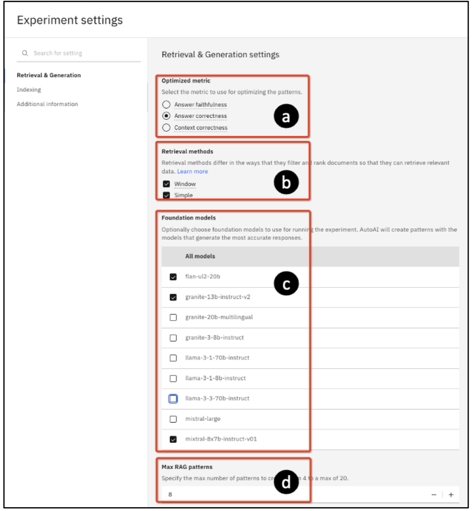

     #### 2. **Indexing Settings**
     ##### a. **Chunk Size & Chunk Overlap**: 
     Determines how the grounding document is split for optimal performance during retrieval. Default settings are used for this experiment.
     ##### b. **Embedding Models**: 
     The choice of embedding models affects how documents are vectorized for retrieval. Default embeddings are selected for the current experiment.
    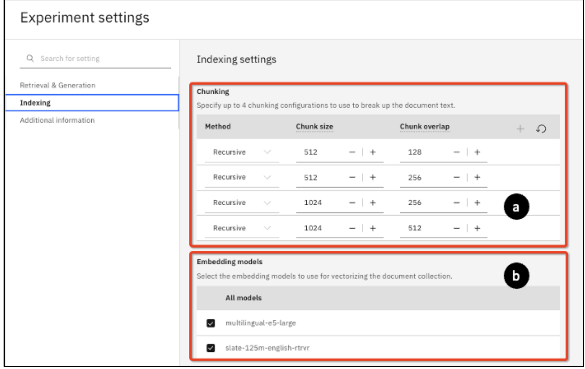

     #### 3. **Additional Information**
     - Runtime Environment: **Large** with **8 CPUs** and **32 GB RAM**. This can be adjusted based on new environment availability.

        
   - Click **Save** on the bottom.

### 7. **Run Experiment**  
   - Come back to **AutoAI RAG test** page and click **Run experiment**.
   - The progress can be monitored using the **progress map**.
     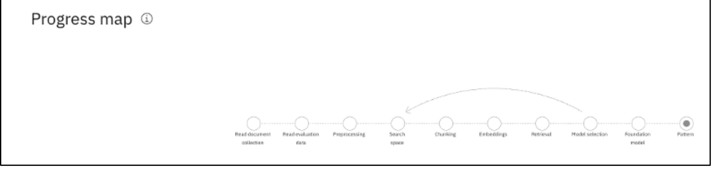
   - You can see a leader board now, where all the patterns are ranked by metric(in this case, Answer Correctness).
     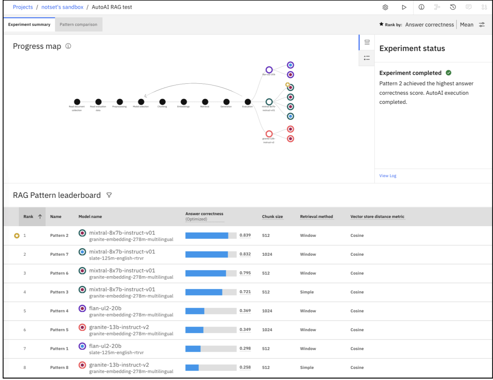
   > **Note**: Sometimes the experiment may not complete(fail). If so, click the following **rerun** button.
     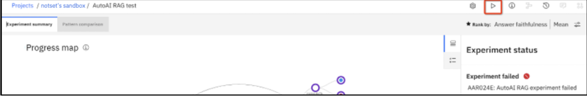

## Analyzing Results

### **Review Ranked Patterns**  
   - After the experiment completes, review the ranking based on **Answer faithfulness** or **Answer correctness** as mentioned. You can add other metrics like **Answer faithfulness** as well by clicking on the **rank preferences** icon(**A**) as shown below and choosing the relevant metric by following the instructions you see.
   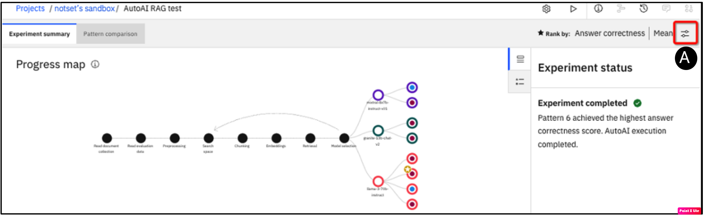

## Saving your work
   - Click a pattern to see detailed information, including how models answered the model questions.
    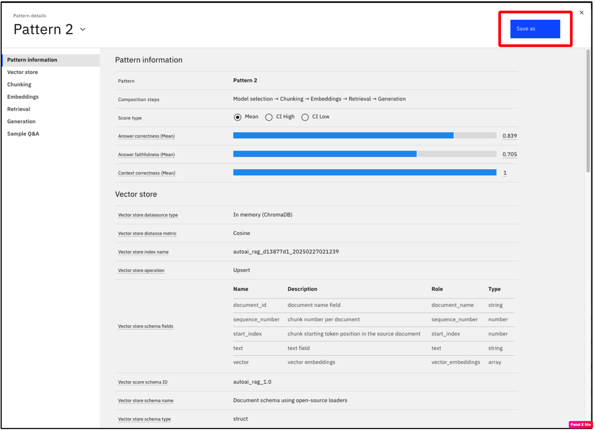
   - Click **Save as**.
   - The **Save notebook** page opens. Keep all the defaults and click **Create**.
   - Save successful prompt appears. Click **View in project**(**V**).
    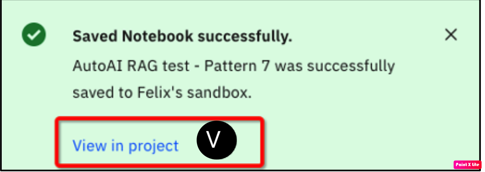
   - The notebook with you specific pattern opens up.
    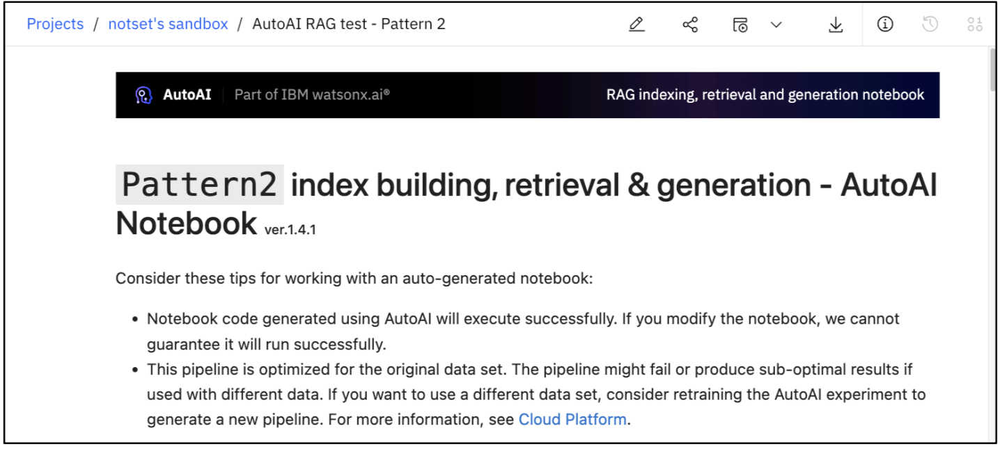
    ### Notes:
   - **This notebook** is for running **RAG using Pattern**, not for **AutoAI RAG**.
   - You must provide your **API key** to run the notebook.
   - You can adjust settings (chunk size, chunk overlap, etc.), but avoid changes unless there are significant updates (e.g., changes to grounding documents).

---

## Section Summary:
- **AutoAI RAG** helps identify the best pattern for your use case by testing various combinations of models and parameters.
- It measures patterns against specified metrics, generates test results, and ranks them.
- You can customize models, chunk size, embedding methods, and the number of patterns to test.
- For significant updates in your use case, consider re-running the **AutoAI RAG experiment** with new model questions/answers instead of modifying existing parameters.

