# Part Two: AutoAI RAG Using a Jupyter Notebook

In this part of the lab, you will use a Jupyter Notebook to perform AutoAI RAG. Here’s the information you need to gather for the notebook:

| **Field**                           | **Description**                                    |
| ----------------------------------- | -------------------------------------------------- |
| **API Key**                         | Your Watsonx.ai API key                            |
| **Project ID**                      | Your Watsonx.ai Project ID                         |
| **Cloud Object Storage Bucket**     | The name of the Cloud Object Storage bucket        |
| **Granite 3.0 PDF**                 | The uploaded Granite 3.0 PDF in the Cloud Storage  |
| **Access and Secret key**           | The access and secret key credentials              |
| **Cloud Object Storage Connection** | The Data Connection ID to the Cloud Object Storage |
| **Milvus Vector Store Connection**  | The Data Connection ID to the Milvus vector store  |

---
> Note: For easier access and future use, store all the retrieved values to a table.
## Getting Your API Key

1. **Log in** to Watsonx.ai and open the **main menu**(**A**).
   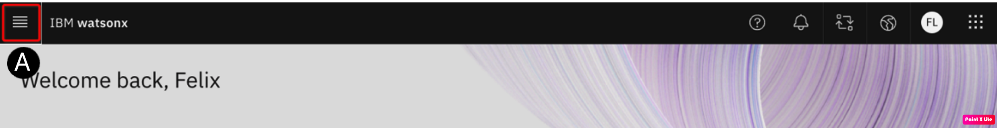
2. Scroll down and click **Access (IAM)**(**B**).
   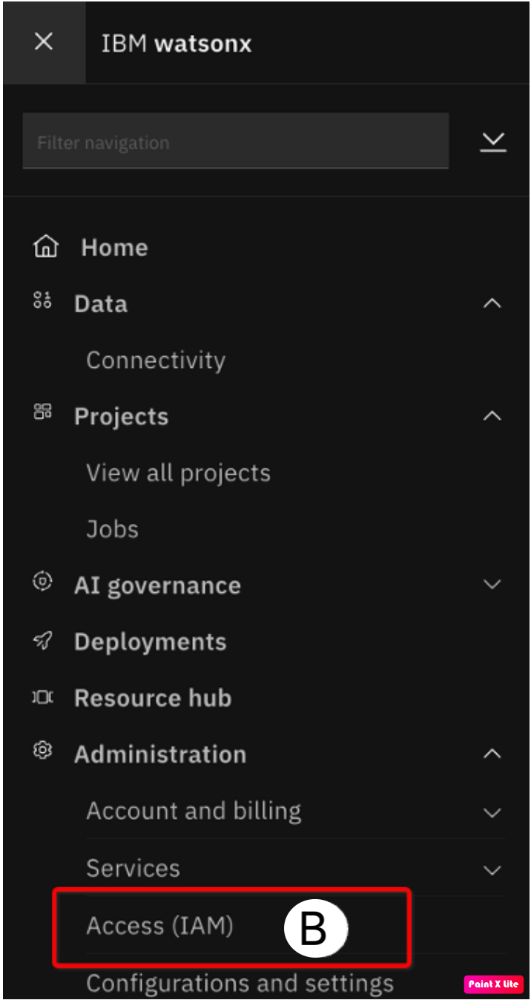
3. In the **IBM Cloud Identity and Access Management** page, click **API Keys**(**C**) and click **Create**(**D**) to generate a new API key.
   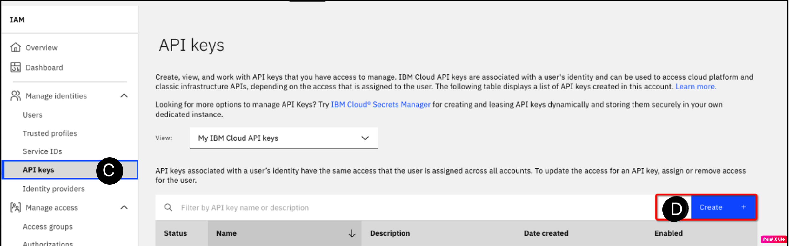
4. Name it **AutoAI RAG API**(**E**) and choose settings as in the image below and click **Create**(**F**).
   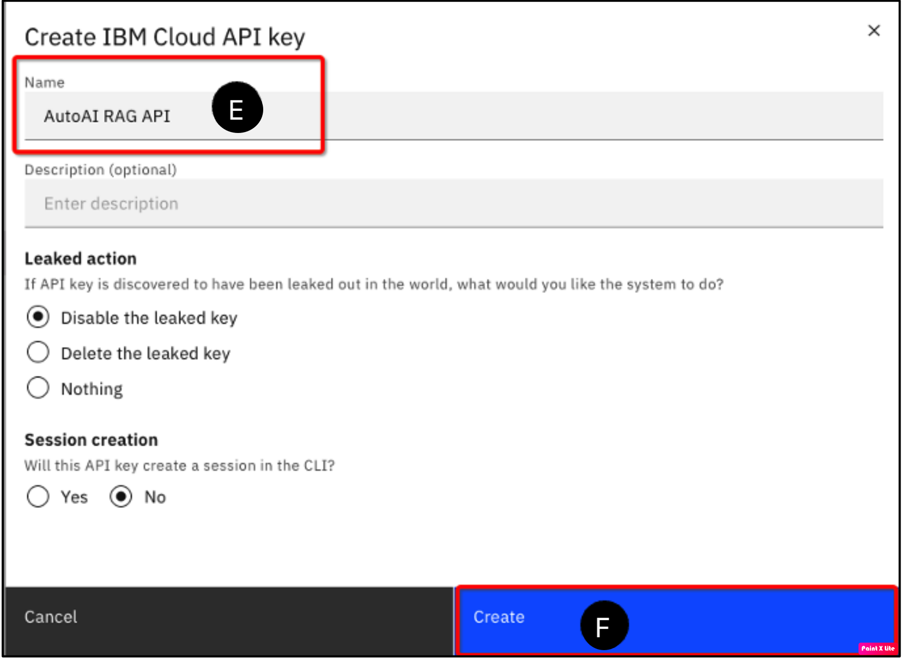
5. Now, **Download**(G) the key or copy it to track in your table.
   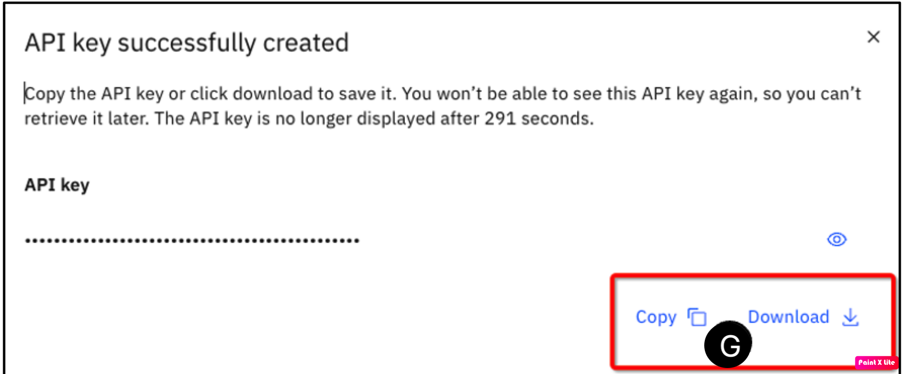

**Sample table entry:**

| **API Key**                                  |
| -------------------------------------------- |
| OJ6FtvivYysTmbcT_heLLpWCQqlIDSIrG78NhUYzIusr |

---

## Finding Your Watsonx.ai Project ID

1. In the Watsonx.ai console, scroll to the **Projects** section.
2. Open the sandbox project (e.g., **notset’s sandbox**) or create a new project(**A**) if not available.
   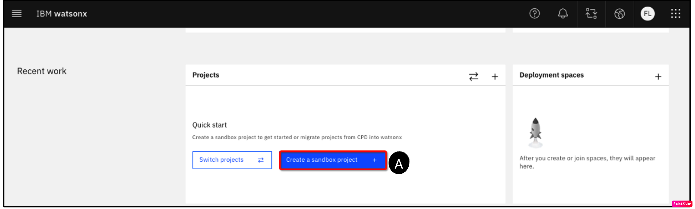
3. Go to the **Manage**(**B**) tab and select **General**(**C**).
   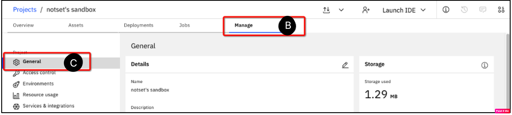
4. Copy the **Project ID**(**D**) and add it to your tracking table.
   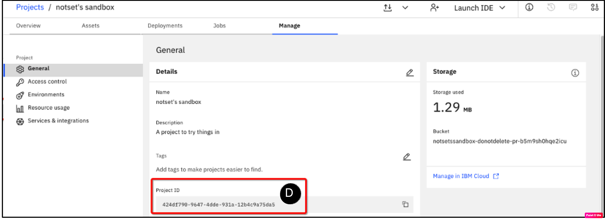

**Sample table entry:**

| **Project ID**                       |
| ------------------------------------ |
| 424df790-9647-4dde-931a-12b4c9a75da5 |

---

## Uploading the Granite 3.0 PDF to Cloud Object Storage

1. **Download and unzip** the Granite.zip file from [this link](https://ibm.seismic.com/Link/Content/DC7XJF4WPc8g48cFdBff9BQMgqPG).
2. Log in to **IBM Cloud**, open the **Resource list**(**A**), and select **Storage**(**B**).
3. Click on the item in the drop down(**C**) (e.g., `itzcos-xxxxxx`), which is **itzcos-110000f3jk-jrz4l** in this case.
   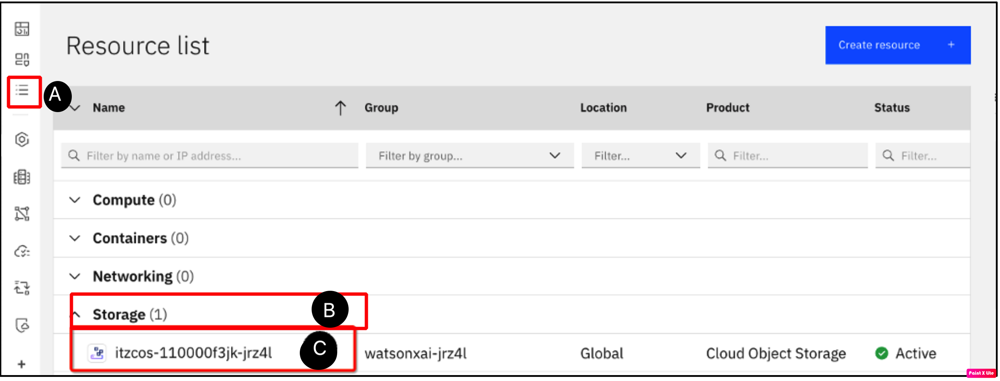
4. The page opens. Note your **Cloud Object Storage Bucket** name, which is highlighed in blue in below image. Click **Upload**(**B**). 
    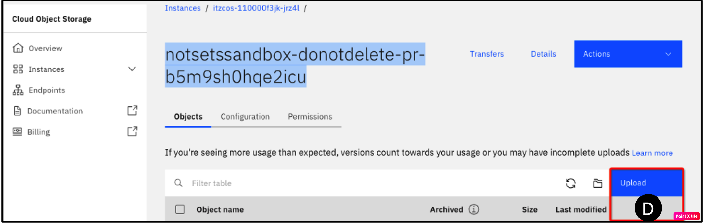
5. Ensure that **Standard** transfer(**E**) is selected (should be by default). Click **Upload folders**(**F**).
    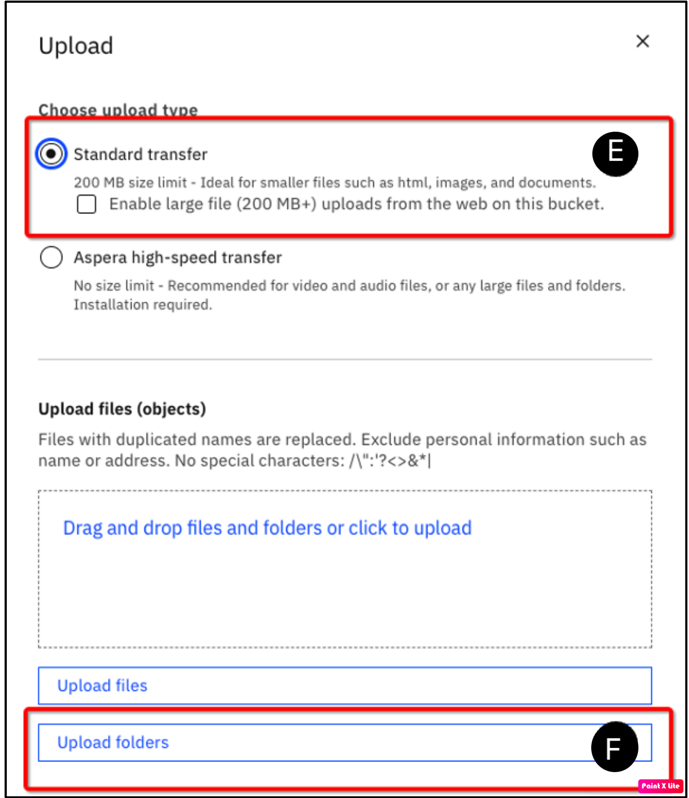
6. Upload the **Granite** folder(D) (not the PDF directly) into your storage bucket, follow the steps and confirm it is uploaded and shows up(**G**).
    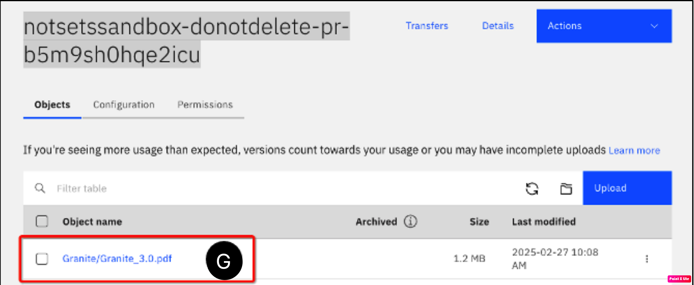
   
> **Note:** You bucket name should be added here.
**Sample table entry:**

| **Cloud Object Storage Bucket**              |
| -------------------------------------------- |
| notsetssandbox-donotdelete-pr-b5m9sh0hqe2icu |

---

## Creating credentials

1. Once again go to the **Storage** option in the **Resource list** as done previously and select the previous item.
2. Under **Service credentials**(**A**), click **New Credential**(**B**).
   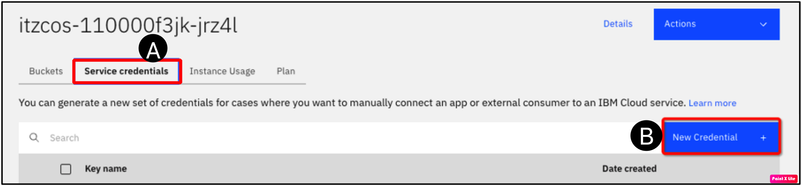
3. Name it **COS_notebook_connect**(**C**).
4. Choose a **Manager** role(**D**), and enable **Include HMAC Credential**(**E**). Click **Add**(**F**).
   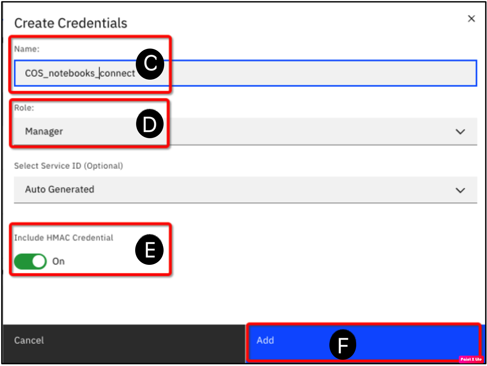
5. Select the credential dropdown(**G**). Copy the **access_key_id** and **secret_access_key**(**H**), then add them to your tracking table.
   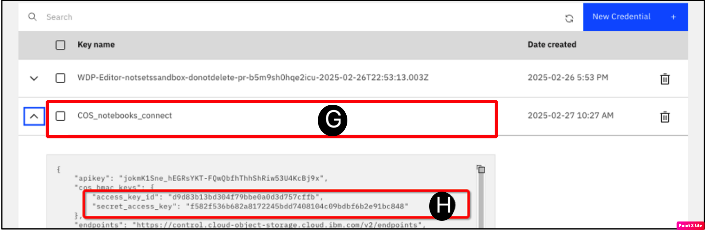

**Sample table entry:**

| **access_key_id**                | **secret_access_key**                            |
| -------------------------------- | ------------------------------------------------ |
| d9d83b13bd304f79bbe0a0d3d757cffb | f582f536b682a8172245bdd7408104c09bdbf6b2e91bc848 |

6. Go to Buckets(**I**) and click on your bucket(**J**) which you added to your tracking table. 
   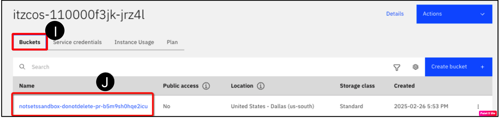
7. Click on **Configuration** tab(**K**).
   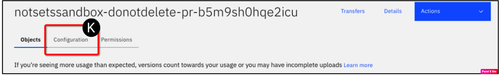
8. Find the **Public Endpoint**(**L**) and note it.
   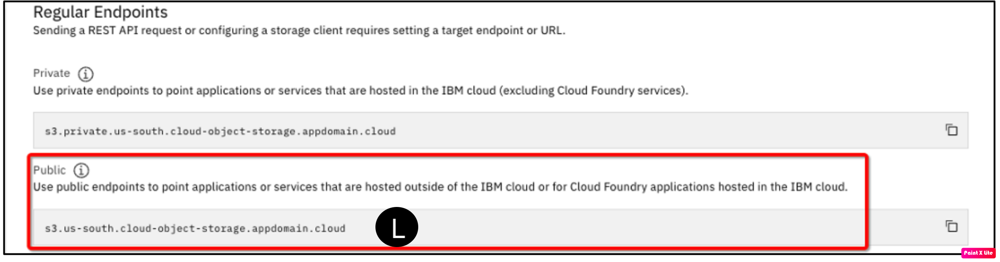

**Sample table entry:**

| **Public Endpoint**                              |
| ------------------------------------------------ |
| s3.us-south.cloud-object-storage.appdomain.cloud |

---
## Creating a Connection to the Cloud Object Storage Bucket
### 1. Add the Connection
1. From **main menu**, go to **watsonx** and launch **watsonx.ai**.
2. Go to the **project** section and open **notset's sandbox**.
3. Click the **Assets** tab(**A**) and select **New asset**(**B**).
   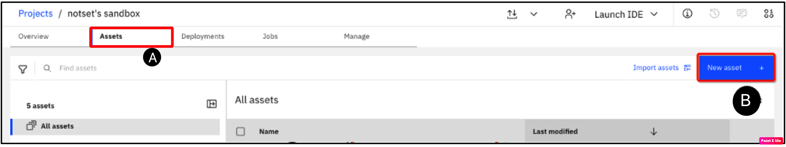
4. In the 'What do you want to do' search bar, search for **Connect to a data source**(**C**) and select the same below(**D**).
   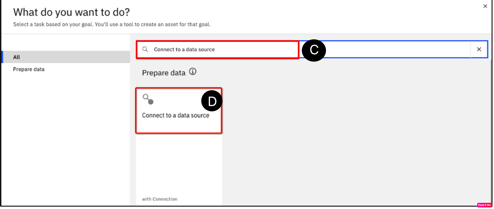
5. Go to **Add connection** in watsonx.ai.
6. In the search field, type: **IBM Cloud Object Storage**(**E**).
7. Select the **IBM Cloud Object Storage**(**F**) tile (either from main area or sidebar).
8. Click **Next**(**G**).
   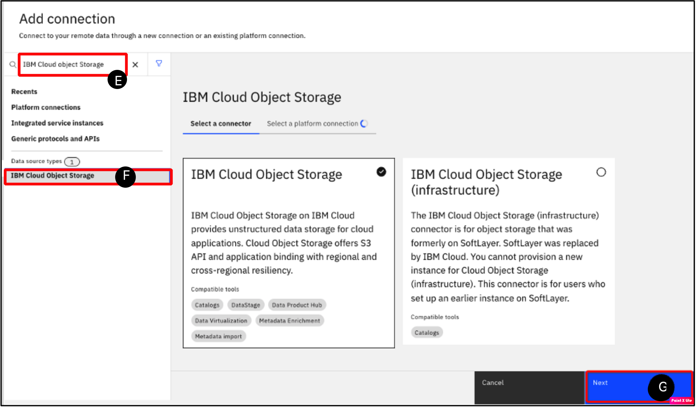

### Configure the Connection

9. On the *Connect to a data source: IBM Cloud Object Storage* page:
    - **Do NOT select an instance**(**A**).
    - Fill in the following fields:
      - **Name**: **COS_connection** (**B**)
      - **Bucket**:Enter the value of **Cloud Object Storage Bucket ID** (**C**). 
      - **Login URL**: Enter the value of **Public Endpoint** (**D**). 
      - **Authentication method**: Select **Access key and Secret key** (**E**.)
      - **Access key**: Enter the value of **access_key_id** (**F**).
      - **Secret key**: Enter the value of **secret_access_key** (**G**).

10. Click **Test connection** (**H**).
    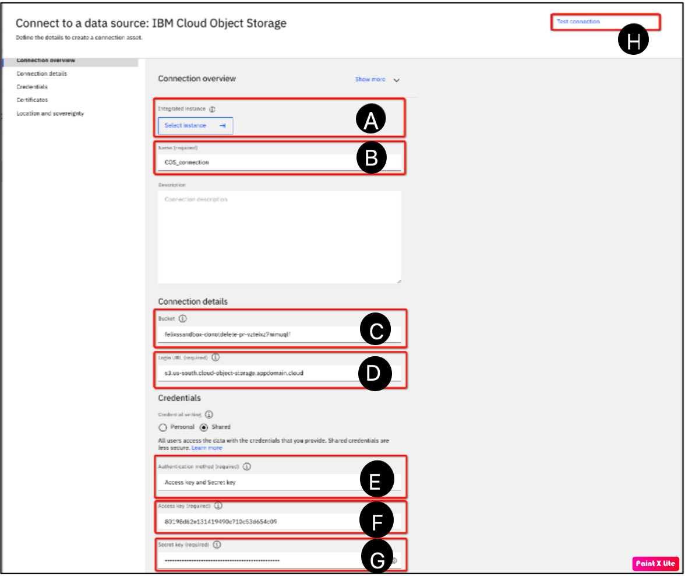

### 3. Finalize the Connection

7. If the test is successful, click **Create** on the bottom.
8. When prompted with *Create connection without setting location and sovereignty*, click **Create** again.

---

## 🔎 Retrieve the Connection ID

9. After creation, click the **COS_connection** entry(**A**).
   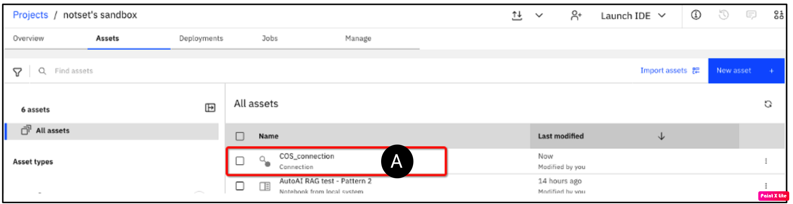
10. In the URL of the **Edit connection** page, locate the **Connection ID** and select the highlighted part. 
    Example URL:  
    ```
    https://dataplatform.cloud.ibm.com/connections/**984d2202-ebd6-45ea-b84f-854ab2dfb56e**?project_id=...
    ```
    - **Connection ID**: `984d2202-ebd6-45ea-b84f-854ab2dfb56e`

11. Record the Connection ID in your tracking table.
12. Click **Cancel** to close the window.

## Creating a Data Connection to the Milvus Vector Store

1. If you’ve already set up a **Milvus vector store** connection, note the **Connection ID** (this was done in part one).
2. G to **Assets** tab and Click **AutoAI RAG Connect* (**A**). 
   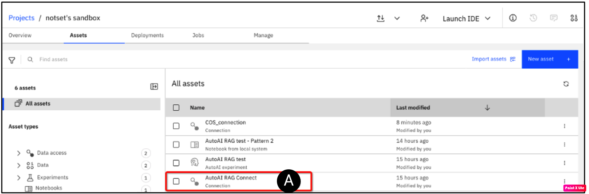
3. You should find it in the **Edit connection: Milvus** page. Copy the **Connection ID** as done in the previous step from the URL (**B**).
   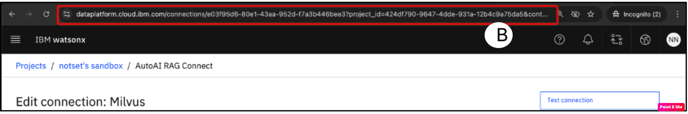 

**Sample table entry:**

| **Milvus Connection ID**             |
| ------------------------------------ |
| e03f95d6-80e1-43aa-952d-f7a3b446bee3 |

---

## Running AutoAI RAG Using the Jupyter Notebook
>**Note:**Your watsonx.ai is all set up to run the Jupyter Notebook. Further instructions on running the AutoAI RAG lab are documented in the Notebook.
1. **Download** the [AutoAI RAG using Granite 3 document with Milvus notebook](https://ibm.seismic.com/app?ContentId=bd5fceb9-0b25-4eb5-ad99-008af5f51d40#/doccenter/861ea1fd-99e0-44d7-9135-85412e5c28d1/doc/%252Fdd3359e5f7-a856-a91b-7688-41024b2ac637%252FdfNTY4NmVhOWItY2RkNS04ZWY3LTZkNzItZTQwZjczMWUyMjk1%252CPT0%253D%252CRGF0YSBQbGF0Zm9ybQ%253D%253D%252FdfNDRmODBlMzMtY2ViMC0zMDI1LTVhNDEtNzg2OTg4MWVmZDBl%252COthers%252FdfOTRiYmU4NTQtNWY4NC03Y2QyLWZjYWUtOGIxYmFmZjkyZThk%252CPT0%253D%252CRWR1Y2F0aW9uL0xlYXJuaW5n%252Flfc222458f-c7f5-48c9-b9f9-238ab5da27c7/grid/).
2. Log in to **Watsonx.ai**, open your sandbox project, and navigate to **Assets** as done earlier.
3. Click **New asset** and search for **notebook**.
4. Select **Work with data and models in Python or R notebooks** (**A**).
   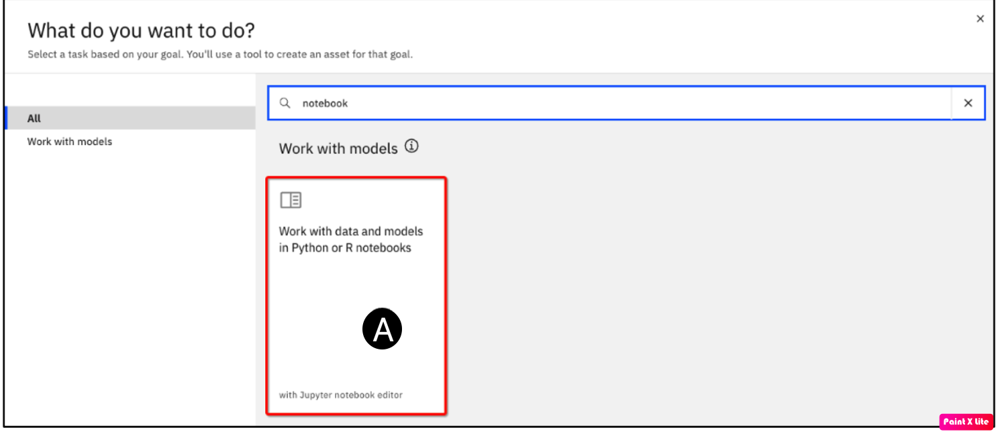
5. Click **Local file** (**B**) and **upload** (**C**) the notebook (AutoAI RAG using Granite 3 document with Milvus.IPYNB).
   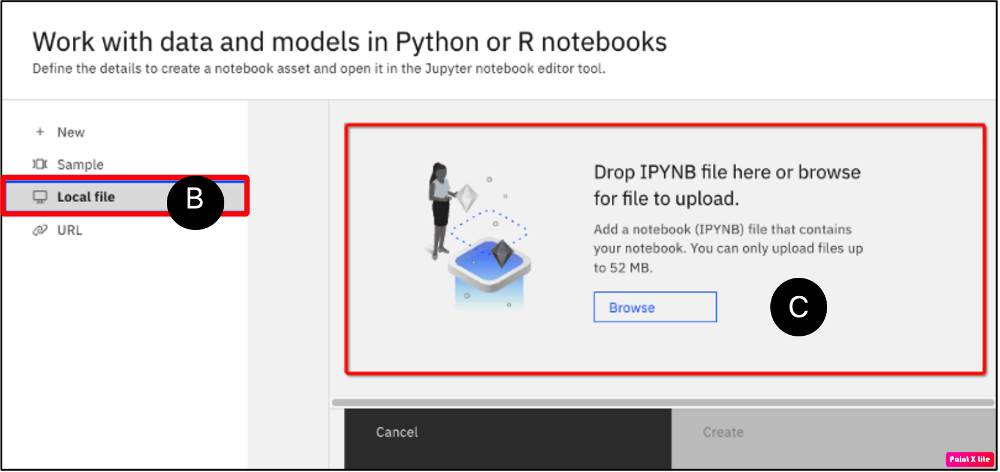
6. Check the name (**D**), click **Create** (**E**) and open the notebook.
   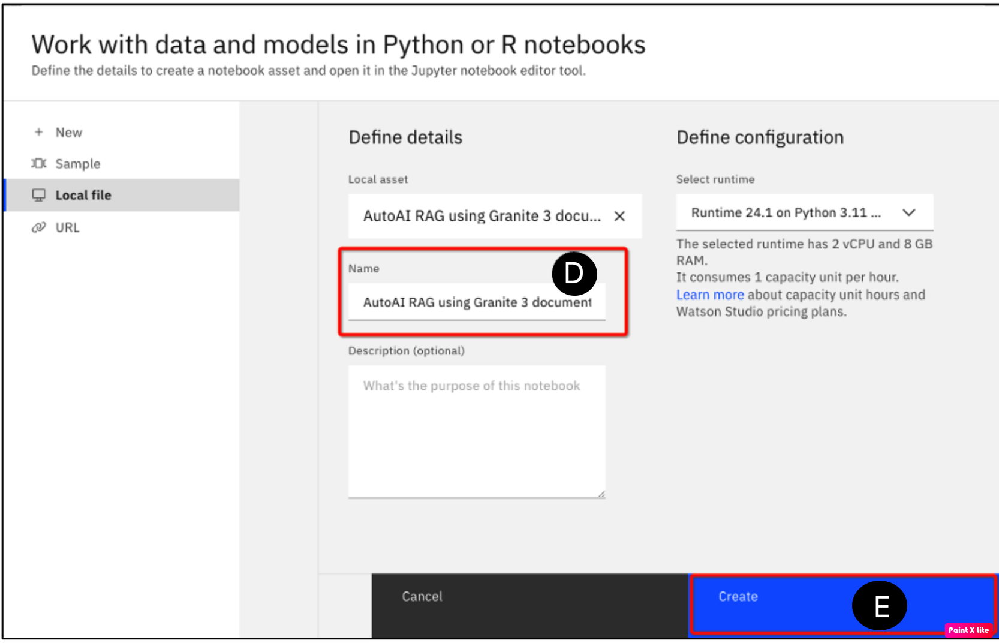

### **Important Notes:**
- The **TechZone environment** is designed for testing, not production. You might experience failed notebook runs. If this happens, simply rerun the notebook.
- Follow the instructions in the notebook to complete the lab.

---

Now you have all the necessary steps and information to run AutoAI RAG successfully using the Jupyter Notebook!
