## 1. Selecting the correct TechZone image to reserve

### 1.1 For Custom Foundation Model Lab

1. Go to [https://techzone.ibm.com/collection/data-and-ai-technology-sales-enablement/journey-watsonx-technical-enablement](https://techzone.ibm.com/collection/data-and-ai-technology-sales-enablement/journey-watsonx-technical-enablement) (**A**).

2. Look for **watsonx.ai for custom models (Student ID version) (**B**).**
   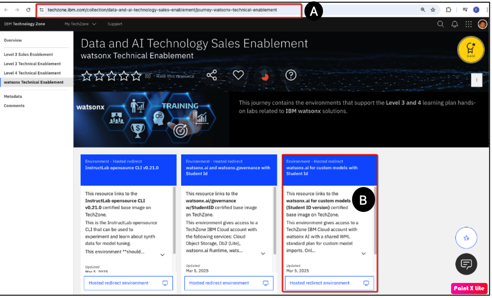
3. Hover over **Hosted redirect environment** – it will turn into a blue **Reserve it** button.  
   Click **Reserve it**.

4. Proceed to **Section 2**.

### 1.2 For AutoAI RAG Lab

For this lab, you need to make **two reservations**:  
1. A **watsonx.ai and watsonx.governance** reservation  
2. A **watsonx.data Development Lab** reservation

---

#### 1.2.1 watsonx.ai / watsonx.governance (SaaS)

1. Go to [https://techzone.ibm.com/collection/data-and-ai-technology-sales-enablement/journey-watsonx-technical-enablement](https://techzone.ibm.com/collection/data-and-ai-technology-sales-enablement/journey-watsonx-technical-enablement) (**A**).

2. Look for **watsonx.ai and watsonx.governance with Student ID** (**B**).
   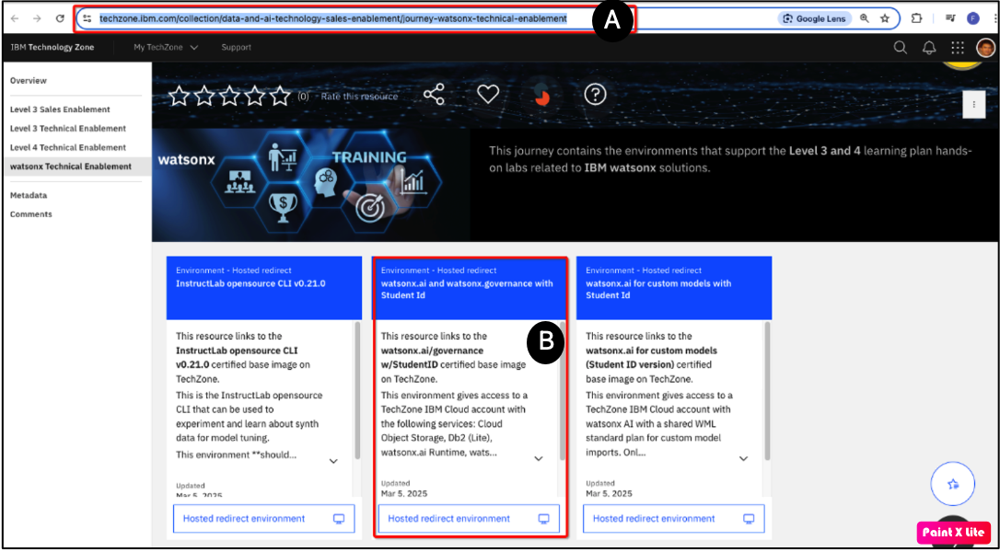
3. Hover over **Hosted redirect environment** – it will turn into a blue **Reserve it** button.  
   Click **Reserve it**.

4. Proceed to **Section 2**.

---

#### 1.2.2 watsonx.data Development Lab

1. Go to [https://techzone.ibm.com/collection/data-and-ai-technology-sales-enablement/journey-watsonx-technical-enablement](https://techzone.ibm.com/collection/data-and-ai-technology-sales-enablement/journey-watsonx-technical-enablement) (**A**).

2. Look for **IBM watsonx.data Development Lab – 2.1.1 GA** (**B**).
   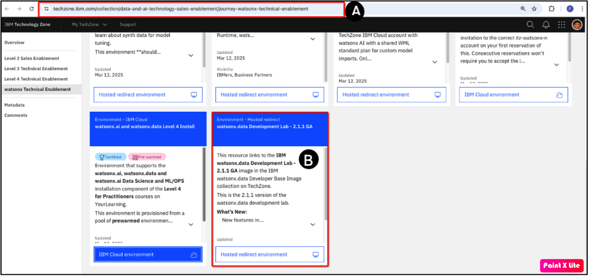
3. Hover over **Hosted redirect environment** – it will turn into a blue **Reserve it** button.  
   Click **Reserve it**.

4. Proceed to **Section 2**.

## 2. Making a TechZone reservation

### Reservation Steps:

1. Choose **Reserve now** or schedule for later
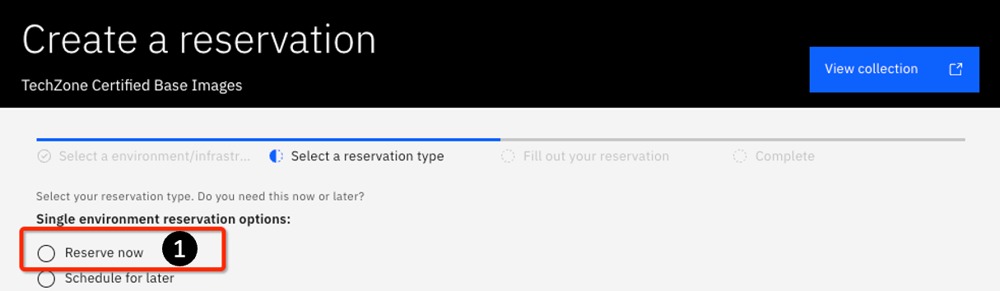
2. Set name of reservation (e.g., `john_doe_foundation_model`)
3. Purpose: **Education**
4. Description: e.g., `Complete L4 Custom Foundation Model Lab`
5. Choose a preferred geography: `us-south`, `eu-de`, `jp-tok`, etc.
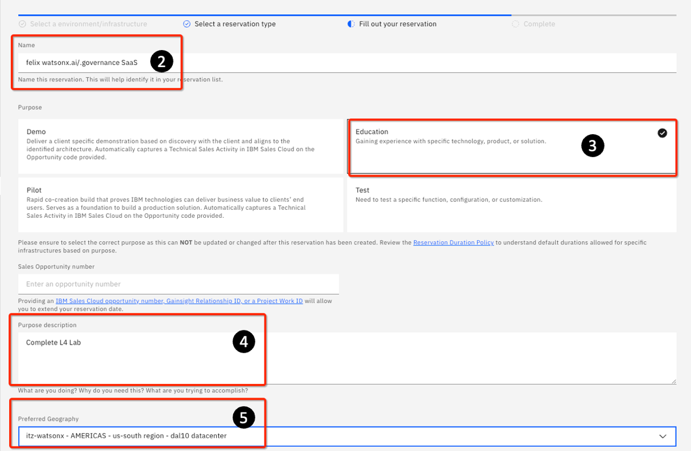
6. Optional: Set a shorter reservation time
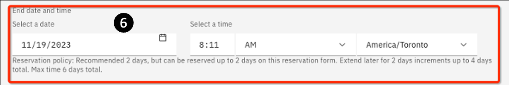
7. If prompted, select **Install Db2 = No**
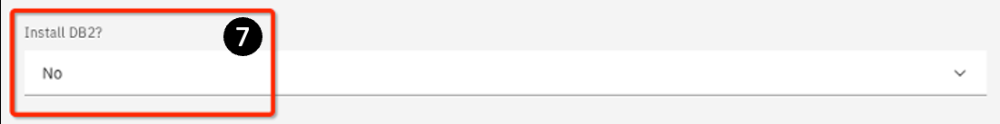
8. Add notes if needed
9.  Accept Terms → Click **Submit**
   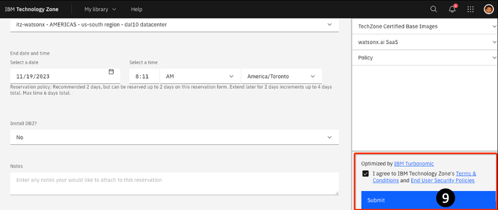
10. Wait for provisioning email (~10–15 min)
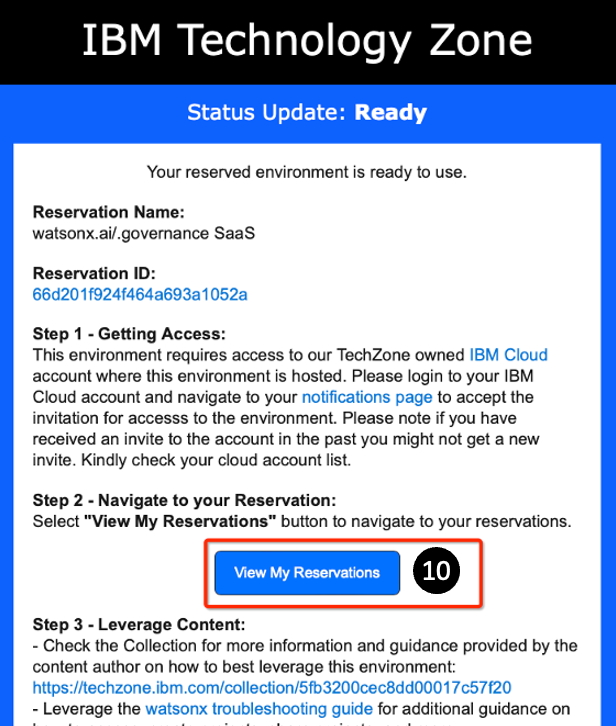
11. The My reservations page opens. You can always get to this page by going to [https://techzone.ibm.com/my/reservations](https://techzone.ibm.com/my/reservations). Click your reservation (in this example it is the watsonx.ai/.governance w/StudentID) tile.
 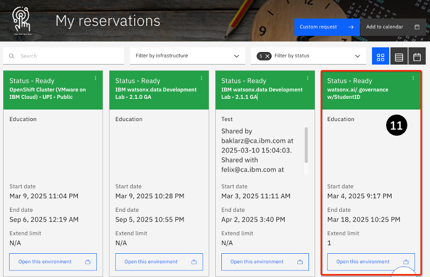
12.  The detail reservation page opens. You will often need to bring up this page as it contains important information on how to use the image properly
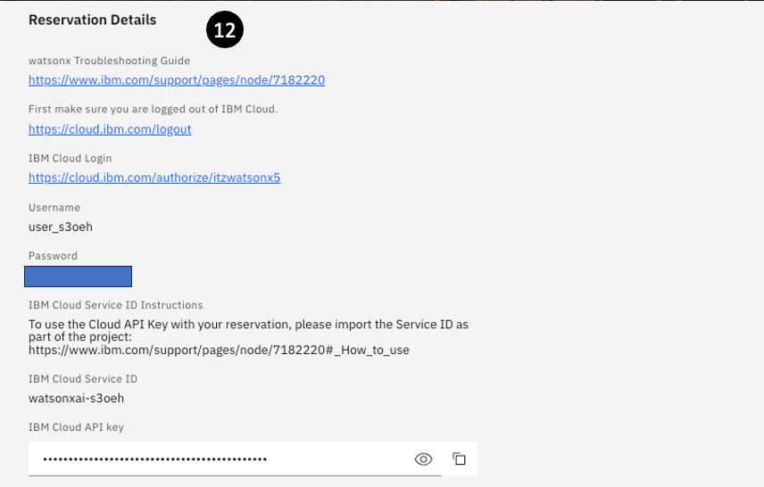

Once the environment is ready perform the following steps : 

### 🎓 Post-Reservation Steps for TechZone Labs (Student ID Version)

> **Note:** These steps apply only to specific labs that use the **Student ID version** of the TechZone image.

---

### 🧪 Applicable Labs Using the Student ID Image

- Custom Foundation Model lab  
- AutoAI RAG lab *(Note: You also need info from the watsonx.data image, but don’t access it directly)*

---

### 🔐 Logging in with Student ID Credentials

> ✅ It’s recommended to use a **private/incognito window** for this login flow.

### Step-by-Step Instructions

1. Visit your reservations at:  
   [https://techzone.ibm.com/my/reservations](https://techzone.ibm.com/my/reservations)

2. Click on your active reservation to open its details.

3. Scroll to the **Reservation Details** section. Note the **Username** (**C**and **Password** (**D**).

4. First, **log out of any existing IBM Cloud sessions** (**A**):
   [https://cloud.ibm.com/logout](https://cloud.ibm.com/logout)

5. Then, click on the unique **IBM Cloud Login** link provided in your Reservation Details (**B**).
   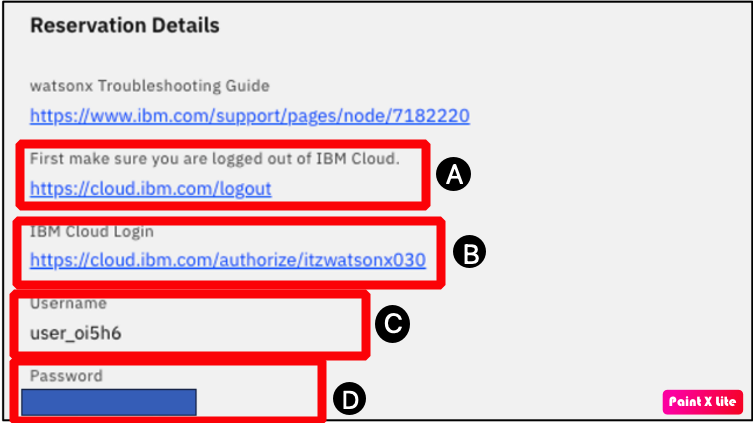
6. Log in using the **Username** and **Password** (**E**) provided.

7. Click **Sign In** (**F**) to access the IBM Cloud Dashboard.
   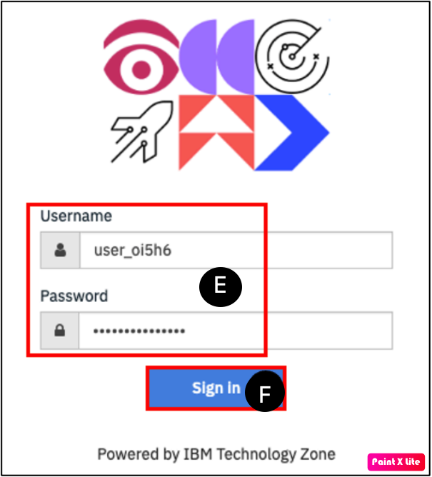
---

### 🧭 Navigating to watsonx.ai

8. From the Dashboard, open the main menu (☰) in the top-left corner.

9. Select **Resource list** from the dropdown.

10. Expand **AI / Machine Learning** (**A**).

11. Click on the **watsonx.ai Studio** entry (**B**)(the name starts with `itzws-`).
    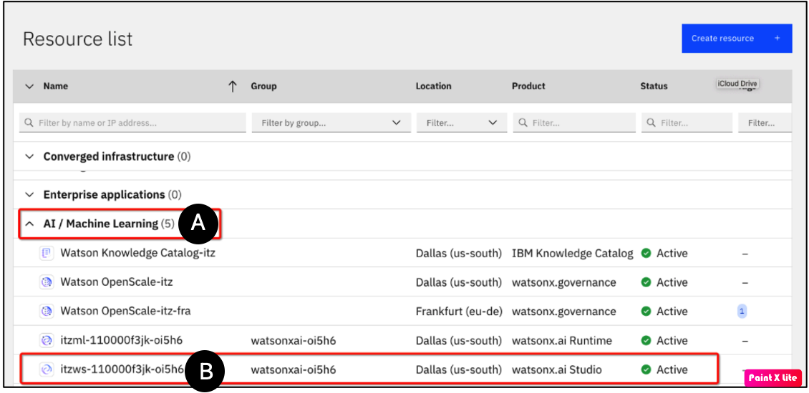
12. The watsonx.ai Studio page will load. Click the arrow next to **Launch in**.

13. From the dropdown (**C**), select **IBM watsonx** (**D**).
    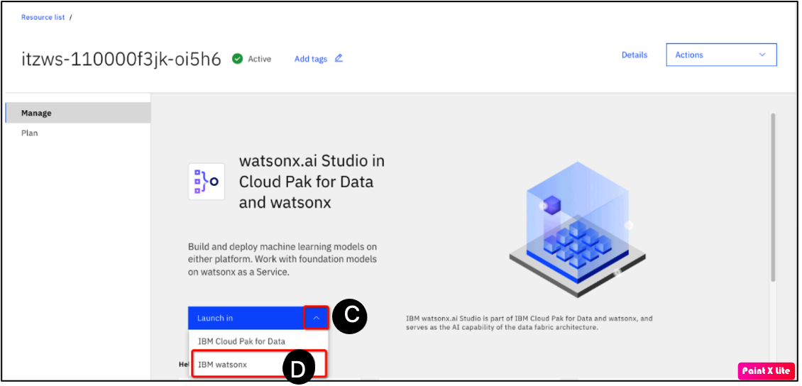

---

### 🗂 Access Your Project

16. Scroll down to the **Recent work** area.

   You should see a sandbox project named something like **notset’s sandbox** (**A**).
    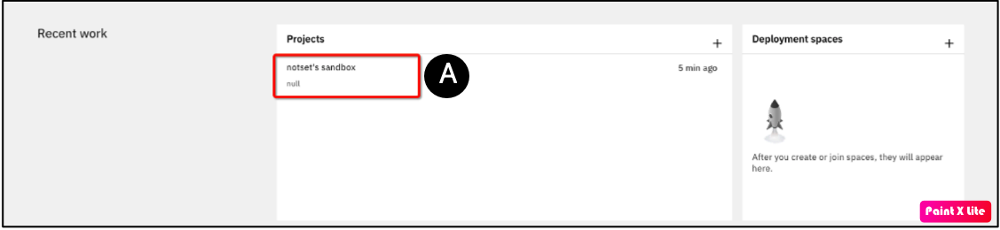

---

🎉 **You are now ready to begin the lab!**

