# Custom Foundation Model

## Introduction
IBM’s generative AI strategy is open, trusted, and performant. IBM watsonx.ai is designed to work with models from different sources: IBM-developed models, open source, and other third-party models. 

IBM watsonx.ai provides a set of carefully curated models, which include IBM’s Granite series models, Meta’s llama models, Goggle’s flan models, and Mistral AI’s mistral and mixtral models. These models provide a wide range of generative AI use cases. For example:

- Generation
- Extraction
- Classification
- Summarization
- Question Answering
- Code generation and conversion

IBM has recognized that clients may have been working with models that they have found satisfactory or might have tuned a model to support their business use cases. Clients want to deploy these models within watsonx.ai to use the rich features. For example:

- Model governance, AI automation, and deployment
- Integration with watsonx.data and watsonx.governance
- Integration with various AI Assistants
  
The watsonx.ai Custom Foundation Model feature allows clients to bring their own model and deploy it on watsonx.ai. This feature provides the flexibility for clients to implement the AI solutions that are right for their use case. Always consult Supported model architectures on [Planning to deploy a custom foundation model](https://eu-de.dataplatform.cloud.ibm.com/docs/content/wsj/analyze-data/deploy-custom-fm-plan-cloud.html?context=wx&audience=wdp) to ensure the model that you want to add is based on a supported architecture. 


## Prerequisites & Getting Started (Short Version):

- Create a Hugging Face account: https://huggingface.co/join

- Use Mac OS or Linux with at least 2 GB of free space

- Python 3.9+ required; know how to update it

- Use Chrome browser (Safari not supported)

- Be familiar with basic Linux commands

- Be prepared for multiple steps and possible setup issues

- A GPU is required to complete the final deployment step

## Using TechZone
Refer to the setup under this section and follow the steps to setup the lab environment for Custom Foundational model.

## Lab
To add a custom foundation model to **watsonx.ai**, follow these key steps:

- Check if the model is supported by watsonx.ai  
- Get the model files (e.g., from Hugging Face)  
- Convert the model if needed  
- Create a project in watsonx.ai (via TechZone reservation)  
- Upload the model to Cloud Object Storage (COS)  
- Set up a deployment space and link it to your COS  
- Create a model asset from COS content  
- Deploy the model  
- Use it in watsonx.ai

---
## Verifying That Your Model Is Supported

Use `flan-t5-base` as an example.

1. Go to [https://huggingface.co/models](https://huggingface.co/models)

2. Search for `flan-t5-base`.
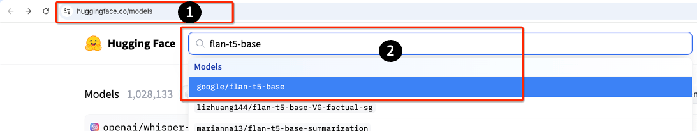
3. Select **google/flan-t5-base**.  
   > Note: Include the full name `google/flan-t5-base`.

4. Click the **Files** tab.

5. Ensure the following files are available:  
   a. `config.json` – required by the TGIS runtime  
   b. `tokenizer.json`  
   c. `model.safetensors` – model must be in this format
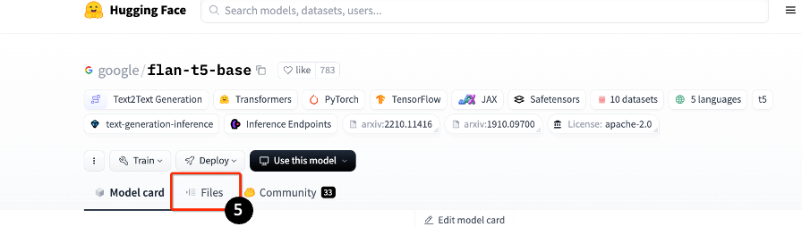
6. Open `config.json`.  
   - Check for the field: `"model_type"`  
   - It should say `"t5"` for this model.
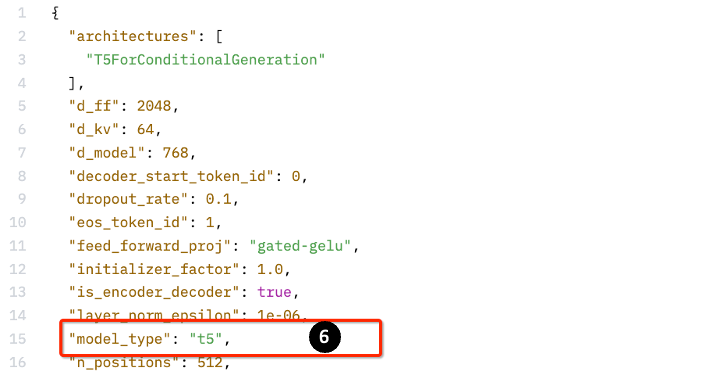
7. Confirm the model architecture (`t5`) is in the [supported list (as of March 2025)](https://eu-de.dataplatform.cloud.ibm.com/docs/content/wsj/analyze-data/deploy-custom-fm-plan-cloud.html?context=wx&audience=wdp#architecture).  
   - `t5` is supported with Small, Medium, or Large watsonx.ai configurations.
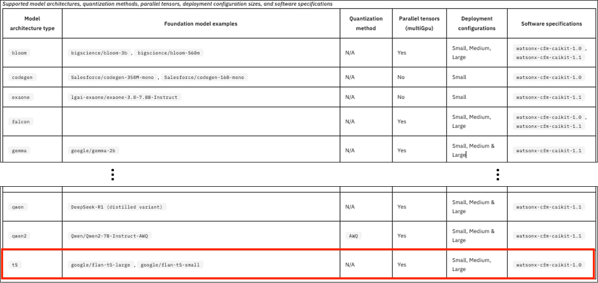


## Downloading the Asset from Hugging Face

To proceed, you’ll need a Hugging Face account. If you don’t already have one, sign up at:  
🔗 [https://huggingface.co/join](https://huggingface.co/join)

---

### Getting a Hugging Face Access Token

You’ll need an access token to download model files from Hugging Face:

1. Go to 🔗 [https://huggingface.co/](https://huggingface.co/) and click **Log In**. 
   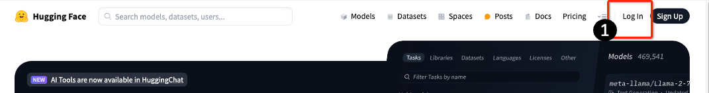 
2. Enter your **Username/email** and **Password**.  
3. Click **Login**. 
   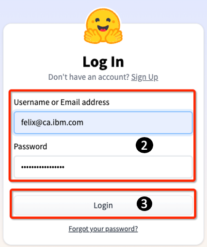
4. On the left-hand panel, click **Settings**. 
   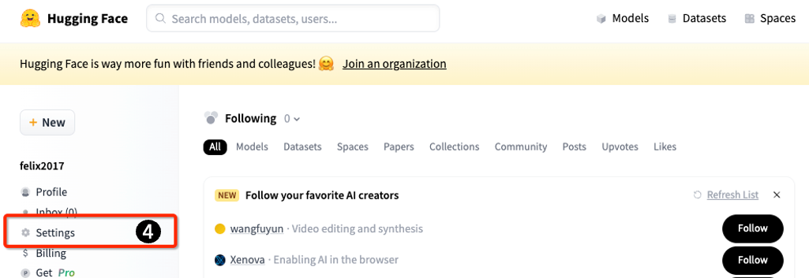 
5. Under Settings, click **Access Tokens**. 
   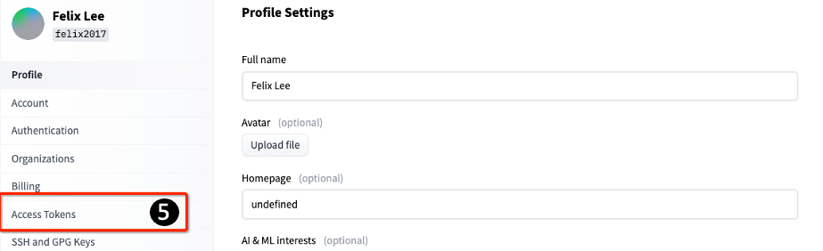 
6. Click **+ Create a new token**.  
   > **Note:** You may already have one, but it’s good practice to create a new token for this lab.
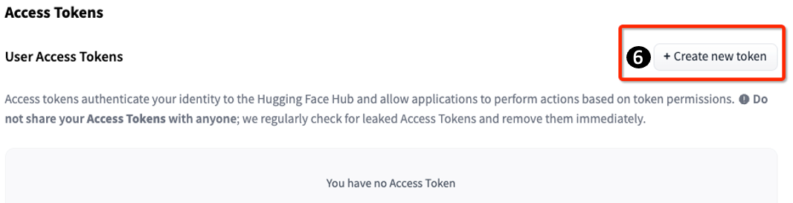
7. In the **Token name** field, enter something like `CFM token`.  
   
8. Under **Permissions**, select:  
   **• Read access to contents of all public gated repos that you can access**  
   > This permission is sufficient for the lab.
   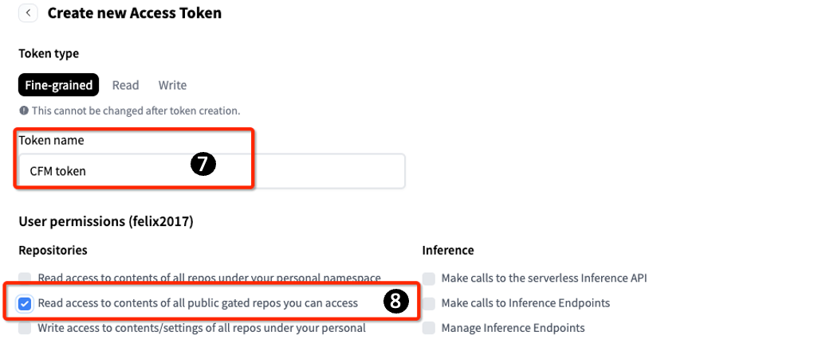
9. Scroll to the bottom and click **Create token**.  
   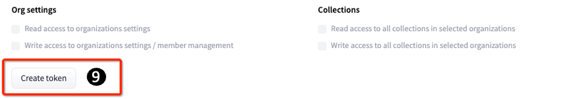
10. The token will be shown on the next screen.  
    > **⚠️ Important:** This token is only displayed once. Be sure to **copy and save it somewhere safe**. If you lose it, you’ll need to create a new one. 
11. Click **Done** when finished.
    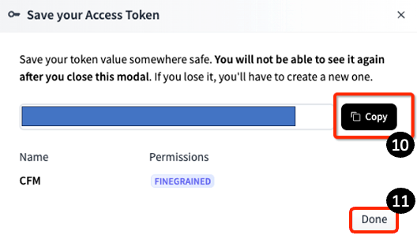

---

With your token ready, you're now set to download the `flan-t5-base` model from Hugging Face.

## Downloading a Model from Hugging Face

---

1. **Open a terminal** on your Mac OS or Linux workstation.  
2. **Create a directory** and a new Python virtual environment (update `<username>` accordingly):

    ```bash
    cd /Users/<username>/Downloads
    mkdir CFM
    python -m venv /Users/<username>/Downloads/CFM/venv
    ls /Users/<username>/Downloads/CFM
    ```

    You should see a `venv` directory under `CFM`.
    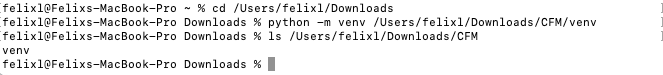

3. **Activate the virtual environment**:

    ```bash
    cd /Users/<username>/Downloads/CFM
    source venv/bin/activate
    ```

    > **Note:** You’ll notice your terminal prompt reflects that you’re now inside the `venv`.
    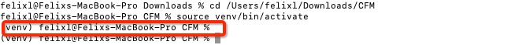

4. **Create a subdirectory** to hold the model:

    ```bash
    mkdir flan-t5-base
    ls -l
    ```
    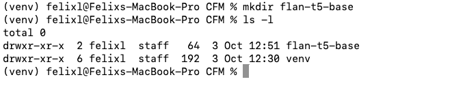

5. **Install the Hugging Face CLI tool**:

    ```bash
    pip install -U "huggingface_hub[cli]"
    ```
    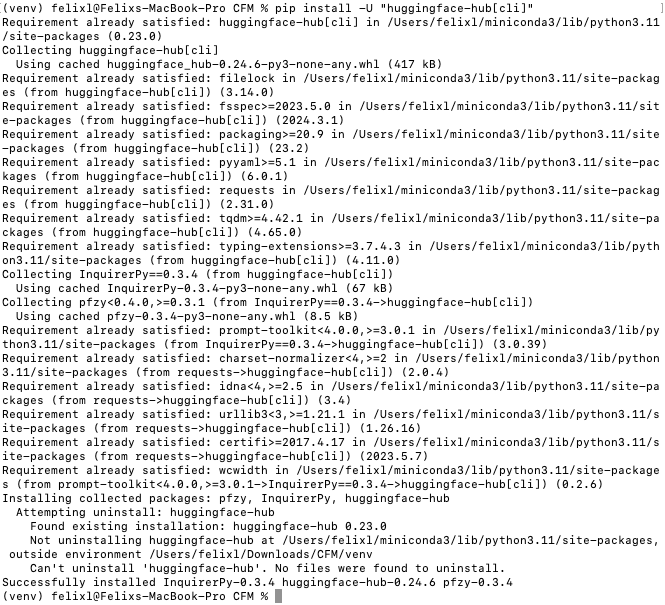
    > **Note:** Ensure your Python version is 3.9 or higher for smooth compatibility.

6. **Verify the CLI installation**:

    ```bash
    huggingface-cli --help
    ```
    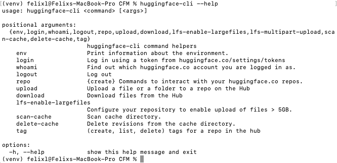
    > **Note:** If the `--help` output doesn't include the download option, your Python version may be outdated.

7. **Set up required environment variables** (remember to use your actual token and path):

    ```bash
    export HF_TOKEN="<your Hugging Face token>"
    export MODEL_NAME="google/flan-t5-base"
    export MODEL_DIR="<your base directory>/CFM/flan-t5-base"
    ```

    > **Note:** **Your Hugging Face access token is essential here.** You should’ve saved it earlier—if not, generate a new one. You also need to use the full path name you saw earlier. 
    **google/flan-t5-base**. 
    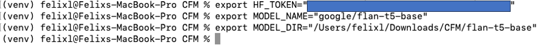

8. **Log in and download the model**:

    ```bash
    huggingface-cli login --token ${HF_TOKEN}
    huggingface-cli download ${MODEL_NAME} --local-dir ${MODEL_DIR} --cache-dir ${MODEL_DIR}
    ```

    > **Note:** Expect around **12 files**, totaling approximately **4 GB**. Some models can be significantly larger.
    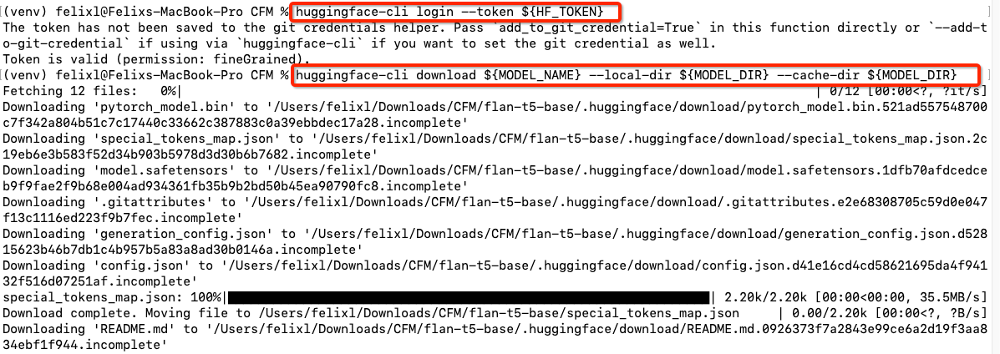

9. **Verify the download**:

    ```bash
    ls /Users/<username>/Downloads/CFM/flan-t5-base
    ```

    > You should see all the model files required for deployment.
    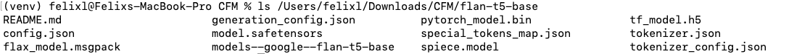


### Converting the Model to the Required Format (if necessary)

To deploy a **custom foundation model** on `watsonx.ai`, the model **must be in `safetensors` format**.

- For example, the `flan-t5-base` model includes a `model.safetensors` file, which is ready for deployment.
- If your downloaded model does **not** include a `.safetensors` file, you'll need to **convert it**.

> 📌 **Why safetensors?**  
> The `safetensors` format is a secure and efficient alternative to PyTorch's `.bin` format. It ensures faster loading and prevents arbitrary code execution during deserialization — a key requirement for production environments like `watsonx.ai`.

#### 🔧 How to Convert:
Instructions for conversion are provided in the guide:  
[Downloading a custom foundation model and setting up Storage](https://dataplatform.cloud.ibm.com/docs/content/wsj/analyze-data/deploy-custom-fm-storage-cloud.html?context=wx&audience=wdp)
➡️ Refer to the section: **_Converting a model to the required format_**

### Making a TechZone Reservation and Uploading Model Files

Once you’ve downloaded the model files, you’re ready to set up `watsonx.ai`.

As mentioned, using a **Custom Foundation Model** requires a **specific TechZone pattern**.

In this step, you'll:
- Reserve the environment.
- Upload the downloaded model files to **Cloud Object Storage (COS)**.

---

#### Reserving a Specific TechZone Pattern

Detailed setup instructions are provided in the setup guide of this section.

Please follow the section on **Setting up Custom Foundation Model lab** exactly as described.

> This tutorial is based on the reservation process described in the setup guide. If you deviate from it, the steps may not work as expected.

### Logging in to Your TechZone Environment

To access the Custom Foundation Model TechZone environment, you **must use the credentials from your reservation** — **do not log in with your IBM ID**.

Follow these steps:

1. Go to [http://techzone.ibm.com/dashboard](http://techzone.ibm.com/dashboard)
2. Click **My TechZone**, then click **My reservations**.
   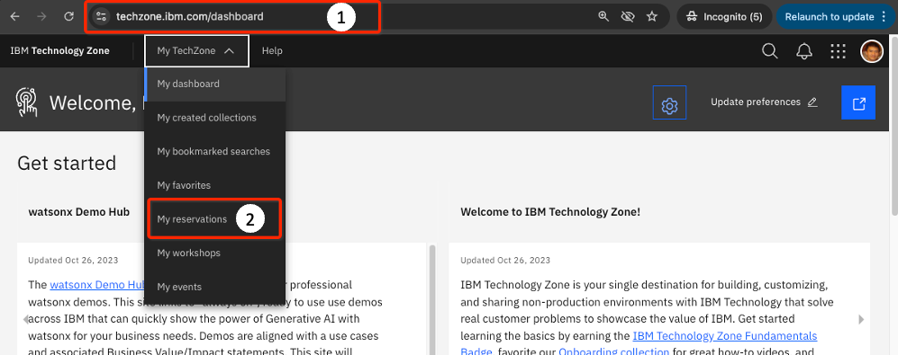
3. On the *My reservations* page, find the tile labeled **watsonx.ai for custom models (student ID)**.
   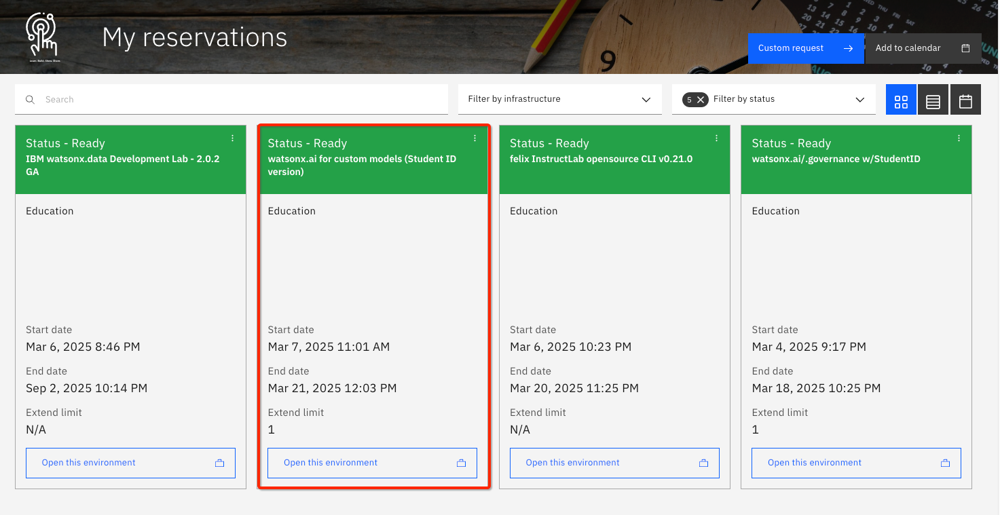
4. Click the tile to view its details.
5. Scroll to the **Reservation Details** section.  
   ➡️ Click [https://cloud.ibm.com/logout](https://cloud.ibm.com/logout) to log out of any existing sessions.
6. Return to your reservation tab and click the unique **IBM Cloud Login** link.
   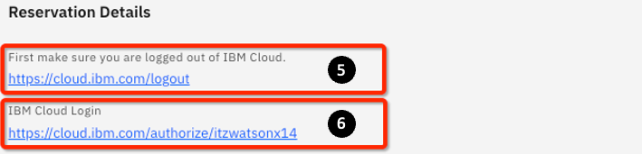
7. A login page will open. Use the **Username** and **Password** from your reservation (not your IBM ID).
8. Click **Sign in**.
   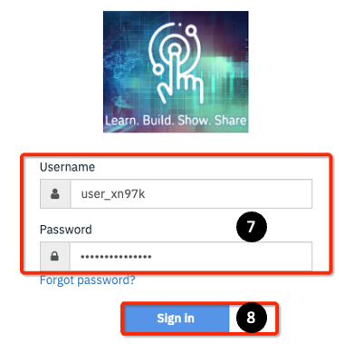
9.  You are now logged into IBM Cloud using the Student ID.  
   > **Always log in using this method for the lab**. You can remain logged in or repeat the steps later if needed.

---

### Creating a Project in watsonx.ai

Now, you’ll create a **sandbox project** in `watsonx.ai`, which includes a **Cloud Object Storage (COS)** instance for uploading model files.

1. On the IBM Cloud **Dashboard**, click the main menu (☰) at the upper left.
   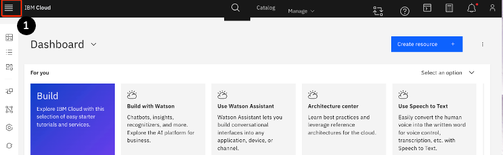
2. Click **Resource list**.
   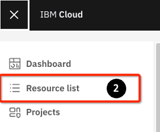
3. Expand the **AI / Machine Learning** section.
   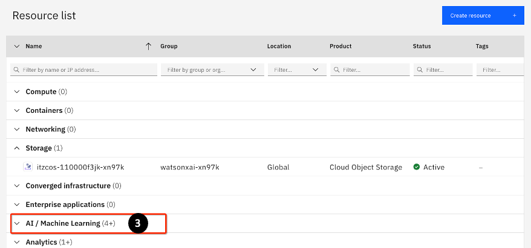
4. Click the **Watson Studio** instance (your entry may show a different `itzws-***` label).
   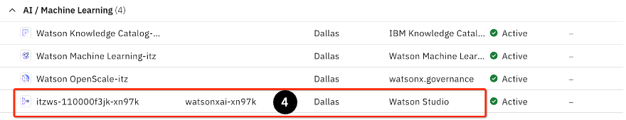
5. On the Watson Studio page, expand and click **Launch in**.
   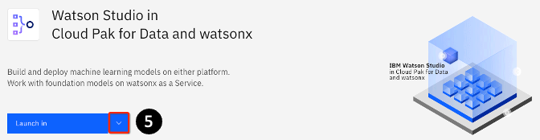
6. Choose **IBM watsonx** from the two options:  
   - IBM Cloud Pak for Data  
   - IBM watsonx
   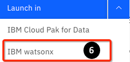
7. If prompted again, log in with your **IBM ID** (*this time only*). This step grants access to the watsonx.ai console.
8. Click **Continue**.
   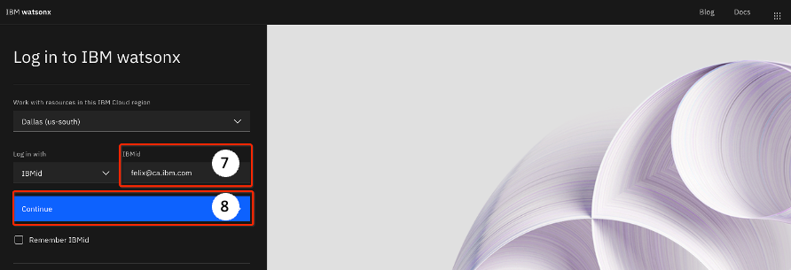
9.  On the "Welcome to watsonx" screen, agree to the terms if prompted.  
   > You might not see this screen if you've accessed watsonx before.
10. Close the welcome screen by clicking the **X**.
11. Scroll to the **Projects** section and click **Create a sandbox project**.
    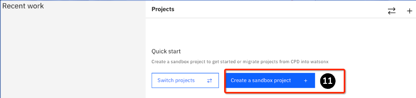
12. A project titled **notset’s sandbox** is created.  
    > 💡 You're using a Student ID, so the project won't include your name or have a `itz-watsonx` prefix like in L3 labs.

🪣 When the project is created, a **Cloud Object Storage (COS) bucket** is automatically provisioned — you’ll upload your model files here in the next step.

### Uploading the Model to Cloud Object Storage

Once your sandbox project is ready, upload your model files to the associated **Cloud Object Storage (COS)** bucket.

---

1. If you’ve logged out or your session timed out, **log in again**. 
2. On the IBM Cloud **Dashboard**, click the main menu (☰) in the upper left.
3. Click **Resource list** from the slide-out menu.
4. Expand the **Storage** section.  
   - Look for an entry with a name like `itzcos-*-*` (e.g., `itzcos-110000f3jk-kzliz`).  
   - Click this **COS instance**.
  
   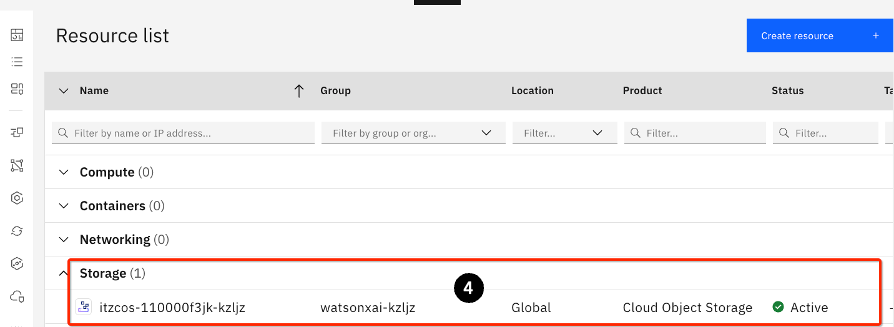

5. The instance page opens.  
   - You may see multiple buckets — click the one named like `notsetsandbox-donot-delete-*`.
   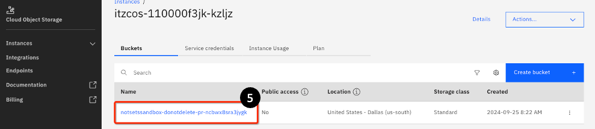

6. Click the **Upload** button on the right.
   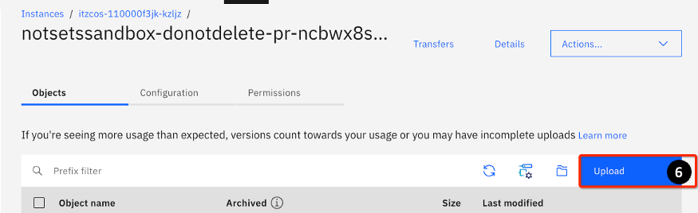
7. The **Upload** slide-out appears.  
   - COS recommends **Standard transfer** for files under 200MB.  
   - Since the `flan-t5-base` model is larger, use the **Aspera high-speed transfer** option (if available).  
   - If you can already select Aspera, **skip to Step 21**.

8. If not, click the **Installed Aspera** link to begin setup.

   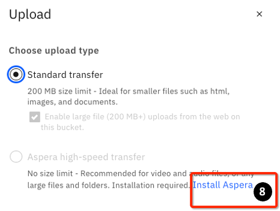

9. On the **Required Steps** page, click **Install Extension**.  
   - If it’s already installed, click **Install Connect** and skip to Step 13.
   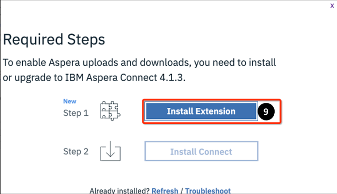

10. The **Chrome Web Store** opens — click **Add to Chrome**.
   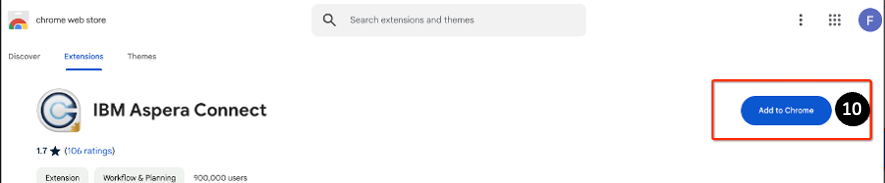
11. In the dialog, click **Add extension**.

12. After successful installation, close the window.

13. Back on the Required Steps page, click **Install Connect**.
    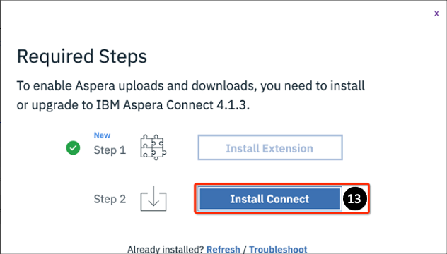
14. The installer downloads.  
   - For macOS, you might see: `ibm-aspera-connect_4.1.3.93_macOS_x86_64.dmg`  
     *(version may vary)*

15. Go to your **Downloads** folder and open the file.

16. Double-click the **IBM Aspera Connect Installer**.
    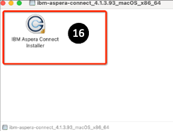
17. On macOS, click **Open** on the warning prompt.
    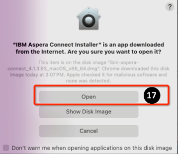
18. On the installer screen, click **Start**.
    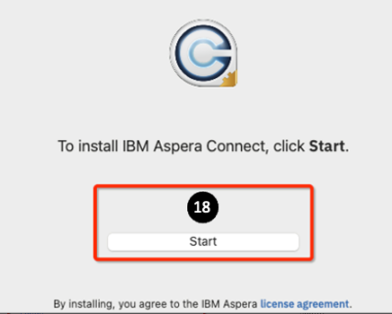
19. When installation completes, click **Close**.

20. Close the **Required Steps** window.

21. Back in the watsonx.ai console, click **Upload** again.  
    - Now, **Aspera high-speed transfer** should be available. Select it.  
    > **Note:** If Aspera is installed but still unavailable, check if your browser is **blocking the plug-in**.

22. Click **Upload folders**.
    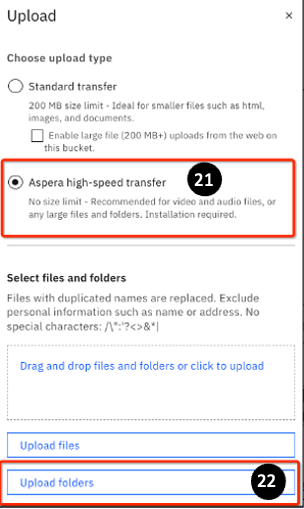
23. When prompted for access, click **Yes** to allow your computer access.

24. Navigate to your **CFM** folder on your machine  
    ➡️ For example: `/Users/felixl/Downloads/CFM`  
    - Select the **`flan-t5-base`** folder.

25. Click **Open** to begin the upload.

26. You will see the folder listed (e.g., “1 objects” with `flan-t5-base`).

27. Click **Upload** to start the transfer.

28. A progress message appears.  
    > Thanks to Aspera, the upload should be fast — actual speed depends on your connection.

29. When the upload is complete, you’ll see a confirmation.  
    - Click **X** to close the **Transfers** page.

30. Your COS bucket will now display many uploaded files.  
    - The contents may span **multiple pages**.
    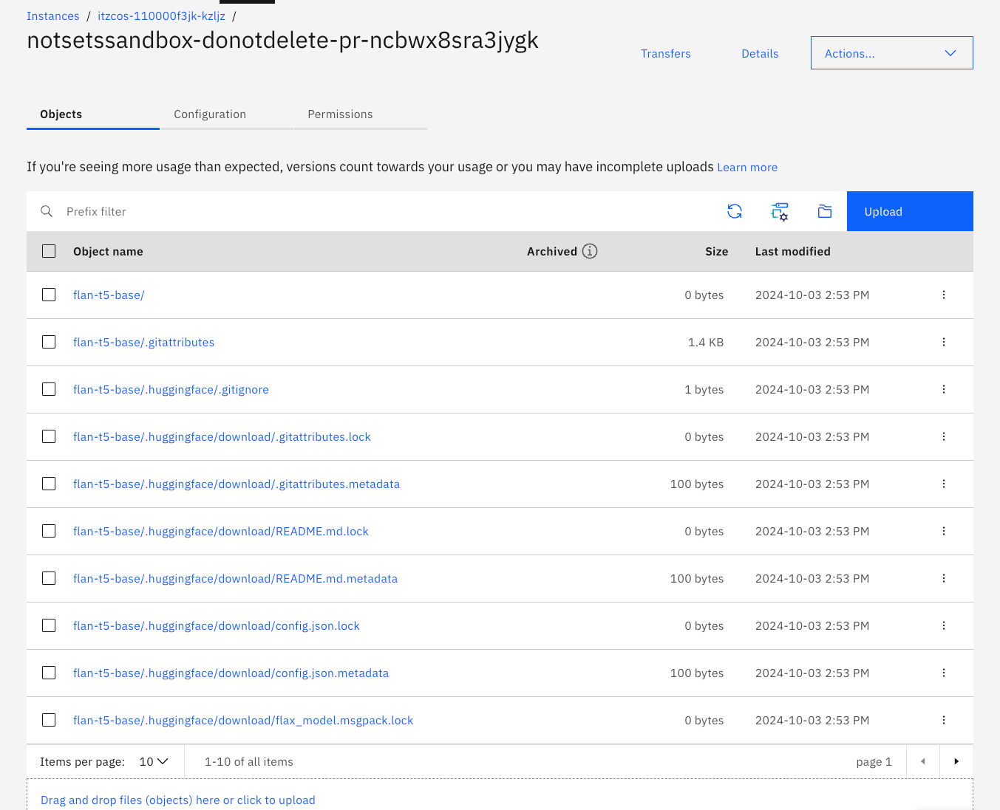

    You are now ready to connect your model to `watsonx.ai`. To do this, you’ll need the **public endpoint** of your COS bucket.


31. Click the **Configuration** tab on the COS bucket page.
    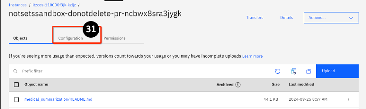
32. Scroll down to the **Endpoints** section.  
    - Find the **Public endpoint** and click the **Copy** icon next to it.
    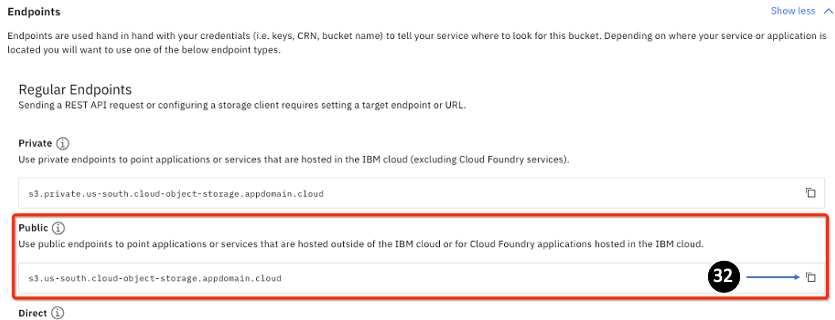

> Save this public endpoint — you’ll need it to link your model to your `watsonx.ai` project.Example:`s3.us-south.cloud-object-storage.appdomain.cloud`

### Creating a Connection to COS from watsonx.ai

After uploading your model to the COS instance, you must **create a connection** from `watsonx.ai` to allow access to the model files.

---

### Getting Your Access Key and Secret Key

To securely connect to your Cloud Object Storage (COS), you'll need to retrieve a **Service Credential** with HMAC access.

1. If logged out or timed out, log in again. 

2. On the IBM Cloud **Dashboard**, click the main menu (☰) on the upper left.

3. Click **Resource list**.

4. Expand the **Storage** section and click your **COS instance** (e.g., `itzcos-*`).

5. Open the **Service credentials** tab.
   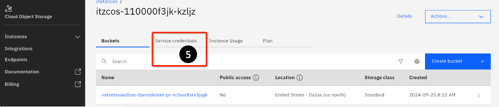
6. If no suitable credential exists, click **New Credential**.
   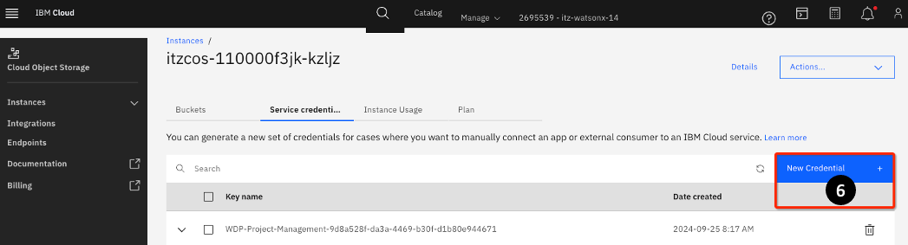
7. On the **Create Credentials** page, use the following settings:
   - **Name**: `CFM_demo`  
   - **Role**: `Manager`  
   - **Include HMAC Credential**: **Set to On**
8. Click **Add**.
   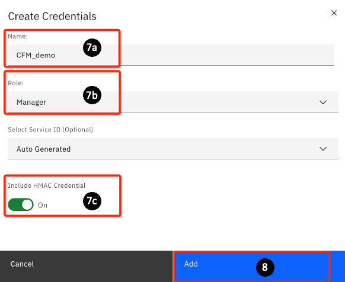
9. Scroll to find the `CFM_demo` credential, then **click it** to view details.

10. Click the **copy icon** to copy the JSON credential.  
    - Paste and save this somewhere safe.
    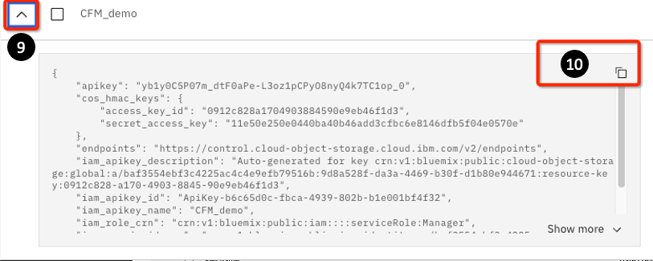
11. From the copied content, extract the following:
    - `access_key_id`: e.g., `0912c828a1704903884590e9eb46f1d3`  
    - `secret_access_key`: e.g., `11e50e250e0440ba40b46add3cfbc6e8146dfb5f04e0570e`

```json
{
  "apikey": "yb1y0C5P07m_dtF0aPe-L3oz1pCPyO8nyQ4k7TC1op_0",
  "cos_hmac_keys": {
    "access_key_id": "0912c828a1704903884590e9eb46f1d3",
    "secret_access_key": "11e50e250e0440ba40b46add3cfbc6e8146dfb5f04e0570e"
  },
  "endpoints": "https://control.cloud-object-storage.cloud.ibm.com/v2/endpoints",
  "iam_apikey_description": "Auto-generated for key...",
  "iam_apikey_id": "ApiKey-b6c65d0c-fbca-4939-802b-b1e001bf4f32",
  "iam_apikey_name": "CFM_demo",
  "iam_role_crn": "crn:v1:bluemix:public:iam::::serviceRole:Manager",
  "iam_serviceid_crn": "crn:v1:bluemix:public:iam-identity::...::serviceid:...",
  "resource_instance_id": "crn:v1:bluemix:public:cloud-object-storage:global:..."
}
```

You use these values when you create the connection to the COS instance.
---

### Creating a Deployment Space and Connecting to COS using Access Key and Secret Key

You can deploy a model to either a **project** or a **deployment space**. Unlike projects, a deployment space is independent and can be used across multiple projects.

In this section, you will:
- ✅ Create a **deployment space**
- 🔗 Define a **connection from the deployment space to COS**

---

#### Steps:

1. Log in to **watsonx.ai**.

2. On the watsonx.ai main console, click the main menu (☰) in the upper left.

3. From the slide-out menu, click **Deployments**.
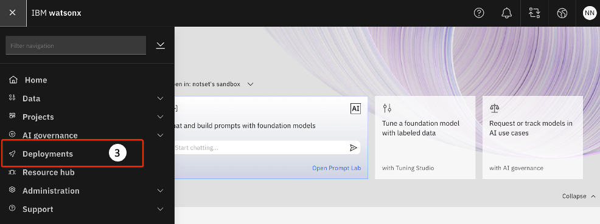
1. On the **Deployments** page, click **New deployment space**.
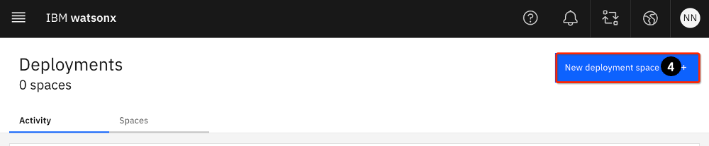
1. The **Create a deployment space** page opens. **Name**: Enter `CFM_space`
   
6 **Deployment stage**: Select `Development`

7. For **Selected storage service**:
   - If you only have one COS instance, it is selected automatically. If you have multiple, select the one identified earlier.

8. Leave all other options at their default values and click **Create**.
   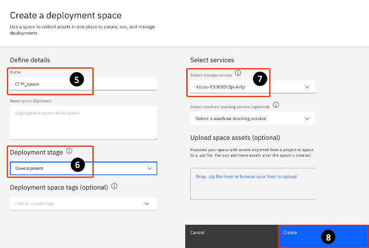

9. Wait for the deployment space to be created. Once the **View new space** button appears, click it.
   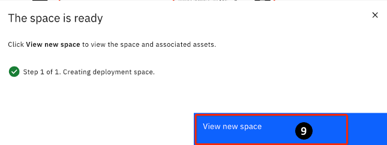
10. On the `CFM_space` page, click the **Assets** tab.
    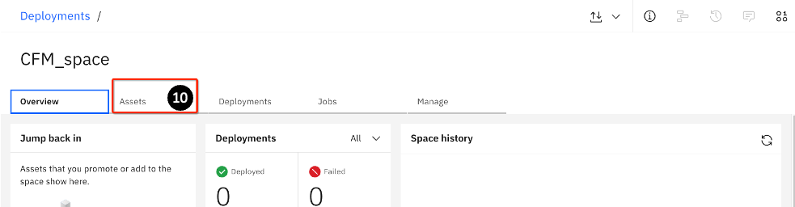
11. In the **Assets** tab, click **Import assets**.
    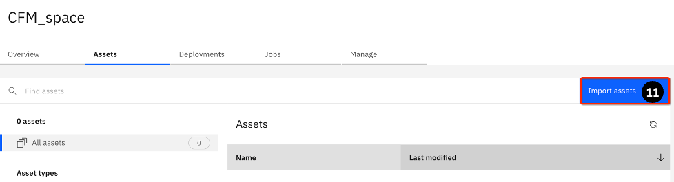
12. The **Import assets** page opens. Before importing, define **data access** to the COS instance where you uploaded your model.On the left sidebar, click **Data access**.
    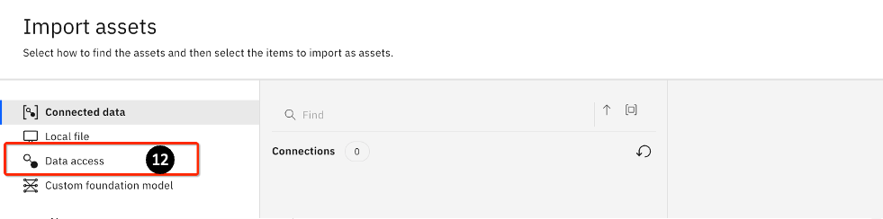
13. Click the **Connection** tile.
    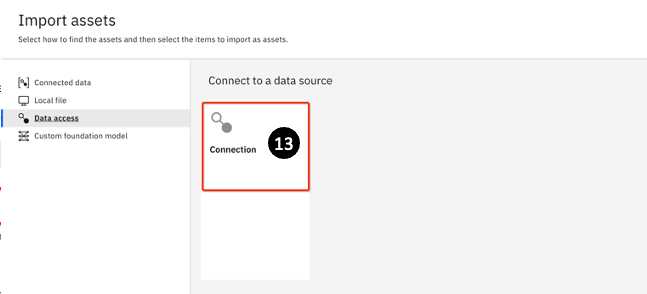
14. The **Add connection** page opens. If **IBM Cloud Object Storage** is not immediately visible:
   - Use the **Search** field in the upper left and enter `IBM Cloud Object Storage` to filter the list dynamically.
15. Click the **IBM Cloud Object Storage** tile.
16. If two options appear, select **IBM Cloud Object Storage** (not the one marked **(infrastructure)**).
17. Click **Next**.
    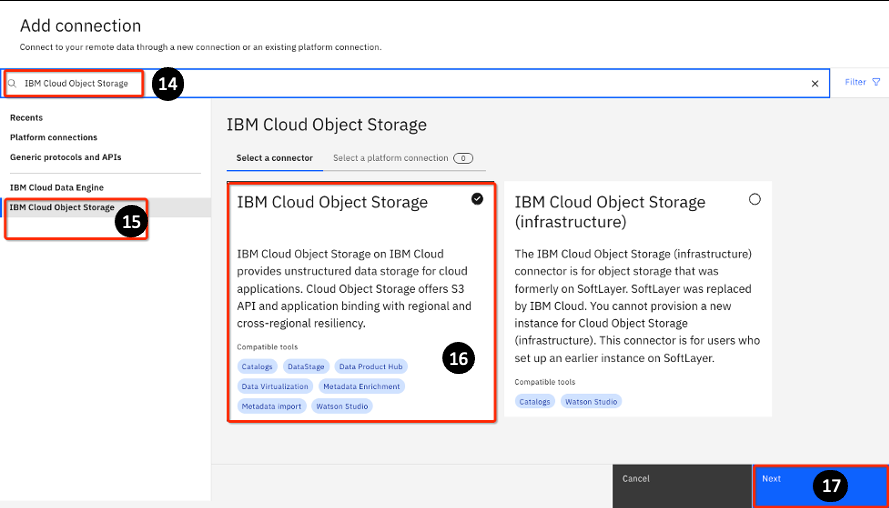
18.  Fill out the form:
   - **Do NOT** click **Select instance**.
   - **Name**: Enter `CFM_connect`
   - **Login URL**: Use the **public endpoint** from earlier.  
     _Example_: `s3.us-south.cloud-object-storage.appdomain.cloud`
   - **Credentials**: Select `Personal`
   - **Authentication method**: Choose `Access key and Secret key`
   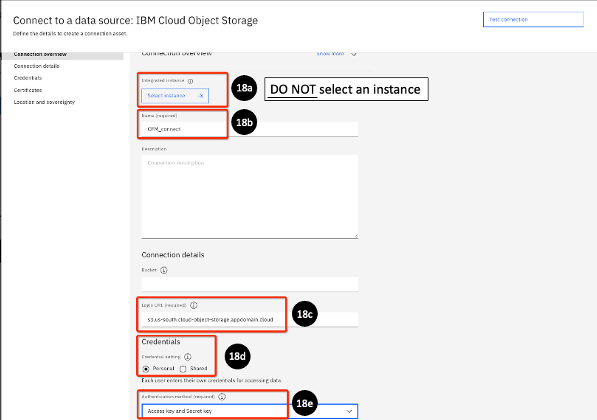
19. Two new fields will appear. Enter the credentials:
   - **Access key**: `0912c828a1704903884590e9eb46f1d3`
   - **Secret key**: `11e50e250e0440ba40b46add3cfbc6e8146dfb5f04e0570e`

20. Click **Test connection**. You should see a message confirming the connection was successful.
    
    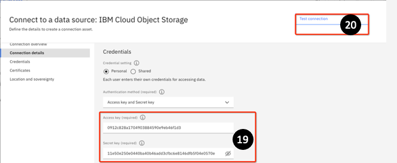

21. Click **Create**.
    
    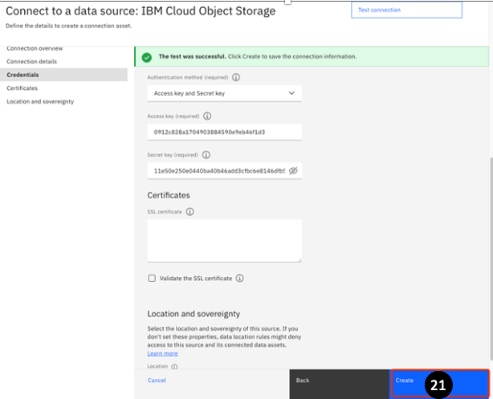

22. A warning may appear — it's safe to ignore it. Click **Create** again.

23. You’ll now see the new connection `CFM_connect` listed as an asset in your `CFM_space`.

    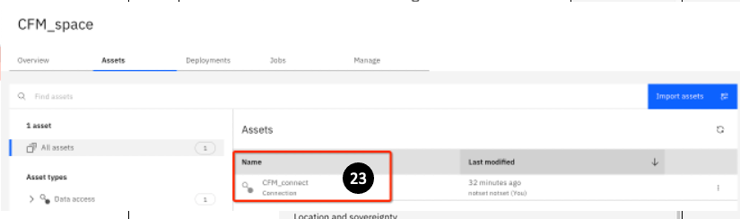


---

## Creating a Model Asset

In this section, you'll import the `flan-t5-base` model as a **Custom Foundation Model (CFM)** asset into the `CFM_space` deployment space.

1. On the **CFM_space > Assets** tab, click **Import assets**.
   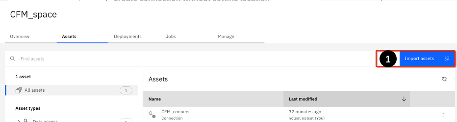
2. The **Import assets** page opens. It should default to the **Connected data** tab. You should see your connection `CFM_connect`.
3. On the left sidebar, click **Custom foundation model**.
   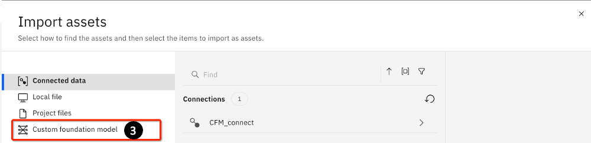
4. You’ll see the `CFM_connect` entry listed. Click it to expand.
   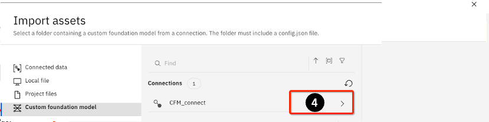
5. Expand the **COS bucket** shown under `CFM_connect`. If there are multiple buckets, make sure to select the one previously identified.
   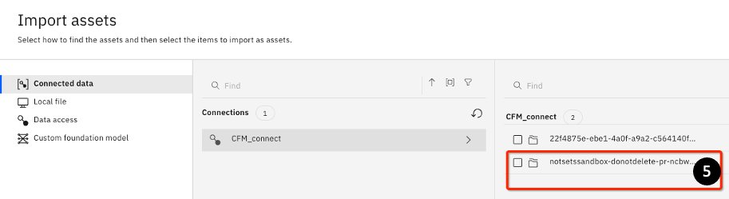
6. You may need to **scroll right** to see the full contents. Locate and click the **`flan-t5-base`** folder.
   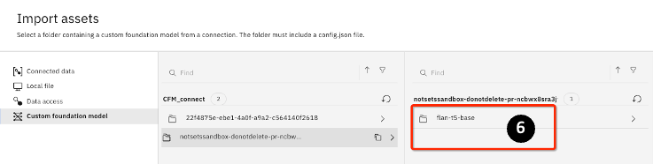
7. The contents of the folder are displayed. Click **Next** to import the entire folder.
   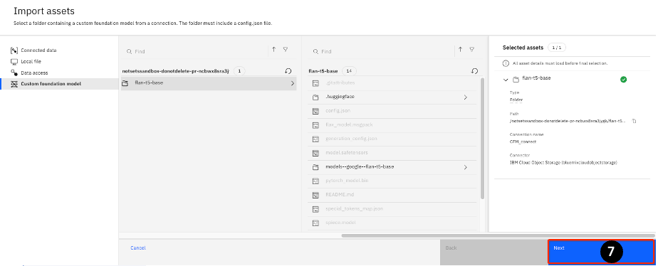
8. The **Import a custom foundation model** page opens.
   - **Architecture**: `t5` (auto-filled)
   - **Name**: `flan-t5-base` (leave this as is)
9. **Tags (Optional)**: Skip adding tags for this exercise.
10. Note the** Model deployment parameters** at the bottom of the page. You can update these by clicking the associated pencil icon to the right. For this exercise, simply use the default values provided.
11. Click **Import**.
    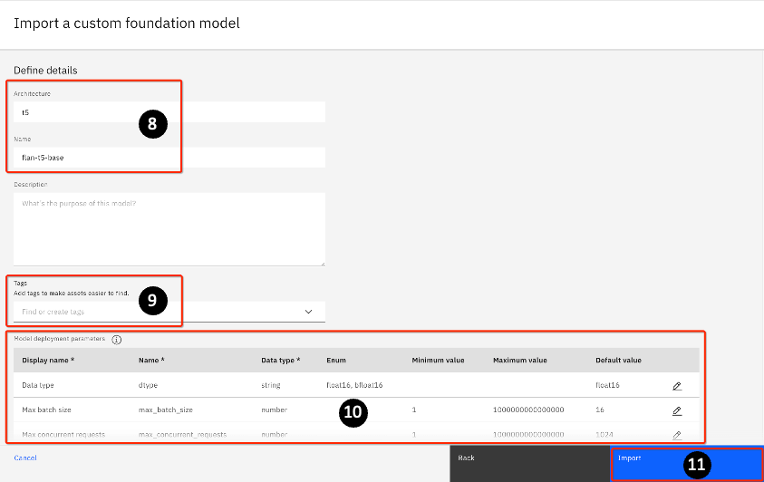
12. The model asset page for `flan-t5-base` will open.
    - You’ll see a section titled **About this asset**.
    - You can add a description or modify details later.
    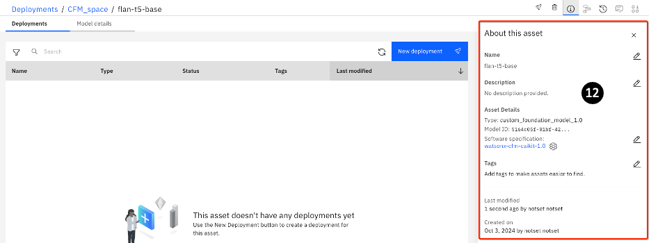
13.  **Do NOT close the window**. You need to deploy the model in the next section before it becomes usable.

---

## Deploying a Model Asset

Now that the model has been imported into your deployment space, you must **deploy it** before it becomes usable in watsonx.ai.


1. On the `flan-t5-base` model asset page, click **New deployment**.
   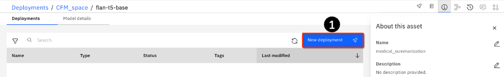
2. If you see a warning about a **Machine Learning Service** instance, click **Go to space settings**. _If not, skip to Step 10._
   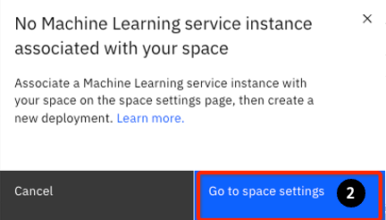
3. On the **CFM_space** page, look to the right and click **Associate instance** under the Machine Learning service section.
   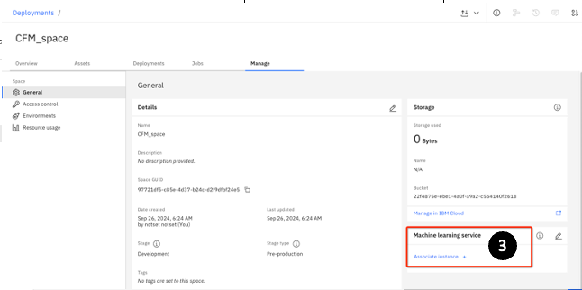
4. Expand **Select a machine learning service** to view available instances.
5. Select your instance, e.g., `Watson Machine Learning-itz`.
   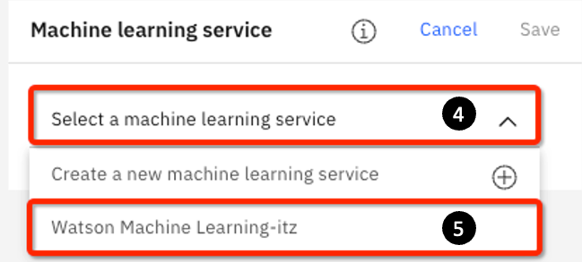
6. Click **Save**.
   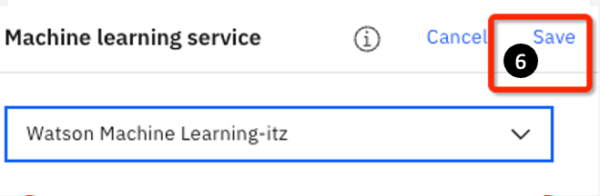
7. You are redirected to the **Manage** tab. Click the **Assets** tab again.
8. Click the `flan-t5-base` model asset.
   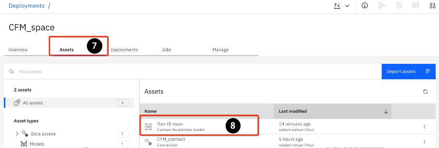
9. On the model page, click **New deployment**.
   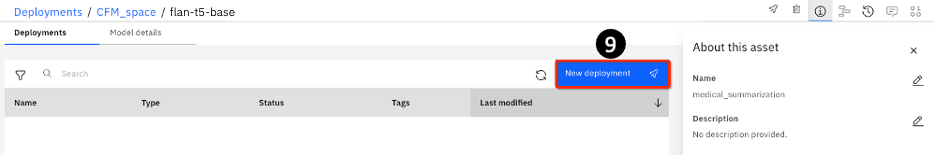
10. You may see a **No user API key** warning, 
11. Click **Create**.
    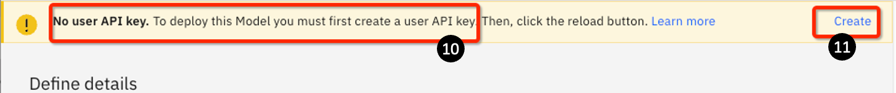
12. This opens the **API Key Creation** page. Click **Create a key**.
    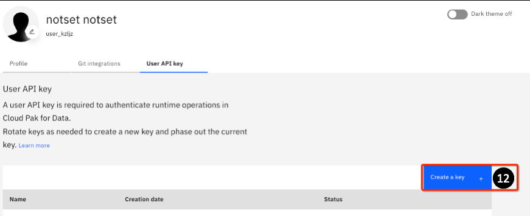
13. The key should be created.
14. Return to the **Create a deployment** tab.Click **Reload** on the Create a Deployment page.  
    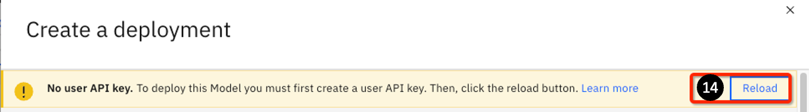
    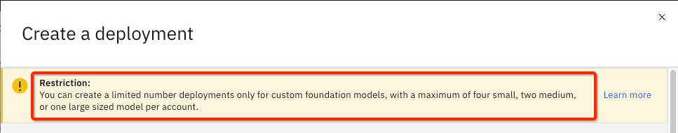
15. After reloading, a message will inform you of your deployment capacity: _"You can create four small, two medium, or one large model."_.This exercise will deploy a **small** model.

16. **Deployment type**: `Online` _(informational – cannot be changed)_

17. For **Name**, enter: `CFM-flan-t5-base`

18. For **Description**, enter:  
    `"This is a Custom Foundation Model based on flan-t5-base."`

19. **Architecture**: `t5` _(already set – leave as is)_

20. Under **Select configuration**, change from `Extra small` to `Small`.

21. Note that there is a cost to model deployment. This means two things:
    - Only use **Small** for exercise and higher only for client activities when needed.  
    - **Remove** your deployment after finishing the lab to avoid unnecessary charges.

22. For **Copies**, leave the default as `1`.

23. You can expand **Model deployment parameters** to see if wanted.

24. Click **Create**.
    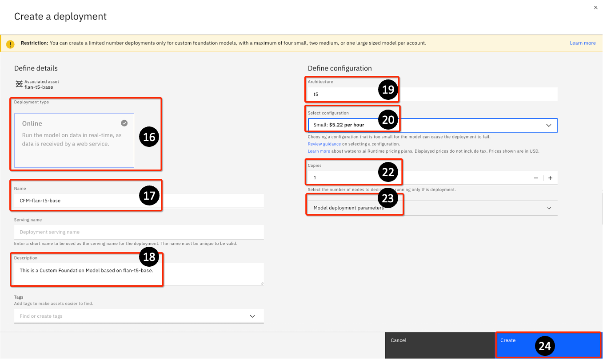
    
    If you get an error about GPU unavailability, this is the limit of your lab access.  
    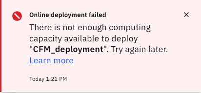
    In that case, watch the [IBM watsonx.ai Custom Foundation Model Last Step demo](https://ibm.seismic.com/Link/Content/DCphh9Dp99H9pG7CQRCCmmBJd9R8) to understand the final step.

25. If you do have GPUs – the deployment succeeds. It does take some time to complete. In this example, it took 4 minutes, and you see this.
    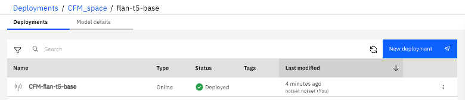
    This model is now ready to be used.
---

## Using the Custom Foundation Model

Now that your model is deployed, you can use it just like any other foundation model in the watsonx.ai interface.

1. Open the **watsonx.ai console** and click **IBM watsonx**.
   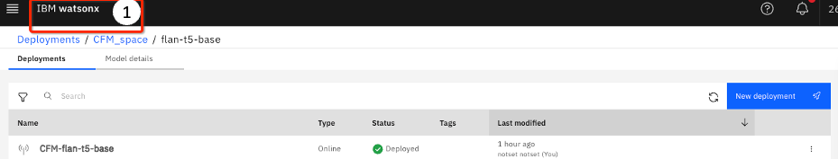
2. In the console, click **Open Prompt Lab**.
   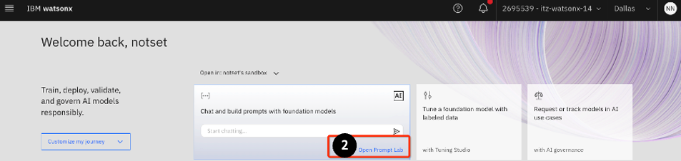
3. If it doesn’t open to it by default, click the **Structured** tab.

4. Click the **Sample prompts** icon on the right sidebar.

5. From the list of samples, click **Earnings call summary**.
   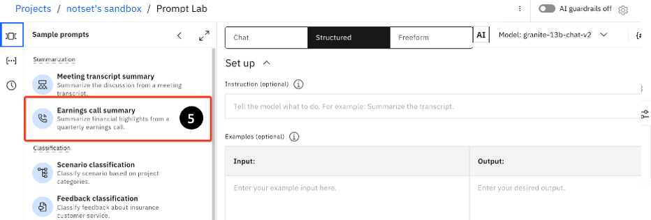
6. The sample prompt loads. Now click the default model name (e.g., `flan-ul2-20b`), then select **View all foundation models**.
   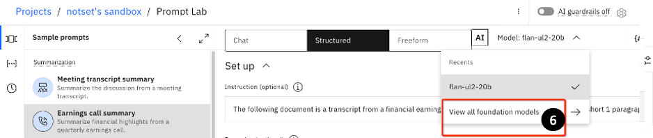
7. Scroll through the list and find your deployed model: `CFM-flan-t5-base`.
   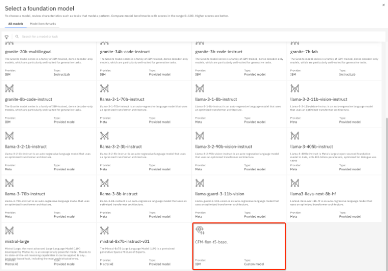
8. Click your model to open its **model card**. You’ll see the **Description**.

9. Click **Select the model**.
   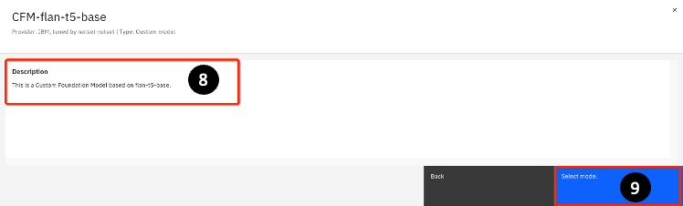
10. Your `CFM-flan-t5-base` model is now selected for the prompt.

11. Click **Generate** to run the prompt.
   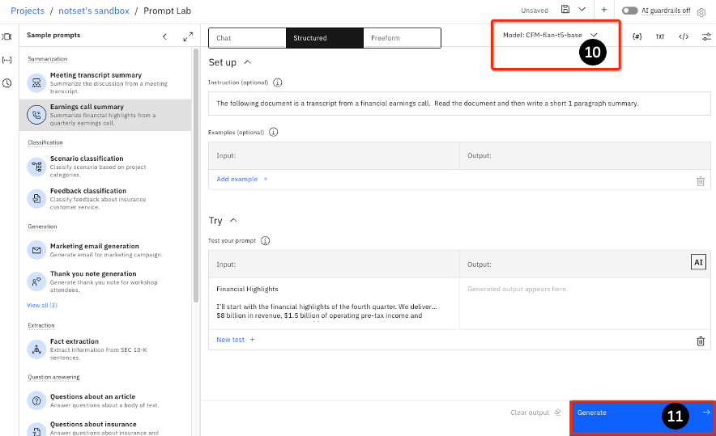

You’ll get output generated by your custom foundation model.

---

## Considerations for Custom Foundation Models

Custom Foundation Models (CFMs) offer flexibility to bring in models you're familiar with — or have already fine-tuned — into the watsonx.ai platform. This lab guided you through the steps to import and deploy one.

Here are key considerations to keep in mind:

1. **Not all models are supported**  
   Always check the [supported architecture list](https://eu-de.dataplatform.cloud.ibm.com/docs/content/wsj/analyze-data/deploy-custom-fm-plan-cloud.html?context=wx&audience=wdp#architecture) before attempting an import.

2. **Model card data is not automatically imported**  
   Hugging Face models often include a model card, but this is **not imported** into watsonx.ai. Use the **Description** field during deployment to enter important details manually.

3. **Deployment limits**  
   You're limited to:
   - 4 **small** model deployments  
   - 2 **medium** model deployments  
   - 1 **large** model deployment  
   You can remove existing deployments to free up capacity if needed.

4. **There is a cost**  
   Deployment incurs billing based on model size. See the [Hourly billing rates](https://dataplatform.cloud.ibm.com/docs/content/wsj/getting-started/wml-plans.html?utm_source=skills_network&utm_content=in_lab_content_link&utm_id=Lab-432&context=wx&audience=wdp).

5. **Limitations**  
   - The limitations are as shown [here](https://www.ibm.com/docs/en/watsonx/saas?topic=model-planning-deploy-custom-foundation).

---

## Removing a Deployment

 If you only watched the demo video and **did not perform a real deployment**, you can skip this section.  
However, if you **did deploy a model**, follow these steps to avoid ongoing charges.

1. **Log back into your Student ID account**.

2. **Open the watsonx.ai console**  

3. Click the **☰ Main Menu** on the upper left.

4. Scroll down and click **Deployments**, as done earlier.

5. On the Deployments page, click **CFM_space**.

6. Once the CFM_space page opens, click the **Deployments tab** (if it's not already selected).

7. Locate the deployment for `CFM-flan-t5-base`. Click the **︙ (three vertical dots)** next to it.
   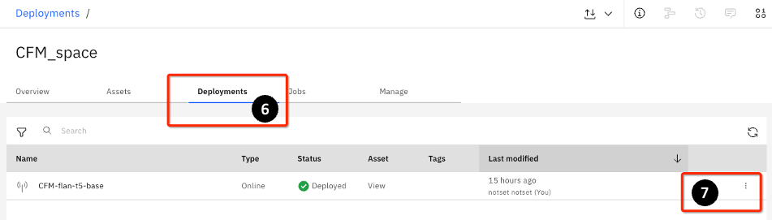
8. Select **Delete** from the dropdown.
   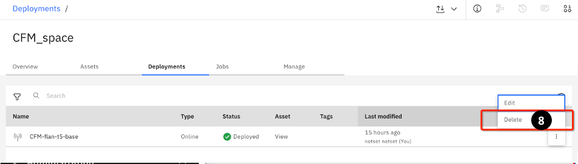
9. Confirm by clicking **Delete** again.

