## 1. Proof of Experience (PoX) with watsonx.ai

Watsonx.ai is IBM’s generative AI and data platform. In a Proof of Experience (PoX) engagement a client is expecting sellers to demonstrate what watsonx.ai (and generative AI) can do to solve their business requirements. While a PoX is not always necessary, there will be times when a client needs to experience it; after all, seeing is believing.

A watsonx.ai PoX can involve various cloud services, depending on what a sales team is trying to prove to the client. There are lots ofcombinations and variations. This document describes how to set up some of the most common environments. Specifically:

* IBM watsonx.ai/.governance SaaS (Software as a Service, using an IBM Technology Sales TechZone pattern)
* IBM watsonx.ai + Watson Discovery + watsonx Assistant (using an IBM Technology Sales TechZone pattern)
* REST API access for when a client wants to use their own applications (this path does not require a TechZone pattern)

For the most part, sellers will use TechZone for a PoX. There are different types of reservations you can select in TechZone, and your choice will depend on what is required for the PoX.

Options include:

* **Education** - Select this mode when you are personally trying to get familiar with the various watsonx services and you want hands-on work from a lab, or when you are learning on your own. In this mode, the `watsonx.ai` environment is reserved for 2 weeks.
* **Demo** - You can use this mode for a simple client-facing demo. However, this is a pre-built, standardized configuration with minimal configuration. For this lab, it is recommended that you use the `Education` mode instead of this mode.
* **Pilot** - Use this when doing a PoX. You can reserve this for longer periods of time (throughout the PoX) so you can have ample time to set up, test, adjust, and rework the PoX, all without worrying that you will lose everything when the reservation time limit runs out.
* **Test** – For testing a specific function, configuration, or customization.

You will be leveraging the `Education` option.

You will need an `IBM Cloud` account to gain access to the TechZone account that hosts the various Watson and watsonx services. Depending on your account status, follow the steps below before proceeding to section 2 to request a reservation.

### Obtain an IBM Cloud Account

If you have an IBM Cloud account, you can skip this step. If you do not have an IBM Cloud account, [Click this link](https://cloud.ibm.com/registration) to create one. After registration, you will be sent an email to activate your account. This can take a few hours to process. Once you receive the confirmation email, follow the instructions provided in the email to activate your account.

### Selecting your TechZone pattern

The instructions in this section describe what you see when you reserve a watsonx.ai TechZone environment for the first time. Some steps will be skipped if you extend your reservation, or if you reserve again.

>**Note:** You do not need to do this again if you already have an existing reservation.

1. Go to the [IBM TechZone](https://techzone.ibm.com/) website.

**Note:** Safari is not a supported browser, you should use Chrome, Edge, or Firefox (this lab was tested using Chrome).

2. If you already have an IBMid, skip this section and go to Section 2.1. If you do not have one, click **Create an IBMid** and follow the instructions from the subsequent panels to create your IBMid... then go to the next step.
   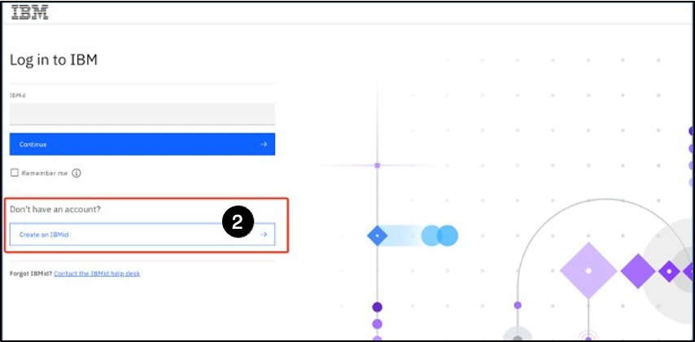

3. Provide your IBMid and click **Continue**.
   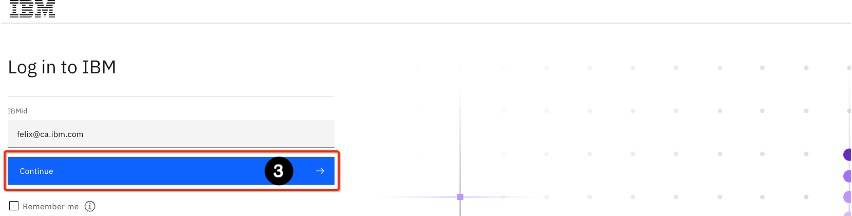

4. If presented with this option, select the **Single-Sign-On** method.
   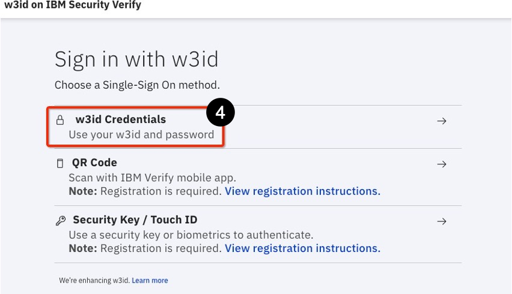

5. Provide the necessary information (w3id and password, QR code, etc.) and sign in.

The next step depends on what you need to reserve from TechZone. If you only want to reserve a watsonx.ai environment, use the steps in the below section. For a watsonx.ai + Watson Discovery + watsonx Assistant environment (what this lab is about), use the instructions in the subsequent section.

### Reserving a TechZone Environment to a PoX on watsonx.ai

If you only need to demonstrate watsonx.ai (in Prompt Lab or Tuning Studio) then you can simply reserve the watsonx.ai pattern. For the Retrieval Augmented Generation (RAG) with Watson Discovery (WD) lab, read section 2.1 but you need to reserve a different TechZone image outlined in section 2.2.

1. You should be logged into IBM TechZone.

2. Copy and paste the following HTTP address in the browser's search field (do not use the magnifying glass icon) and press Enter:
[https://techzone.ibm.com/collection/tech-zone-certified-base-images/journey-watsonx](https://techzone.ibm.com/collection/tech-zone-certified-base-images/journey-watsonx)
to be taken to the **TechZone Certified Base Images** page.

3. The **TechZone Certified Base Images – watsonx** page opens. On the left navigation menu select **watsonx** if it is not already selected.
   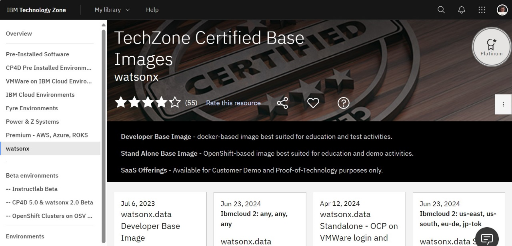

4. Scroll down until you find the **watsonx.ai/.governance SaaS** tile.
   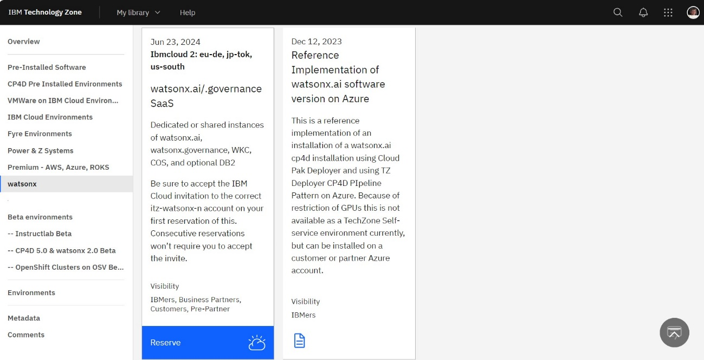

5. Click the **Reserve** button at the bottom.

6. The **Create a reservation** page opens. Select the **Reserve now** radio button. If you are not ready to start, you can select the **Schedule for later** radio button – the steps that follow are the same either way.
   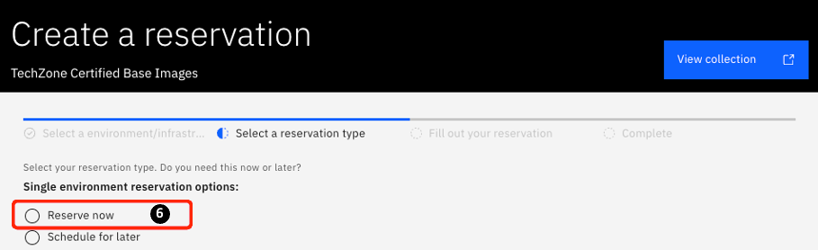

7. You can leave the **Name** of the reservation unchanged or modify it to something like `'your_name' watsonx.ai L4 SaaS`.
   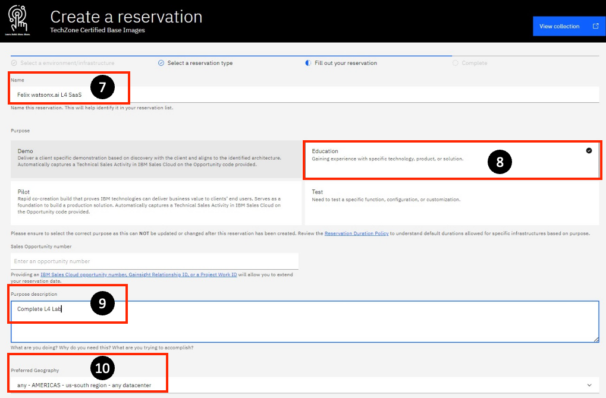

8. In the **Purpose** section, select the **Education**, or **Pilot** tile if you need to reserve a PoX environment.

9. In the **Purpose** description, box enter `Complete L4 Lab`.

10. Choose your **Preferred** Geography. The US-south region is used in this lab (any – AMERICAS – us-south region – any datacenter).
    

>**Note:** You may be assigned `itz-watsonx-n` instead of `itz-watsonx`. Adjust lab steps accordingly to match your assigned environment.

11. Scroll to the bottom part of the reservation page and fill in the **end date and time** field. The maximum you can select is 2 weeks from the current time, but it can be extended once for 4 more days. Your reservation period is longer if you select the **Pilot** mode.

12. Click on the **Install Db2** drop-down and select **No**.

13. Optionally provide some additional notes in the **Notes** section.
    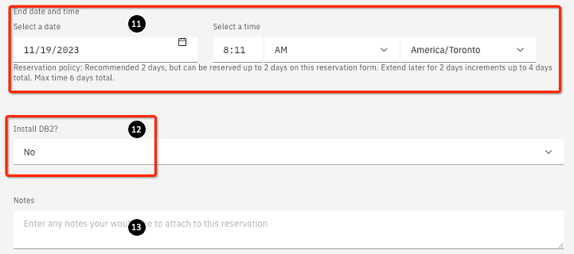

14. On the right-hand side at the bottom, accept the Terms and Conditions, then click **Submit**.
    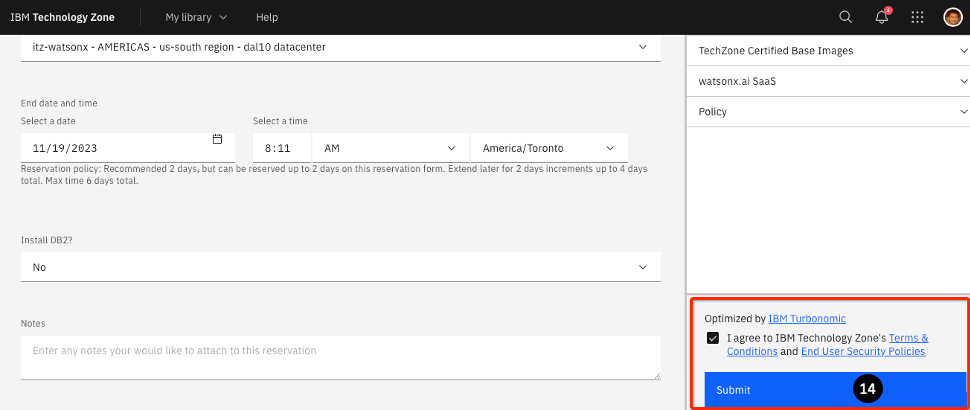

15. A success message should appear in the top right. Next, an email will be sent to your IBMid email address immediately letting you know that your reservation is being provisioned. Once your watsonx.ai environment has been provisioned (typically within 10-15 minutes), you will receive a second email telling you that it is ready for use. This email looks like the example below (if you want you view your reservation, you can click on the **View My Reservations** link highlighted in red below to view your reservation).
   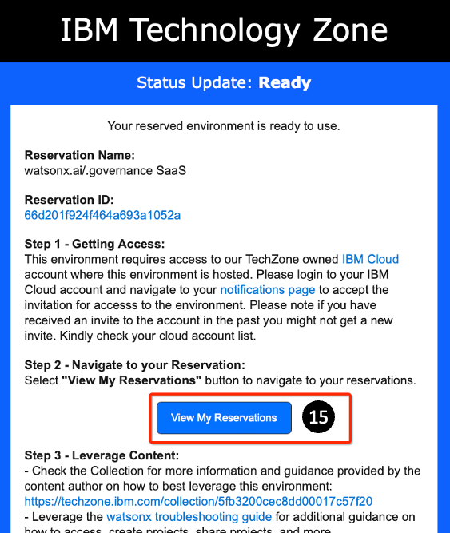

>**Note:** If there are a lot of reservation requests on the system, the reservation task might fail. If this happens, try again later.

16.  Click on the notifications page link above the **View My Reservations** button provide your IBM cloud credentials if required.
    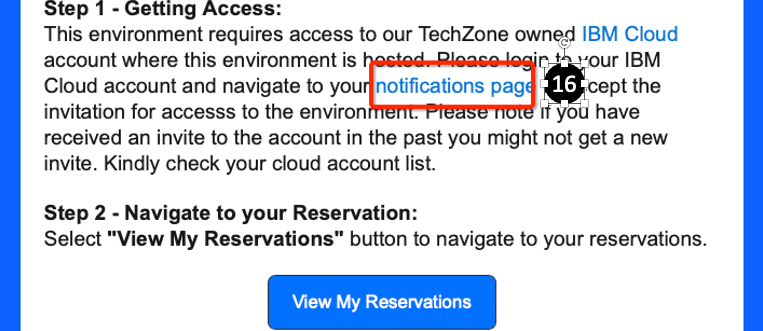

17. This takes you to the IBM Cloud **Notifications** page. Your recent notifications are listed. Click the Account with the description: **Action required: You are invited to join an account in IBM Cloud**.
    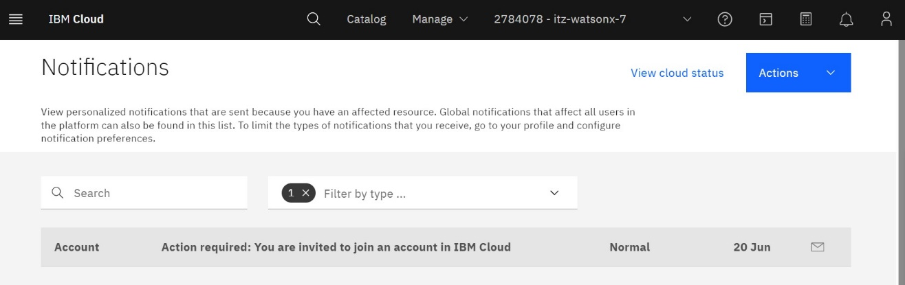

18. Click the **Join now** on the right of the page.
    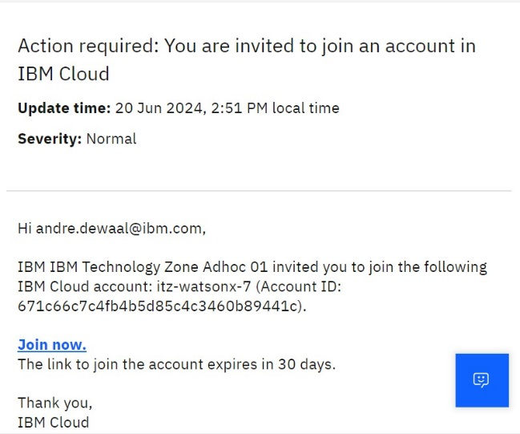

>**Note:** If you had previously applied and have accepted an invitation to the same itz- watsonx account, you will not get another invite. However, if you did get the email noting that your reserved environment is ready, then you would be able to log in.

19. Use your IBMid to log in to the IBM Cloud login page. You are asked to join the TechZone account. **Accept the Terms and Conditions**, then click **Join Account**.
   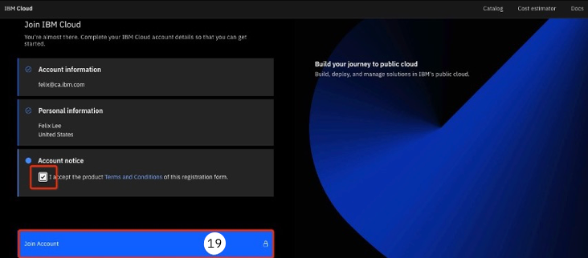

20. Once logged in, ensure you are using the right account. If you accepted the TechZone invitation, you should have been added to an **itz-watsonx (or itz-watsonx-n)** account. You should now be in that account. To verify, you should see this on the upper right.
   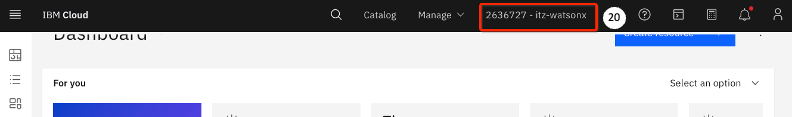

21. If that is not what you see, click the icon to bring the dropdown list. Select the account that looks like xxxxxxx- itz-watsonx-n, look for that account.
    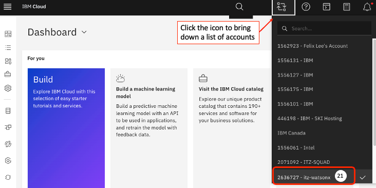

22. Click the hamburger menu on the upper left.
    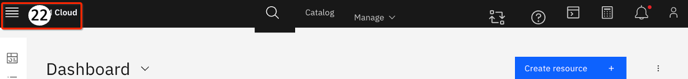

23. Scroll down on the slide-out, and click **watsonx**.
    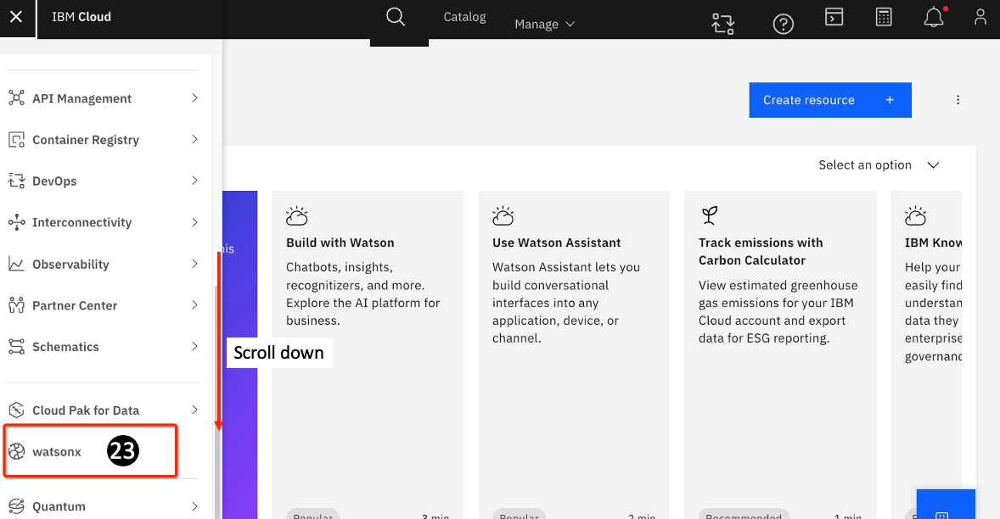

24. On the AI and data platform page, click **Launch** at the bottom of the **watsonx.ai** tile.
    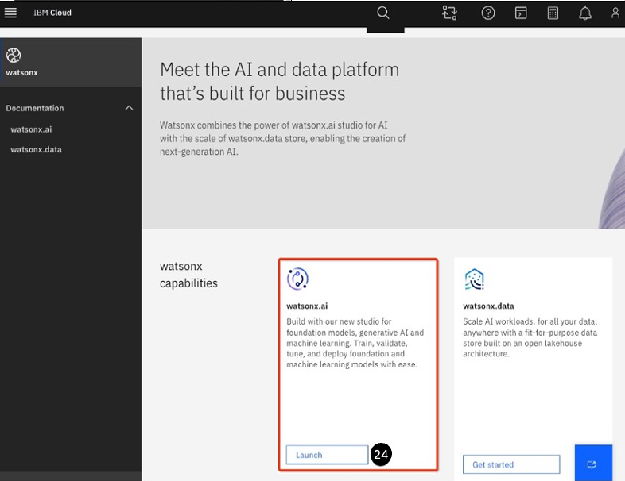

25. The watsonx.ai console opens, and you are ready to begin this lab.
    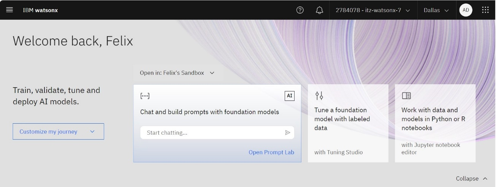

26. You might see a welcome page (if you don’t skip the next few steps). Select the checkbox to agree to the terms.

27. Optionally click on the Take a tour button on the bottom-right to take a tour of watsonx.ai.

28. For this lab, dismiss the welcome message by clicking on the “x” on the top right to close this window. 
    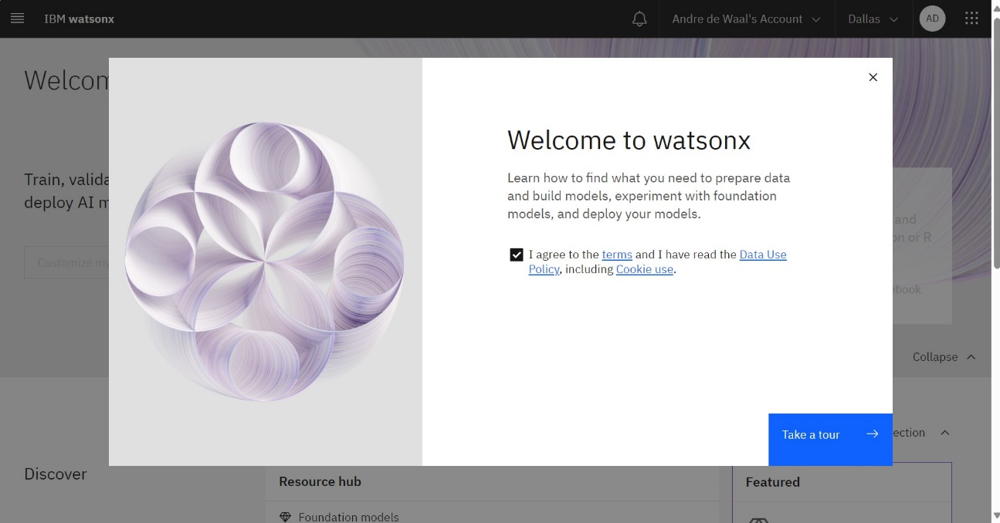

29. Click on the **Chat and build prompts with foundation models** tile. The watsonx **Welcome** page opens.

30. You need to create a **sandbox** project. Click on the **Create sandbox project** button in the **Projects** area. This creates a project with the necessary services associated with it. It may take a few minutes to create the sandbox project, so be patient.
    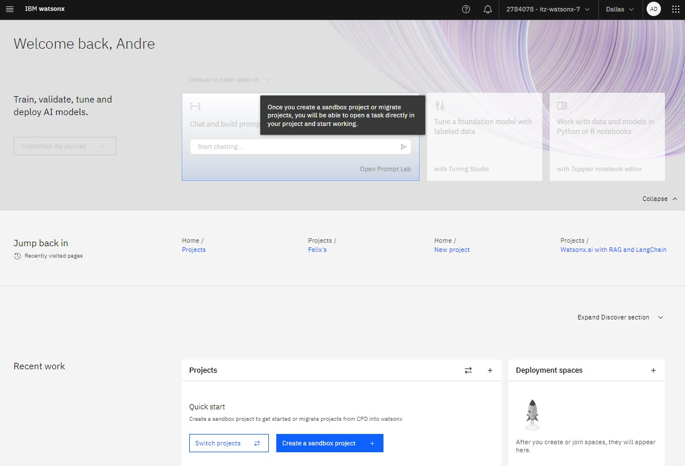

31. You see the sandbox project in the **Projects** area. You are now ready to proceed with the lab.
    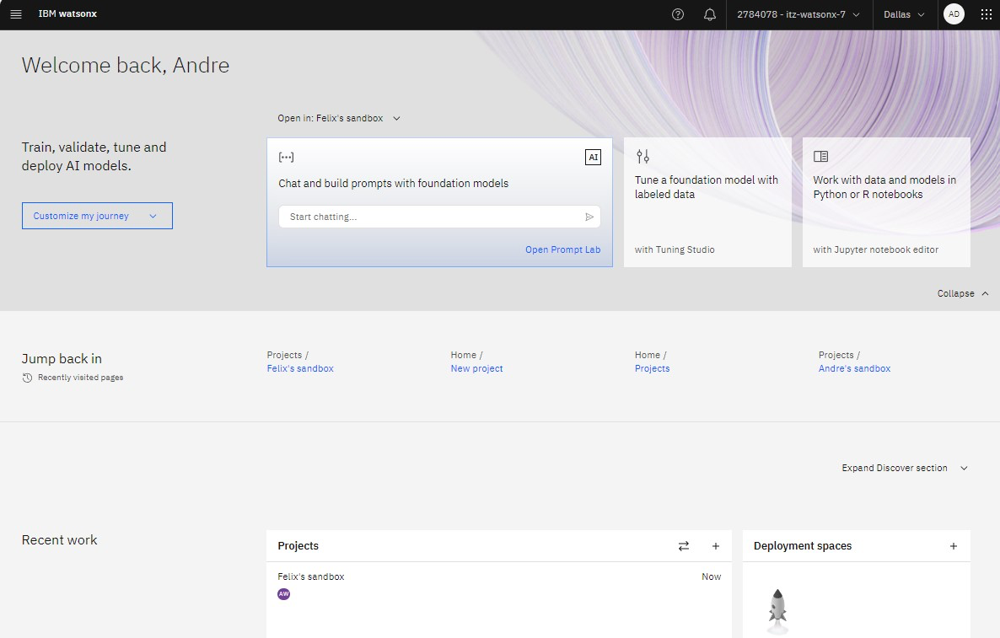

### Reserving the watsonx.ai + Watson Discovery + watsonx Assistant pattern

The steps in this section are almost identical to the above section, except for the first few steps where you locate the proper pattern to use. Here are the different steps.

1. Go to the [IBM TechZone](https://techzone.ibm.com/) website and log in if required.

2. Copy and paste the following HTTP address in the browser's search field (do not use the
magnifying glass icon) and press **Enter**:
[https://techzone.ibm.com/collection/watson-enterprise/environments](https://techzone.ibm.com/collection/watson-enterprise/environments)

3. The **Watson Applications Environments** page opens.

4. Scroll down until you find the **Watson Discovery with Assistant, AI, and Speech** tile (highlighted in red below – note that the relative location may be different).

5. Click **Reserve**.
   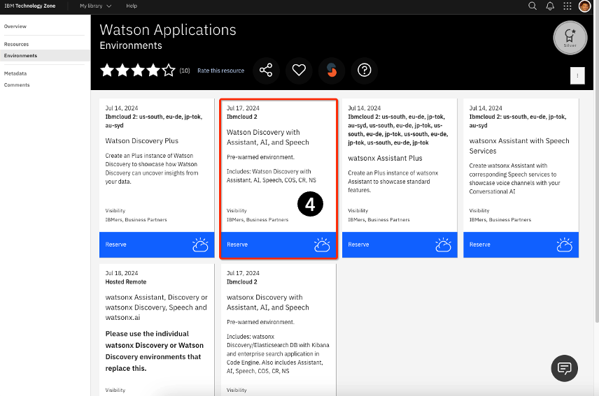

The rest of the reservation process is the same as above

Your **Watson Discovery with Assistant, AI, and Speech 0environment** is set up and ready to use for this lab .

### Selecting a different reservation mode

The **Education** mode will reserve a watsonx.ai TechZone environment for 2 weeks. You can extend this reservation once for 4 days – for a total of 18 days. This may be sufficient for doing some prep work or pre-testing, but it is not likely enough for a PoX (unless you are just doing a demo).

For a PoX, you should reserve your watsonx.ai environment in the **Pilot** mode, but note that this mode requires a valid **Opportunity number**.

To book a TechZone for a Proof of Experience (Pox), (for watsonx.ai or watsonx Assistant + Watson Discovery + watsonx.ai), select the **Pilot** tile and provide the appropriate Opportunity number:

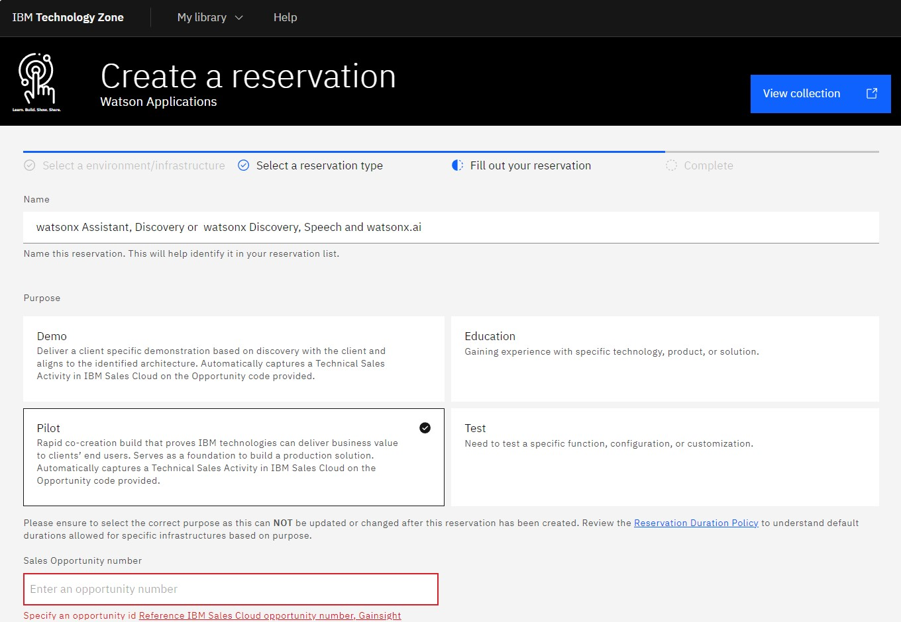

A PoX TechZone environment in the **Pilot** mode can be reserved for 7 days and you can extend it up to 7 times (in 7 days increments) for a total maximum of 56 days.

Even though this is a fairly long period, you should plan your PoX steps well (and probably test using the Education mode) before using the Proof of Technology reservation.
